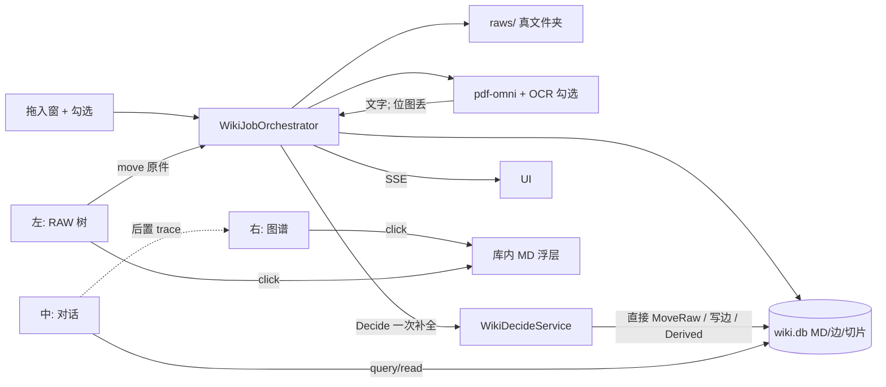

# WIKI APP 重写架构

日期：2026-08-17 · 状态：设计稿（已按用户第二轮修订）  
性质：推翻 `docs/design/WIKI_APP_2026-08-17.md` 的 xu-wiki 迁入实现。旧代码不当兼容目标，不必回归测试。

第一轮三席合成后，用户当场改了四条（编号沿用原 7 条）：

| # | 修订 |
|---|---|
| 2 | 摄取过程中 **LLM 直接决策并落地**，不必等人点提案 |
| 3 | PDF/文件里的图、表尽量 OCR；摄取窗打勾。相册是照片，与此无关。从 PDF **抽出的图丢掉**（有原件） |
| 4 | 布局：**左 RAW 目录树 / 中对话 / 右图谱**。Query 时图谱缩放 + 流光思维路径后置。点节点打开对应 MD |
| 7 | 人移动的是 **RAW 原件**；编译出的 MD **只住在库里**，不是一棵给人挪的文件树 |

---

## 1. 项目概述

WIKI 是 BoenMind 的一等 APP：把一份原件和一句人话收成可审计的知识。

用户丢进来的是 **RAW 文件 + 备注 + 几个勾选**。固化程序锁原件、按勾选做 OCR、抽出正文进 Turso。同一作业里宿主再调一次 LLM，按备注和正文 **直接** 归夹、连边、写派生记录。人日常收拾的是左边那棵 **原件树**；问问题在中间对话；右边图谱跟着亮。编译稿（MD）在 `wiki.db` 里，点图谱节点再打开。

对照卡帕西：吸收 compile-time 与 Raw 不可改；拒绝 SKILL 逐步改笔记树。LLM 在本架构里是摄取作业里的 **一次结构化决策调用**，不是会话状态机。

---

## 2. 范围

### 2.1 M1 必须能用

- 拖入窗：多文件；勾选（整件 OCR / 表 OCR / 图 OCR）；备注；目标 RAW 文件夹；进度（页数 / 初步处理 / 精准识别 / 决策中）
- 固化编排器：解析与切片零 SKILL；决策步 = 宿主 LLM API，成功则直接写库
- pdf-omni：内部 `ProgressSink`；`parse_pdf` 一次性工具契约不改
- 权威库 `working_dir/wiki/wiki.db`；RAW 按文件夹落在 `wiki/raws/`
- 左树只展示并可拖拽 **RAW**；移动原件后库内归属、检索、图谱跟变
- 默认布局：左树 / 中 `ChatPane scene=wiki` / 右图谱
- 点图谱节点（或 RAW 条目）打开库内 MD 阅读浮层
- 设置中心 `app-wiki`
- 向量表口子（不跑模型）

### 2.2 后置

| 后置 | 原因 | 以后 |
|---|---|---|
| Query 流光思维路径 + 自动缩放 | 用户说最后做、不强求 | 对话工具轨迹映射到 `graph/ego` 高亮 |
| 相册 APP | 用户定义为 **照片**，不是 PDF 抽图 | 独立 APP，不认领 PDF 抽图 |
| 向量真检索 / Tantivy 侧车 | 模型未到；主进程裁 `fts` | `embed_chunks` + `bm-wiki-index` |
| DOCX / 多 wiki / doctor GUI | 非闭环 | 同一 Job 加解析器；`wiki_registry` |
| 旧 xu-wiki 热兼容 | 重写 | 一次性导入器可后做 |
| md 磁盘投影给人整理 | 用户明确 MD 在库里 | `export/` 仅备份/损坏回灌，默认不展示 |

### 2.3 已决

- 摄取主路径是固化 Job，不是 SKILL 逐步执行
- LLM 通讯走宿主 API（可经 `wiki-reflect` 薄壳）；**摄取决策步直接落地**
- 精准识别 = pdf-omni cascade / 高阶解析，不是模型改 MD
- PDF 抽出来的位图扔掉；表/图的 **文字** 进库
- 存储 = Rust Turso/limbo；知识 MD 在 `wiki.db`
- 人挪的是 RAW；插件不碰 `ProviderPort`

---

## 0. 相对第一轮合成稿：改了什么

| 主题 | 第一轮 | **现在** |
|---|---|---|
| 摄取中的 LLM | 禁止进 Job；只出提案，默认关 | **Job 内 Decision 步**，一次结构化补全，**直接 apply**；失败不回滚已入库正文 |
| 图/表 | StructuredAsset 桩留给相册 | **勾选 OCR**；表→结构化文本进库；图→OCR 文字进库，**位图丢弃**；相册脱钩 |
| 默认布局 | 中阅读、右对话、图谱叠阅读 | **左 RAW 树 / 中对话 / 右图谱**；阅读是点开才出现的浮层 |
| 目录权威 | Turso Folder，磁盘按 document_id 投影 | **用户看见并拖的是 `raws/` 真文件夹**；Move = 挪原件 + 同一事务改库 |
| 编译 MD | 可单向 export 成文件树 | **只在库里**；打开 = 读 `documents/slices/derived` 渲染 |

未改：引擎不跑 SKILL 状态机；Raw 字节不可被模型改；`wiki.db` 不进 `boenmind.db`；边不 LRU 驱逐；主进程不开 tantivy。

---

## 3. 技术栈

| 层 | 选型 | 对应需求 |
|---|---|---|
| 引擎 | 重写 `bm-wiki` | Job、Move RAW、检索、图 |
| 权威知识 | `wiki/wiki.db`（turso 0.7.2） | 全部 MD / 切片 / 边 / 备注 / Job |
| 用户书架 | 磁盘 `wiki/raws/<文件夹>/文件` | 左树；人只挪这个 |
| PDF | `pdf_omni` + `ProgressSink` + 按勾选 OCR | 页数、初步、精准、表/图文字 |
| 决策 | 宿主 `WikiDecideService`（LlmPort + Credentials，不开 session） | 摄取内直接落地 |
| 检索 M1 | 库内 CJK 2-gram + 拉丁 token | 中文；含备注 |
| 向量 | `embed_chunks` 口子 | 以后填 |
| HTTP | `/api/wiki/*` + Job SSE | GUI |
| 对话 | `ChatPane` 居中；`wiki_query` / `wiki_read` | Query；轨迹后置喂图谱 |
| 前端 | dockview：`wiki-raw-tree` / `chat-pane` / `wiki-graph` / `wiki-reader`（按需） | 布局第 4 条 |

**UNVERIFIED：** turso 0.7.2 rustdoc 无独立向量 feature。M1 不赌。

---

## 4. 目录与模块

```
working_dir/wiki/
  wiki.db                         # 权威：MD、切片、图、备注、作业
  raws/                           # 人看见的书架（真文件、真文件夹）
    新加坡舰队/
      第五条船/
        XXX文件.pdf
  derived/{document_id}/{run_id}/ # TextMaster、OCR 文本、精准侧报；不给人整理
  .bm/wiki.toml

backend/crates/bm-wiki/
backend/crates/bm-server/src/
  routes/wiki.rs
  wiki_jobs.rs
  wiki_decide.rs
  wiki_tools.rs
  pdf_omni/                       # ProgressSink；抽图不落知识库
backend/plugins/wiki-reflect/     # 薄壳；摄取外再整理时也走同一决策 API

frontend/src/components/wiki/
  WikiDockApp.tsx
  WikiRawTree.tsx
  WikiGraph.tsx
  WikiReaderOverlay.tsx           # 点节点/RAW 打开库内 MD
  WikiIngestDrawer.tsx
frontend/src/stores/wiki-workspace.ts
```

`boenmind.db` 不存知识正文。`export/` 不进 M1 默认界面。

---

## 5. 组件与系统

### 5.1 知识对象

| 对象 | 一句话 | 人怎么碰 | 权威 |
|---|---|---|---|
| RawFile | 原件 | 左树拖拽移动、改名 | 磁盘路径 + `documents.raw_relpath` |
| Folder | `raws/` 下的文件夹 | 左树新建/拖拽 | 磁盘目录 + `folders` 镜像 |
| Document | 这份原件的身份 | 不直接改 ID | `documents` |
| AttributionNote | 拖入备注 | 提交时写 | 库；Accepted 即可搜 |
| IngestJob | 一次作业 | 进度条 | `ingest_jobs` |
| TextMaster | 初步处理主文本 | 不单独整理 | derived + 入库副本 |
| Slice | 页/块证据（MD） | 点开阅读 | **只在库** |
| OcrText | 表/图 OCR 出的字 | 随 Document 读 | 库；**无图片 blob** |
| Relation | 有向边 | 图谱；决策步可写 | `edges` |
| DerivedRecord | 实体/主张/清单（MD） | 点开阅读；决策步可写 | **只在库**；主张要有证据 |
| EmbeddingSlot | 向量占位 | 无 | `embed_chunks` |

没有「给人拖的 MD 文件」。没有「PDF 抽图进相册」。没有 50 边 LRU 存储。

`documents.raw_relpath` 例：`新加坡舰队/第五条船/XXX文件.pdf`。稳定 `document_id` 不随路径变。

### 5.2 摄取窗勾选

| 勾选 | 默认 | 含义 |
|---|---|---|
| 整件 OCR | 关 | MinerU `is_ocr`（扫描件） |
| 表 OCR | 开 | 尽量把表格认成文字/网格，写入库 |
| 图 OCR | 开 | 图上的字认进库；**位图丢弃** |
| （资深）精准识别 | 关 | cascade / 高阶引擎，侧报不回写主 MD |

相册与这些勾选无关，摄取窗不出现相册入口。图片文件（照片）不进本窗；那是未来相册 APP。

解析产物策略：

- 主路径：TextMaster（MD 全文）入库为 Slice
- 表：`ocr_tables`（纯文本或简单 JSON 网格），可再切成 Slice
- 图：只留 OCR 字符串 + 页码定位；`pdf_omni` 拼出的图、抽页图 **不写入 wiki 资产、不进图谱**
- 原件始终在 `raws/`，需要看图就打开原件

### 5.3 固化 Job（程序推进，决策一步调 LLM）

```
Created → Accepted → ParseQueued
       → Preliminary（初步处理 + 页进度）
       → Precise（可选）
       → Archived / Sliced / Indexed
       → Decide（宿主 LLM，直接落地）
       → Ready
```

| 用户看见 | 阶段 | 谁 | LLM？ |
|---|---|---|---|
| 排队 | Accepted | 哈希、**按目标夹写入 raws/**、备注入索引 | 否 |
| 页数 n | counting | pdf_ops | 否 |
| 初步处理 3/12 | Preliminary | MinerU | 否 |
| 精准识别 | Precise | cascade | 否 |
| 识别表/图文字 | 并进 Preliminary/Precise | 按勾选 | 否 |
| **决策中** | Decide | `WikiDecideService` 一次 JSON 补全 | **是** |
| 完成 | Ready | — | — |

**Decide 输入：** 备注、标题、TextMaster 摘要/切片、现有 RAW 树、用户提交时选的目标夹、已有相近 Document/Derived。  
**Decide 输出（结构化，宿主校验后直接写）：**

- 目标文件夹（可新建路径，如 `新加坡舰队/第五条船`）→ 执行与手动拖拽同一条 `MoveRaw`
- 标题修正（可选）
- 边（连到已有实体/文件）
- Derived（实体笔记、主张）；主张无证据 ID 则丢弃该条，不失败整次 Job

**Decide 失败：** Job 仍 Ready，文件留在提交时的目标夹（或 Inbox），进度标记 `decide=skipped`。不回滚 Slice。不重跑解析。

仍禁止：用 SKILL/多轮 tool call 当状态机；模型改 Raw 字节；模型自己调 `parse_pdf`。

摄取外再整理：同一 `WikiDecideService`，可由 `wiki-reflect` 或对话里的 `wiki_propose_*` 触发；摄取外默认仍可直接落地（与第 2 条一致），设置里留「仅建议」开关给以后，M1 不必做两套。

### 5.4 pdf-omni

- `ProgressSink`：页数、`extracted_pages/total_pages`、cascade 起止
- 工具 HTTP 零变更
- WIKI 只经编排器调内部解析
- 抽图/拼页可作 OCR 输入，**OCR 结束后删除临时图**，不进 `wiki.db` 资产表

### 5.5 RAW 树与移动（第 7 条）

左树 = `wiki/raws/` 的真实层级（文件夹 + 原件名），不是四分区，也不是 MD 列表。

`MoveRaw(paths → dest_folder)`：

1. 校验不越出 `raws/`、无环、不覆盖
2. **先** `BEGIN` 改 `folders` / `documents.raw_relpath` / 检索 `folder_path` / `graph_epoch`
3. **同逻辑成功后** 磁盘 `rename`；若盘失败则事务回滚或标 `fs_dirty` 并提示重试（实现选「盘先挪再提交」也可以，但必须单命令内对账，禁止只改一半）
4. Slice / Derived / 边的 ID 不变；图谱上该文件的点只换「所在文件夹」属性
5. 不移动、不改写任何 MD 文件（本来就没有给人挪的 MD）

OS 里手挪 `raws/`：启动或刷新时扫描对账（路径变、哈希同 → 更新 `raw_relpath`）。这是跟手，不是第二权威。删除 RAW：Document 可标缺失，库内 MD 仍在，阅读器提示「原件不在」。

Inbox = `raws/Inbox/`。

### 5.6 检索

- 备注 Accepted 即可搜
- Slice + OCR 表/图文字 + Derived 进 n-gram
- 目录过滤按 RAW 路径前缀
- 对话 `wiki_query` 打同一索引；`wiki_read` 读库内 MD，不读磁盘 md

### 5.7 图谱

点：Document（绑 RAW）、Folder、Derived。不画抽图资产。  
边：持久。阅读不改图。

`GET /api/wiki/graph` 与 `/graph/ego/{id}` 同前（上限、截断、分层/力导向）。

**打开 MD：** `GET /api/wiki/documents/{id}` 返回库内拼好的 Markdown（主切片 + OCR 文本 + 备注）。前端 `WikiReaderOverlay`。没有「打开 export 下某个 md 路径」的产品入口。

**Query 思维路径（最后做）：** 对话里每次 `wiki_query` / `wiki_read` 把命中 uid 追加到 `wiki-workspace.trace[]`；图谱按序缩放、高亮、流光连线。M1 只预留 `trace` 数组与 API，不做动画。

### 5.8 界面

```
┌ wiki-raw-tree (240) ┬ chat-pane（主列） ┬ wiki-graph (300) ┐
│ RAW 文件夹/原件      │ 对话 scene=wiki    │ 知识图谱           │
│ [+ 拖入摄取]         │                   │ 点节点 → 打开 MD   │
└─────────────────────┴───────────────────┴───────────────────┘
```

- `WikiApp` = `<DockLayout appId="wiki" />`，默认三列如上
- `wiki-ingest`：抽屉/命令打开，不占默认列
- `wiki-reader`：默认不挂组；点 RAW 或图谱节点以 overlay / 临时 Tab 打开库内 MD
- 窄屏：先收图谱，再收树；对话尽量保留
- 摄取进度钉在对话顶或树底，不打断输入

拖入：拖到树的某文件夹 = 目标夹；拖到窗空白 = Inbox。

对话仍是场景会话。`parse_pdf` 对 wiki 会话隐藏。`wiki_ingest` 若保留，只许文本速记进库，hints 写明文件走拖入窗。

### 5.9 API 要点

```
POST /api/wiki/jobs
  files, folder, note,
  ocr_document, ocr_tables, ocr_figures, precise?
POST /api/wiki/raws/move
  { paths: [], dest: "新加坡舰队/第五条船" }
GET  /api/wiki/raws/tree
GET  /api/wiki/documents/{id}          # 库内 MD
GET  /api/wiki/graph
GET  /api/wiki/jobs/{id}/events        # SSE
```

SSE `phase`：`queued | counting_pages | preliminary | precise | index | decide | ready | error | cancelled`。

Decide 由编排器调 `WikiDecideService`，**不是**前端再 POST 一次才算完成。

---

## 6. 数据流



一次 PDF：

1. 拖到 `新加坡舰队/第五条船`（或 Inbox），勾表/图 OCR，写备注  
2. 原件落到对应 `raws/` 路径；备注可搜  
3. 初步处理出全文；表/图出字；抽图扔掉  
4. 正文进 `wiki.db`  
5. Decide：按备注把夹定准、连上「第五条船」实体、写一条带证据的派生——直接生效  
6. 左树看到 PDF；右图出现点；中间可问。点节点读库里的 MD

---

## 7. 权衡

1. **Decide 直接落地会分错夹。** 换的是「少点一次确认」。缓解：Move 与边可撤销（审计 + 拖回）；Decide 失败保持用户提交夹；模型仍不能改 Raw。  
2. **RAW 树与库对账。** 人只挪原件，必须单命令内盘+库一致；刷新扫描只修漂移。  
3. **中列是聊天不是阅读。** 长文阅读靠点开。符合「问库」主路径；MD 不当第二套文件管理器。  
4. **抽图丢掉。** 表结构只靠 OCR 质量；看版式回原件。不养一套无用图片库。  
5. **图谱动画后置。** M1 先点得开、缩得动；流光不挡摄取闭环。

---

## 8. 简单性

| 砍掉 | 原因 |
|---|---|
| 摄取提案箱 + 人点 apply | 用户要直接决策 |
| PDF 图资产 / 相册挂点 | 抽图无用；相册是照片 |
| 给人整理的 export MD 树 | MD 在库里 |
| 中列阅读器常驻 | 主路径是对话 |
| 主进程 tantivy | 体积 |

保留：Job+SSE（第 1 条进度）；独立 `wiki.db`；Decide 仍是一次 API 不是 SKILL 环。

---

## 9. 里程碑

### M1

| # | 交付 | 体量 |
|---|---|---|
| 1 | `wiki.db` + `raws/` 真目录镜像 | 大 |
| 2 | Job：解析/OCR 勾选/丢抽图/入库 | 大 |
| 3 | `ProgressSink` + SSE 三阶段人话 | 中 |
| 4 | 拖入窗 + 勾选 + 备注 | 中 |
| 5 | 左 RAW 树 DnD = `MoveRaw` | 中 |
| 6 | 默认三列 dock：树 / 对话 / 图谱 | 中 |
| 7 | 点节点/RAW → 库内 MD 浮层 | 中 |
| 8 | Decide 步直接落地（夹/边/派生） | 大 |
| 9 | n-gram（含备注与 OCR 文字） | 中 |
| 10 | `app-wiki` 设置 | 小 |

### 最后做

Query `trace[]` → 图谱自动缩放 + 流光思维路径。  
向量回填、Tantivy 侧车、相册（照片）、多库、旧库导入。

---

## 10. 拍板点（本轮已按你的话锁死）

| # | 点 | 锁定 |
|---|---|---|
| 1 | 权威 | 知识 MD 在 `wiki.db`；人挪 `raws/` 原件 |
| 2 | 摄取 LLM | **Job 内直接决策落地**；失败跳过决策、不回滚正文 |
| 3 | 图/表 | 勾选 OCR 进文字；**抽图丢弃**；相册无关 |
| 4 | 布局 | **左 RAW / 中对话 / 右图谱**；阅读按需打开 |
| 5 | 思维路径 | **最后做**；M1 只留 hit uid 轨迹口子 |

---

## 附录

### 术语

- **RAW：** `wiki/raws/` 里的原件，人整理的唯一文件面。  
- **库内 MD：** Slice / Derived 的正文，只在 Turso，点开才看见。  
- **Decide：** 摄取末尾一次宿主 LLM 调用，直接写夹/边/派生。  
- **抽图：** 解析器从 PDF 抠出的位图，用完即删。

### 必须丢掉的旧假设（追加）

- 摄取后必须等人确认才归类  
- PDF 抽图要存成资产或留给相册  
- 左树是 Pages/Lists/… 或 MD 文件树  
- 中间主区是阅读器  
- `raws/{uuid}/original.pdf` 当做人的书架  

### 参考

- 本文件覆盖第一轮合成结论  
- 旧迁入：`docs/design/WIKI_APP_2026-08-17.md`（不作运行目标）  
- 卡帕西：https://gist.github.com/karpathy/442a6bf555914893e9891c11519de94f  
