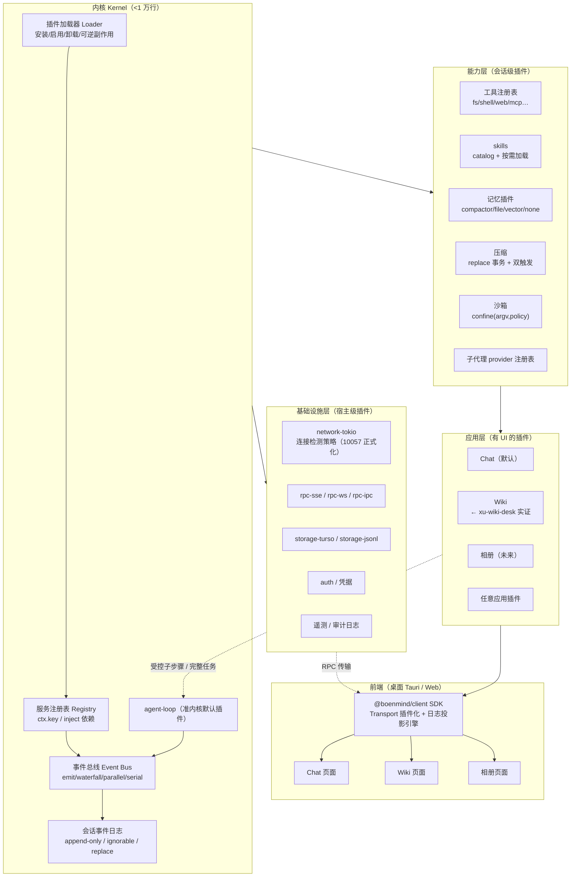

# BoenMind 2.0 ——「万物皆插件」架构设计

> 状态：**v0.4（迭代完毕，待用户拍板）**——四家参考研读齐、pi-compat 已查证、Simplicity Check 已审计
> 日期：2026-08-14
> 参考系：pi_agent_rust（现引擎，vendored）、DeepSeek Harness（dsh）、ZCode（插件/技能/市场）、Hermes（NousResearch/hermes-agent）、**xu-wiki-desk（用户已有应用插件实证）**
> 本文档持续迭代，直到自认完美后交用户拍板。

---

## 〇、一句话愿景

**BoenMind 的内核只做一件事：把插件装起来、让插件互相看见、把一切都记进事件日志。除此之外，什么都不是内核——聊天不是内核，记忆不是内核，网络不是内核，UI 也不是内核。**

> 用户原话（2026-08-14）："我是真的希望一切都是插件，包括记忆系统的！"……"甚至你前几轮的网络问题，与前端的 SDK 和 RPC 通讯之类的，要是都能做成插件就完美了。"……"插件/Skill 是钩在 agent 里面的能力，能不能再搞出个**独立的功能界面**（也是插件），核心依然是 Agent。以后开发不同功能的智能应用，外观上看着不是 Agent，但本质仍然是调用了 Agent。"（Wiki、相册）

## 一、什么是"插件"：双形态模型

本架构中插件有两种形态，**同一个插件可以同时具备两种形态**：

| 形态 | 是什么 | 例子 | 用户看到什么 |
|---|---|---|---|
| **能力插件**（Capability） | 钩进 Agent 会话里的工具/技能/记忆/策略，无独立界面 | web_search、ctx-compactor、记忆、沙箱策略 | 聊天中的能力 |
| **应用插件**（App） | 有独立功能界面的完整应用，**核心依然是一个（组）Agent** | Chat（默认）、**Wiki、相册**、文件浏览器 | 独立页面，外观不是 Agent |

关键不变量：**应用插件的界面只是"壳"，逻辑全部通过调用 Agent 核心完成**。Wiki 的"整理笔记"按钮 = 向后端发一条消息 → 后端起一个隔离的 Agent 会话 → 执行 → 结果回写 Wiki 存储 → 前端从事件日志投影刷新。

## 二、最小内核（The Kernel）：小到什么程度

对照四家的"核"：

| 系统 | 核是什么 | 核的大小 |
|---|---|---|
| pi | agent loop + 插件引擎 + 工具集（一切内置） | ~35 万行（我们对它的依赖面） |
| dsh | Cordis：服务容器 + 类型化事件 + 可逆副作用 | 5690 行 vendor |
| ZCode | 客户端本体 + 插件/技能/MCP 体系 | —— |
| **BoenMind 2.0** | 插件加载器 + 服务注册表 + 事件总线 + **会话事件日志原语** | **目标 < 1 万行** |

内核四件套，缺一不可：

1. **插件加载器**（Loader）：扫描/安装/启用/卸载插件，可逆副作用（卸载 = 撤销它注册的一切）。
2. **服务注册表**（Service Registry）：服务占稳定的 `ctx.<key>`，插件按 key 找服务，不 import 实现。依赖用声明（inject）而非手工编排。
3. **事件总线**（Event Bus）：类型化事件 + 四种分发模式（emit 观察 / waterfall 环绕中间件 / parallel 扇出 / serial 按序）。waterfall 是"环绕中间件"：监听器收 `(...args, next)`，不调 `next()` = 短路（策略拥有决策权）。
4. **会话事件日志**（Event Log）：append-only 的持久事实流，**一切状态的唯一事实源**。所有消息/工具/压缩/记忆投影都从它派生——"模型可见即已记录"。

**agent loop 不是内核，是第一个启动的默认插件**（`agent-loop`）。它的接口是 `Agent` trait：`send/steer/inject/cancel/whenIdle`，任何实现可替换它（dsh 验证了这条路）。但现实上 loop 是最难替换的插件——所以它享受"准内核"待遇：随内核发布、接口稳定、可替换但默认不动。

> **为什么要日志进内核而不是存储进内核？** 存储是可替换的实现（turso/JSONL/内存），日志是语义契约。内核只承诺"事件 append 是原子的、可回放的、有版本的"，不承诺用什么存。

## 三、四家借鉴清单（v0.2，四家齐）

### 3.1 从 dsh 吸收（架构主干）

| # | 机制 | 吸收理由 | 落地形态（Rust） |
|---|---|---|---|
| D1 | 无特权核心，注册=可逆副作用 | 一切皆插件的根本 | `ctx.effect()` 等价物（Drop 时反注册） |
| D2 | append-only 事件日志 + ignorable 守卫 + 版本升级链 | 回放/fork/压缩审计的地基 | `SessionEvent` enum + `SESSION_FORMAT_VERSION` |
| D3 | 压缩 = replace 表面操作 + sourceEventSeqs 引用链 | 压缩可审计、可重放（超越现有 ctx-compactor） | `SurfaceOp::Replace{start,end}` 事件 |
| D4 | 工具把关链（pre/guards/approval/execute/post + finalize） | 权限/沙箱/钩子与工具解耦 | 五个事件 + 单调守卫 trait |
| D5 | scope 隔离（agent 级 ctx）+ preset isolate realm | 多 agent 原生支持、会话级组合 | `ScopeKey` + realm 隔离 |
| D6 | profile/bundle/patch 分层组装 | 组合可审计、用户可覆写一切 | manifest + patch 层 |
| D7 | skill catalog 增量注入 + 按需加载 | 省 token、不干扰（现有注入式可迁移） | catalog 事件 + skill 工具 |
| D8 | 系统提示词片段注册（order/-100 身份/0 人格/100-199 工具） | 可组合的提示词工程 | `PromptSection` 注册表 |
| D9 | 会话日志级压缩事务（compaction/start→summary→replace→end） | 压缩状态本身可审计可恢复 | 事件协议 |
| D10 | 双触发压缩（0.8 水线 + overflow 硬触发重试）+ 摘要吃 KV-cache + 不切 tool 配对 | 比现有 50% 水线更完整 | 压缩插件默认实现 |

### 3.2 从 pi 吸收（资产与生态）

| # | 机制 | 说明 |
|---|---|---|
| P1 | QuickJS 插件沙箱（swc 转译 TS → QuickJS） | **BoenMind 最强的护城河**：真沙箱 vs dsh 的 node:vm。插件语言保持 TS |
| P2 | ExtensionBody 协议 / pi.dev 生态（200+ 插件） | 兼容层：新架构能直接加载现有 pi 插件（见 §7 兼容策略） |
| P3 | 权限三档（含 YOLO）+ 询问弹窗（PermissionBridge） | 已是 BoenMind 资产，升级为审批链（见 D4） |
| P4 | npm/git 插件安装（package_manager） | 安装机制保留 |
| P5 | 工具/skill 同构（都是注册进 ctx.tools 的东西） | 简化心智模型 |
| P6 | 压缩实测方法论（A/B token 对比） | 验收标准沿用 |

### 3.3 从 ZCode 吸收（产品与生态）

| # | 机制 | 说明 |
|---|---|---|
| Z1 | 极简 manifest（`plugin.json`：name/version/description/skills 目录） | 降低插件开发门槛；"目录即声明，manifest 补充" |
| Z2 | skills 目录发现 + 优先级链（用户级 > 工作区 > 插件级，同层 .zcode 先于 .agents） | 三层覆写语义，用户永远能覆盖插件 |
| Z3 | hooks（matcher + script，模板变量） | 轻量事件钩子，非插件开发者也能挂脚本 |
| Z4 | MCP 作为一等公民（config 里直接配 server） | 外部生态接入标准 |
| Z5 | marketplace.json（市场源）+ 插件缓存目录 + i18n（displayName_i18n/examplePrompts） | 商店/多语言的落地格式参照 |
| Z6 | 用户级/工作区级配置分层 | 与 Z2 同构的配置哲学 |

### 3.4 从 Hermes 吸收（NousResearch/hermes-agent，Python 26.7 万行）

| # | 机制 | 说明 | 对 BoenMind 的意义 |
|---|---|---|---|
| H1 | **一个模式多路复用**：目录插件 + register(ctx)/ABC 子类 + 独立发现路径，插件边界按能力面切分（memory/context-engine/browser-provider/platforms 20+/cron/observability 各一套） | 不搞"统一大插件"，每个能力面有自己的 provider 注册表 | **"万物皆插件"的落地模式**：注册表按能力面切分，不要求所有插件同构 |
| H2 | 注册表即契约：`registry.register()` 单入口 + 模块级自注册 + AST 扫描自动发现（mtime+size 磁盘缓存） | 工具注册不维护平行结构 | 工具 schema 自动生成 |
| H3 | **Hook 覆盖面**：pre/post_tool_call、pre/post_llm_call、on_stream_*、pre_verify（验证循环门控）、pre/post_api_request、api_request_error（provider 可接管错误分类）等 20+ 钩子 | 核心循环的每个决策点都留钩子 | 与 dsh 的 waterfall 扩展点互补：dsh 是"服务层事件"，Hermes 是"调用层钩子"，两者都要 |
| H4 | **记忆 = MemoryProvider 插件**（ABC：prefetch/sync_turn/system_prompt_block/on_pre_compress/get_tool_schemas），8 个实现（holographic 本地默认/byterover/hindsight/honcho/mem0/openviking/retaindb/supermemory），仅一个活跃，后台异步写入，压缩前 on_pre_compress 保存 | **用户点名要的"记忆系统插件化"的直接参照** | MemoryPlugin trait 设计对齐 Hermes ABC + dsh 日志投影 |
| H5 | context engine 插件化（默认 compressor，可换 lcm 等） | 压缩引擎可替换 | 压缩插件接口参照 |
| H6 | 技能自创自改闭环：background_review（fork 回放对话快照，白名单仅 memory+skill 工具）+ curator（pin/archive/consolidate 绝不删除）+ learning graph | 自我改进是最大卖点 | 远期可吸收（架构上 = 一个观察日志的插件，天然兼容） |
| H7 | 供应商注册表模式：web_search/TTS/图像/视频 provider 各一注册表 | 与现有 web_search 多源设计同构 | 确认现有方向正确 |
| H8 | 懒加载依赖：第三方后端首用才装，核心依赖极小（供应链安全） | | 插件依赖按需加载 |
| H9 | 权限纪律：override 内置工具需显式 opt-in、scope 隔离（_scoped_tools）、能力声明、审计日志 | | 插件权限模型参考 |
| H10 | 压缩工程细节：CompressionCommitFence 防中断半提交、跨进程 SQLite 锁、受保护尾部、**技能标记重注入**（压缩中丢失的技能在摘要里插回调用提示） | | 压缩插件实现细节 |
| H11 | 会话库 SQLite + FTS5 + **CJK 分词原生扩展**；session_search 工具 DISCOVERY/SCROLL/BROWSE 三模式零 LLM 成本 | | 与 turso FTS5 路线呼应（回忆此前 sqlite-storage-and-search-limits 调研） |
| H12 | PTC 程序化工具调用：execute_code = LLM 写脚本经 RPC 回调父进程工具，多步流水线坍缩为单轮 | 与 dsh PTC 同构（TS 版） | 印证 PTC 是通用模式，语言无关 |

## 四、总体架构（分层图）

```
┌────────────────────────────────────────────────────────────┐
│  应用层 App Plugins（有独立 UI，核心是 Agent）                │
│  ┌──────┐ ┌──────┐ ┌──────┐ ┌──────────┐                  │
│  │ Chat │ │ Wiki │ │ 相册 │ │ 任意应用  │  ← 前端页面包      │
│  │ 默认 │ │      │ │      │ │ 插件      │     + 后端路由包    │
│  └──┬───┘ └──┬───┘ └──┬───┘ └──────────┘                  │
│     └────────┴───┬────┴─── 全部调 Agent 核心（隔离会话）     │
├──────────────────┼─────────────────────────────────────────┤
│  能力层 Capability Plugins（钩进 Agent 会话，无界面）        │
│  工具（fs/shell/web/…）│ skills │ 记忆 │ 压缩 │ 沙箱         │
│  子代理 │ MCP client │ 提示词片段 │ 计划/目标/定时            │
├──────────────────┼─────────────────────────────────────────┤
│  基础设施层 Infrastructure Plugins（宿主级，无界面）         │
│  网络传输（连接检测策略）│ RPC 协议 │ 存储后端 │ 认证          │
│  遥测/审计 │ 凭据 │ 日志持久化                                │
├──────────────────┼─────────────────────────────────────────┤
│  内核 Kernel（<1 万行）                                      │
│  插件加载器 │ 服务注册表 │ 事件总线 │ 会话事件日志原语         │
│  └─ 准内核：agent-loop（默认插件，随内核发布）                │
└────────────────────────────────────────────────────────────┘
```

**三层的注册规则**：
- 应用插件注册：前端包（页面/导航项/快捷键）+ 后端包（路由/服务/工具）；权限最高（用户显式安装、显式启用）。
- 能力插件注册：工具 schema / 提示词片段 / 策略；作用于其被挂载的会话作用域（scope）。
- 基础设施插件注册：全局服务（`ctx.network`、`ctx.rpc`、`ctx.storage`）；替换需用户确认（影响面最大）。

### 4.1 总体架构图（Mermaid）



## 五、核心机制草案（v0.2 要点）

### 5.1 会话事件日志（一切的地基）

```
SessionEvent {
  seq: u64,            // 单调连续
  time: i64,           // epoch ms
  type: EventType,     // 类型化枚举（插件可注册新变体）
  data: Json,          // lossless JSON
  ignorable: bool,     // 未认识可跳过；缺省=必需（不认识必须拒绝重建）
  surface_op?: Append|Replace{start,end},  // 仅消息面事件
  source_seqs?: [u64], // 引用链（压缩遮蔽、chunk→message）
}
```

事件类型（**首版只注册正在使用的域**，其余按需添加，ignorable 兜底，见 S9）：

**核心域**：`turn/start|end`、`step/start|end`、`user/message`、`assistant/chunk|message`、`tool/call|result`、`request/header`
**压缩域**：`compaction/start|summary|end`（replace 事务）
**记忆域**：`memory/write`（记忆投影写回日志，防重放漂移）
**扩展域（插件可注册）**：`app/*`（应用插件）、`infra/*`（基础设施）、`goal/*`、`schedule/*`、`todo/write`——**先用后注册**，注册 = 声明协议版本与 ignorable 语义

**三大不变量**：① 模型可见即已记录；② 新模型可见输入必须新增事件类型；③ 压缩/记忆/一切投影都可从日志重放复现。

**checkpoint 与并发（v0.3 补充）**：
- **持久化策略**：事件流 append 即写日志表（turso 单写者 tokio Mutex，现有基础），**checkpoint 仿 dsh 的 checkpoint-policy**——每请求边界（request/header 落盘点）做一次 fsync 级持久化，轮次不等待 flush（`whenIdle()` 时消费者自行 flush）；崩溃恢复：未闭合的 turn 由加载器打 `interrupted` 标记（dsh 的 TurnEndReason 语义）。
- **并发写**：单进程内单写者（Mutex 串行 append）；跨进程（如子代理子进程）不走日志直写，走 RPC 代理写（未来 multi-instance 时引入租约）——**首版不承诺多进程并发写**（S9 缩小范围）。
- **压缩锁**：unmatched `compaction/start` = 压缩中（dsh 语义），恢复时据此完成或回滚事务。

### 5.2 服务注册与事件（Rust 版 Cordis，v0.2 深化）

- `Ctx` 结构：`ctx.plugin(...)` 挂插件、`ctx.service(key)` 取服务、`ctx.on/emit/waterfall/parallel/serial`。
- 依赖声明：`Plugin::deps() -> &[ServiceKey]`，注册表拓扑排序启动，失败回滚整棵子树。
- 可逆副作用：每个注册返回 `Disposer`（RAII），插件卸载 = 逆序执行全部 disposer。
- **Rust 无 TS 声明合并 → 事件类型的注册式设计**（核心难点，两层分治）：

```rust
// 1. 核心域：强类型 enum（性能 + 编译期检查），变体即契约
pub enum CoreEvent {
    TurnStart { turn: u32 },
    UserMessage(Box<UserMsg>),
    AssistantChunk { turn: u32, step: u32, chunk: StreamChunk },
    ToolCall { turn: u32, step: u32, call_id: CallId, name: String, args: String },
    /* turn/end, step/start|end, assistant/message, tool/result, request/header, compaction/* */
}

// 2. 插件域：注册式（灵活 + 前向兼容），EventId(字符串+版本) + type_id 动态分派
declare_event!(WikiPlugin, WikiIndexed { wiki_id: String, node_count: u32 });
// 序列化走 serde_json，与日志 JSON 语义对齐；不认识 → ignorable 守卫裁决

// 3. waterfall 的 Rust 形态：
ctx.waterfall("agent/pre-step", args, |next| async move { /* 决策 */ });
```

- **两层分治**：核心域（turn/step/user/assistant/tool/request/compaction/memory）用强类型 enum，插件域用注册式——避免"一个巨型 enum 所有人都要改"，也保留插件自由扩展。
- 代价说明：插件域类型安全稍弱（字符串 EventId），换取自由扩展——与 dsh 的 TS 声明合并各有利弊，Rust 侧这是正解。

### 5.3 agent loop（准内核，默认插件）

接口（对齐 dsh 的 Agent trait + pi 的现有会话句柄）：

```rust
trait Agent: Send + Sync {
    fn send(&self, msg: UserMessage, target: InboxTarget, wakeup: bool);
    fn inject(&self, ctx: ContextMessage);       // 注入不唤醒
    fn cancel(&self, cause: CancelCause);
    fn when_idle(&self) -> impl Future;           // 维护期互斥
    fn run_maintenance(&self, job: Job) -> ...;   // 压缩等借壳
}
```

默认实现 `ReactLoopAgent`（从 dsh 的 496 行主循环移植）：turn/step 双层边界、inbox 双队列、每步从日志投影、五个扩展点（pre-step / request / request-error / tool pre+post / turn-stopping）。

### 5.4 工具把关链（权限的正式化，v0.3 细化）

```
tool/call 落日志 → pre-execute(waterfall) → 单调守卫 → approval(一次性) 
→ execute(waterfall, 超时/重试) → 工具体 → post-execute(waterfall) → finalize → tool/result
```

- 权限三档升级为"阶梯 + 审批"：`read-only → workspace-write → danger`，升级需 justification + 用户一次性批准（dsh 范式）。
- **与现有 PermissionBridge 的桥接**：现有弹窗询问（`extension-permissions.json` 权威 + SSE 弹窗 + oneshot 回传）原样保留为 `approval` 服务的**宿主实现**——2.0 把"询问"从插件机制（P5 补丁）升级为"把关链的一环"，询问 UI 本身以后也可以换（桌面弹窗 / 通知栏 / 无头自动策略）。
- 沙箱是 `confine(argv, policy)` 包装器（dsh 范式），策略按调用携带，fail-closed（阶段 3 落地，S6）。

### 5.5 组装与配置（bundle + patch，profile 二期）

- **profile**：具名组装（`~/.boenmind/profiles/<name>`），列出 bundles + 用户 patch。
- **bundle**：分发单元（npm 包 or 本地目录），`manifest.json` 的 `dsh.bundle.patch` 指向补丁文件。
- **patch 层**：`bundle 顺序 → profile patch → 用户 patch → 运行时 --patch`，按 id 覆写，全部可审计。
- **配置**：`settings.json` 三层（用户 > 工作区 > 插件默认），照 ZCode 的 Z2/Z6 语义。

## 六、用户点名领域的插件化设计（v0.2）

### 6.1 记忆系统 = 插件（用户点名，v0.2 升级）

原则：**记忆不是"核心注入文本"，是"事件日志的投影服务"**。事件日志是事实源，记忆插件是投影——所以记忆永远可重建、可审计、可替换。

设计对齐 **Hermes 的 MemoryProvider ABC（H4）+ dsh 的日志投影（D2/D9）**：

```rust
trait MemoryPlugin: Plugin {
    // 观察：随会话推进同步（Hermes: sync_turn）
    fn on_turn(&self, ctx: &AgentCtx, ev: &SessionEvent) -> Result<()>;
    // 后台异步维护（Hermes: _submit_background；Hana: 每日流水线）
    fn maintain(&self, ctx: &AgentCtx) -> Result<()>;
    // 注入形态：可空（Hermes: system_prompt_block，有界字符）
    fn project(&self) -> Option<PromptSection>;
    // 模型侧记忆工具 schema（Hermes: get_tool_schemas）
    fn tool_schemas(&self) -> Vec<ToolSchema>;
    // 压缩前保存机会（Hermes: on_pre_compress）
    fn on_pre_compress(&self, ctx: &AgentCtx);
    // 检索（模型工具调用的实现）
    fn retrieve(&self, q: &Query) -> Vec<MemoryHit>;
}
```

生命周期（对齐 H4）：**仅一个活跃记忆插件**（配置 `memory.provider`），后台异步写入不阻塞循环，压缩前 `on_pre_compress` 给保存机会——**所有投影都从事件日志可重建**，插件损坏 = 换一个实现，历史不丢。

实现（首版两个，见 S2）：
| 插件 | 机制 | 参考 |
|---|---|---|
| `memory-compactor`（默认） | 压缩摘要即记忆（现有 ctx-compactor 升级为 replace 事务） | dsh / 现有 |
| `memory-file` | 传送带：facts.md/today.md/longterm.md 纯文件，可手改，指纹防重 | HanaAgent |
| `memory-vector`（二期） | embedding + 向量检索 | 挂起中的 RAG 排期 |
| `memory-none` | 无记忆（隐私场景） | Hermes 8 实现同理 |

### 6.2 网络层 = 插件（10057 的教训，v0.2 深化）

原则：**连接检测/重试/代理不是"修一次的补丁"，是"可替换的网络策略"**。

```rust
// 网络策略插件（三面切分，H1 模式：按能力面而非统一大插件）
trait ConnectPolicy: Plugin {           // 建立连接 + 健康检测（10057 的战场）
    fn connect(&self, addr: &Addr) -> Result<Conn>;
    fn health(&self, conn: &Conn) -> Health;   // 检测实现可换：getpeername / WSAPoll / 时间窗
}
trait RetryPolicy: Plugin {             // 失败退避 / 源切换
    fn schedule(&self, attempt: u32, err: &Err) -> Option<Duration>;
}
trait ProxyPolicy: Plugin {             // 代理 / 隧道（可选，默认直连）
    fn wrap(&self, addr: &Addr) -> Result<Addr>;
}
```

- `connect-tokio`（默认）：tokio + `health = WSAPoll 检测 + 100ms 时间窗`（**现有 A1/A2 修复的正式化**——补丁变成实现，换环境换实现即可）。
- `connect-probe`（备选）：预连接探测（TCP 握手 + TLS 握手分层判定）。
- `retry-exponential`：退避 + 源切换（吸收 asupersync 忙等教训：**重试必须带时间窗，绝不 1ms 忙等**）。
- **环境变量时代结束**：`PI_HTTP_REQUEST_TIMEOUT_SECS` 等全部进插件配置（settings.json 三层），不再散落 env。
- 收益：10057 类问题的修法从"改 vendor 源码"变成"换一个 ConnectPolicy 实现或加一个策略插件"——**修复即配置，生态可共享**（别人踩过的坑做成插件，商店分发）。

### 6.3 前端 SDK 与 RPC = 插件（v0.2 深化）

原则：**前端不假设传输，后端不锁定协议**。

```rust
trait RpcTransport {   // 后端侧
    async fn serve(self, handler: RpcHandler);
}
// 实现（首版 2 个，见 S1）：rpc-sse（默认，现有 SSE 升级）| rpc-local-ipc（桌面 Tauri 壳）
```

**协议设计（协议版本化 + 事件流投影）**：

```
RpcEnvelope {
  ver: 1,                    // 协议版本（客户端与后端协商，不兼容则提示升级）
  kind: Request|Response|Event,
  id: u64,                   // 请求-响应配对
  method: "chat.send" | "session.list" | "app.wiki.ingest" | ...,  // 方法 = 插件注册的路由
  body: Json,
}
```

- **前端 SDK（`@boenmind/client`）四件套**：
  1. `Transport` 接口（SSE/WS/HTTP-poll/IPC 可插拔实现）；
  2. **日志投影引擎**：订阅 `session/event` 流，本地维护投影状态（增量 apply），任何 UI 组件读投影而非直接调 API——Chat/Wiki/相册共用；
  3. 方法调用客户端（RPC 信封 + 超时/重试/取消）；
  4. 应用插件注册器（前端贡献点：导航项/页面/路由）。
- **插件化的三层**：传输实现可换（S1）、方法路由由后端插件注册（`/api/app/<id>/...`）、前端页面由应用插件注册——**协议本身（信封格式）是内核级的，不插件化**（换协议 = 换客户端，那是大版本事件）。
- 桌面端：Tauri 壳内 `rpc-local-ipc`（不经 HTTP 端口，进程内/命名管道）；Web 端：`rpc-sse`。**同一套前端代码，换 Transport 即可**——这就是"前端 SDK 插件化"的落地。

**日志投影引擎协议（v0.4 草案）**——应用插件的公共同步底座：

```
投影同步（两阶段，借鉴现有 SSE + 补增量语义）：
  Phase 1 快照：POST /api/session/{id}/projection  →  { surface: [...], last_seq: N }
  Phase 2 增量：GET  /api/session/{id}/events?after=N（SSE 流，Event 信封持续推送）
  断线重连：以 last_seq 续拉（幂等，事件带 seq，客户端去重）

投影层（SDK 内置）：
  Projection::apply(event) → 更新 surface（append / replace 语义与后端一致）
  Projection::subscribe(selector)  → 应用插件按域订阅（selector: "app.wiki.*" | "turn.*"）
```

- 语义对齐：**前端的 surface 操作与后端日志的 SurfaceOp 完全同构**（append/replace）——压缩发生时前端收到 replace 事件，UI 直接换摘要，不做本地拼接（现在的 Chat 前端就是这样演进的）。
- 应用插件不直接读后端库：Wiki 页面 = `subscribe("app.wiki.*")` + 投影渲染，搜索 = RPC 方法调用——**一套引擎，所有应用**。

### 6.4 应用插件（UI 即插件）—— v0.2 草案

#### 实证：xu-wiki-desk 已经是"应用插件"的雏形

用户在 `D:/96_CoderWorld/xu-wiki-desk` 已有一个完整实现的 Wiki 桌面系统（Rust server + Tauri + React Web，22 表 / 38+ API / 28 测试通过）。它的迁移设计文档写明的哲学与本架构完全同构：

```
Agent (LLM) — 语义判断、多轮决策（受控子步骤）
      │ JSON {status, data, message, hints}
      ▼
xu 确定性引擎 — 永不调 LLM（create/ingest/query/doctor…）
      ▼
文件系统 — Markdown + YAML frontmatter
```

- LLM 网关抽象层 `trait LlmProvider { fn chat() }`：OpenAI 兼容 + Ollama 适配器，**LLM 调用已插件化**，纯离线/无 LLM 模式可行；
- "全流程确定性，LLM 调用是受控子步骤"——LLM 只做语义判断（关键词提取/实体建议/报告生成）；
- 结论：**应用插件 = 确定性引擎为主 + Agent 调用为受控插件**，xu-wiki 是这个形态的第一号实证，其 22 表 38 API 可直接演化为 Wiki 应用插件的后端包。

#### 应用插件与 Agent 核心的桥：两种调用模式

| 模式 | 语义 | 适用 | 实现 |
|---|---|---|---|
| **受控子步骤**（同步） | 一次 chat 调用做语义判断，主流程确定性 | 关键词提取、实体建议、标题生成 | `agent.assist(prompt, ctx) -> Json`（无工具，轻量） |
| **完整任务**（异步） | 起隔离 Agent 会话，自主多轮执行，结果回写 | "整理这个笔记"、"给这批照片写说明" | `agent.spawn_app_session(app_id, prompt)` + 事件订阅回写 |

xu-wiki 现在的 `trait LlmProvider` 直接调 API——在 2.0 架构里它的出路是：**第一层演进**复用 BoenMind 的 provider 注册表（省一套 key/网关），**第二层演进**把"受控子步骤"升级为"完整任务"（用户说"整理"就是起会话）。

#### 打包结构与前端加载

```
App Plugin 打包结构（一个目录即一个应用）：
app-manifest.json     # name/version/入口/权限/图标/i18n/依赖的app
frontend/             # 前端包（页面/组件/路由），构建产物
backend/              # 后端包（路由/服务/工具/事件处理）
                      #    v0.2 拍板倾向：先支持 TS(QuickJS) 后端包，Rust 包二期
```

- **前端加载机制**（三个候选，待拍板）：
  - A. iframe + 一次性凭证（Hana 模式：pluginIframeTicket + 域隔离）——隔离最强，交互受限
  - B. Web Component + 受控渲染——交互好，隔离靠约定（注：ZCode 插件无页面贡献点，其 manifest 仅 commands/skills/hooks/mcpServers/userConfig——B 方案无现成参照，需自研）
  - C. 微前端模块联邦——灵活，复杂度高

> **定位声明**："应用插件"（独立 UI + Agent 核心）是四家都未完全做到的层——dsh 仅有聊天节点注册（ConversationNodeDefinition）的萌芽，ZCode/Hermes/pi 插件均不贡献 UI 页面。**这是 BoenMind 2.0 的原创创新点**，xu-wiki-desk 是第一个实证。
- **后端**：应用插件注册自己的路由（`/api/app/<id>/...`）+ 工具 + 事件监听。**与 Agent 的桥**：`agent.spawn_app_session(app_id, prompt)` → 隔离会话（自己的 scope/记忆/工具集，见 D5）。
- **Wiki 示例**：Wiki = 应用插件。笔记存储是它的服务，AI 整理 = 调 Agent 隔离会话，页面 = 前端包，搜索结果 = 事件投影 + FTS。相册同理（图片理解调 Agent + 视觉模型）。
- **应用之间**：应用插件可以调其他应用的**能力**（通过工具注册表），不能直接碰别的应用的内部存储（通过服务隔离）。

### 6.5 应用插件权限模型（v0.3 草案）

应用插件是"半可信"的（用户主动安装，但代码未必可信）——权限按**作用域 + 能力声明**两层：

```
安装时声明（app-manifest.json，Hermes H9 模式）：
  capabilities: ["agent.assist", "agent.spawn_session", "storage.wiki", "network.fetch:*.wikipedia.org"]
  sensitive:    []            # 敏感能力（默认拒绝，逐项批准）
  override:     false         # 是否能覆盖内置工具/页面（默认否，opt-in）

运行时校验（dsh D4 把关链复用）：
  调 Agent 核心 → 必须声明 agent.* 能力（assist 轻量 / spawn_session 需批准）
  建隔离会话   → spawn_app_session 继承 app 的 capability 边界（会话内工具集裁剪）
  前端 iframe  → 一次性凭证 + 域隔离 + 只授权本插件路由（Hana 模式）
  审计         → 应用插件的 agent 调用全部落日志（可审计、可回放）
```

**关键设计：应用插件的 Agent 会话是"裁剪会话"**——`spawn_app_session` 生成的会话默认：
- 工具集 = 应用插件声明的能力对应的工具（Wiki 会话有 fs/wiki 相关工具，没有 shell）
- 记忆 = 应用自己的记忆插件（或 none，默认不污染主记忆）
- 作用域 = 应用专属 scope（D5），主会话不可见其事件，反之亦然（除非用户显式关联）
- 预算 = 每次调用有 token/时长上限（防失控成本）

这与 HanaAgent 的"隔离执行纪律"（deny_on_prompt + surface:automation）同构，但更细：**权限从"执行纪律"升级为"会话构造"**——应用插件的 Agent 从出生起就被裁剪，而不是靠事后拦截。

## 七、与现状的兼容与渐进路线（v0.2）

### 7.1 兼容策略

| 现状资产 | 2.0 去向 |
|---|---|
| vendored pi_agent_rust | 拆解：**pi-compat 插件** = QuickJS 引擎（`PiJsRuntime`）作库 + 自写 ~300 行 host 线程（拆法 A，已查证可行，见下）——**pi.dev 200+ 插件直接兼容**；loop/工具集/压缩引擎逐步退役 |
| 现有 TS 插件（web_search 等） | ExtensionBody 协议保留，直接迁移 |
| turso 存储 | 变成 `storage-turso` 插件（日志持久化后端之一） |
| skills（backend/skills/） | 迁移到新格式（SKILL.md + frontmatter，对齐 D7） |
| 前端（React + pi-web 风格） | Chat 应用插件保留，SDK 换成 `@boenmind/client` |
| 热升级/桌面壳/验签 | 保留为基础设施插件 |

**pi-compat 拆法 A（已源码级查证，2026-08-14）**：
- 可行性：**部分可拆，路径清晰**。`PiJsRuntime`（extensions_js.rs:16629，QuickJS 宿主 + swc 编译 + Scheduler 事件循环 + hostcall 队列）与 agent loop **无直接类型耦合**（trait 对象 + 独立线程 + 消息通道解耦）；`ExtensionManager::new()` 零参数零 session 依赖；引擎回调外部世界只有三条路（工具/会话/UI），全部经接口。
- 动作：vendor `extensions_js.rs + scheduler.rs + hostcall_queue.rs + hostcall_io_uring_lane.rs + embedded_assets.rs + error.rs` + 拷 `ExtensionPolicy` 等 5 个符号；自写 ~300 行 host 线程（`drain_hostcall_requests` → 按 `HostcallKind` 分发 → `complete_hostcalls_batch` → `tick`）；加载插件用 `eval_file` + `get_registered_tools`。
- **不需要** ExtensionManager / extension_dispatcher / 性能通道（amac/rewrite/superinstructions/trace_jit/resource_governor/replay 全可去）。
- 工作量：**1-2 周**（vs 之前估的"最大不确定项"）——自研核心的最大障碍已排除。

### 7.2 渐进路线（strangler）

```
阶段 0（先行，零风险）：会话事件日志层落 turso（双写过渡：现有表 + 事件流）
阶段 1：**pi-compat 拆法 A**（vendor 6 文件 + 300 行 host 线程，1-2 周）+ Rust 内核骨架（加载器/注册表/事件总线）+ agent-loop 插件（trait 抽象，QuickJS 引擎已就位，pi.dev 插件当日兼容）
阶段 2：工具把关链 + 权限升级（阶梯审批）；LLM client 只做 OpenAI 兼容 + 现有 providers 配置复用（S7）
阶段 3：基础设施插件化（网络/存储/RPC）——10057 修复正式化为 network-tokio 插件；沙箱 confine 落地（S6）
阶段 4：应用插件机制（前端 SDK 投影引擎 + iframe 加载）→ Wiki/相册试点（复用 xu-wiki-desk 资产）
阶段 5：记忆插件化（compactor 升级 replace 事务 → file → vector）
阶段 6：vendor pi 剩余部分（loop/工具集/压缩引擎）退役判定（插件生态迁移完成度）
```

每阶段可独立发布、可回滚，不阻塞 v0.1.x 发布节奏。

### 7.3 明确不做（范围边界，防止野心溢出）

| 不做 | 原因 | 出路 |
|---|---|---|
| goal/schedule/plan/workflow 事件溯源化（首版） | 现有 cron/tasks 可用；dsh 有 ≠ 我们要有（S5） | 事件域留好 `goal/*`、`schedule/*`，需要时插件化演进 |
| 多平台消息桥（TG/飞书等 20+ 平台） | 定位不符（本地优先，同 HanaAgent 拍板点） | Hermes H1 模式留作未来插件面 |
| OS 级沙箱（首版） | 投入大；exec 政策 + 权限链已兜底（S6） | 阶段 3 的 sandbox 插件 |
| 自我改进闭环（background_review/curator） | Hermes 卖点但非本阶段目标 | 架构天然兼容（= 观察日志的插件，H6） |
| 移动 PWA / 语音 / 唤醒词 | 定位不符 | 不做 |
| 微前端模块联邦（C 方案） | 复杂度不匹配 | iframe（A）先落地，需要时再评 |

## 八、Simplicity Check（过度工程审计，v0.2）

对 v0.1 草案的自我批判——**每个抽象都必须在此刻证明自己的存在**：

| # | 原设计 | 审计结论 | 决定 |
|---|---|---|---|
| S1 | RPC 四种传输（SSE/WS/http-poll/local-ipc） | 首版只需 **SSE（现有升级）+ local-ipc（桌面）** | 砍到 2 种，ws/http-poll 按需再加 |
| S2 | 记忆插件 4 个实现 | 先 **compactor（现有升级为 replace 事务）+ file** 两种；vector 二期 | 砍一半 |
| S3 | 应用插件后端支持 Rust 包 | 首版只支持 **TS(QuickJS) 后端包**（复用插件引擎），Rust 包二期 | 砍 |
| S4 | profile/bundle/patch 三层组装 | 首版只做 **bundle + patch**（profile = 一个默认 bundle 的语法糖），profile 二期 | 简化 |
| S5 | goal/schedule/plan/workflow 事件溯源化 | **首版全不做**——现有 cron/tasks 保留原样，不按事件溯源重写 | 砍（dsh 有 ≠ 我们要有） |
| S6 | 沙箱 confine + OS 级隔离 | 阶段 3 再做，首版权限链仍走现有 PermissionBridge 升级 | 延迟 |
| S7 | 认证/14 家 provider 适配 | 首版 LLM client 只做 **OpenAI 兼容 + 现有 providers 配置复用**；方言适配按需补 | 缩小 |
| S8 | 内核四件套 vs 三件套 | 加载器/注册表/事件总线在 Cordis 里本是同一物；保留四件套但**日志原语 = 注册表的一个内置服务**，不单列 crate | 合并表述 |
| S9 | 全量事件类型（app/*、infra/*、goal/*…） | 首版只注册**正在使用**的类型：turn/step/user/assistant/tool/request/compaction/memory 域 | 砍（类型可后加，ignorable 兜底） |

**审计后内核口径修正**：内核（加载器+注册表+事件总线+日志原语）目标 **5-8k 行**，agent-loop 准内核 **2-3k 行**——合计仍 <1.5 万行（vs vendor 35 万行依赖面），但不再宣称"1 万行"这种容易破的牛皮。

## 九、挑战假设记录（设计决策的论证轨迹）

| 假设 | 论证 | 结论 |
|---|---|---|
| 网络层插件化不是过度设计 | 10057 修复的历史：修一次治一次（getpeername → WSAPoll → 时间窗），下次换个环境还会来。**做成 `health()` 策略插件后，"修 bug"变成"换实现"**——这正是用户要的"网络问题也插件化" | 保留（但只插件化**连接/检测/重试**，不插件化 tokio 本身） |
| 记忆 = 日志投影，不是核心注入 | 事件日志是事实源，记忆插件是投影——记忆永远可重建、可审计、可替换。与"模型可见即已记录"不变量自洽 | 保留 |
| QuickJS 引擎可作库拆出（pi-compat） | **已查证**：`PiJsRuntime` 自包含、零 session 耦合，拆法 A = 6 文件 + 300 行 host 线程（1-2 周）；`ExtensionManager` 不必须（拆法 B 才要，3-4 周） | 定案：拆法 A |
| 应用插件后端先用 TS(QuickJS) | 门槛低（TS 生态）、沙箱现成、与能力插件同构；Rust 后端包留给需要性能/系统能力的高端插件 | 保留 |
| 事件日志与 turso 单写者 | 现 bm-core db 已用 tokio Mutex 单写者，事件 append 天然串行；checkpoint 策略（fsync 频率）仿 dsh 的 checkpoint policy | 可行 |
| 前端 SDK"日志投影引擎"不重复造轮子 | 前端状态 = 日志投影（Chat 已验证此模式），应用插件复用同一引擎，避免每个 app 各写一套数据同步 | 保留（这是应用插件生态的公共底座） |

## 十、已知要解决的问题（迭代清单）

- [x] Hermes 借鉴项（H1-H12，已入 §3.4）
- [x] 内核口径修正（S8：日志原语 = 注册表内置服务，不单列 crate）
- [x] ZCode 插件贡献面确认（无 UI 页面点 → 应用插件层 = 原创创新点）
- [x] Rust 事件注册宏设计（5.2：核心域强类型 enum + 插件域注册式，两层分治）
- [x] 应用插件权限模型（6.5：能力声明 + 裁剪会话）
- [x] 事件日志 checkpoint/并发策略（5.1：请求边界 fsync + 单写者 + interrupted 标记）
- [x] **pi-compat 可行性**：已查证——拆法 A（6 文件 + 300 行 host 线程，1-2 周）定案，见 §7.1
- [ ] 应用插件前端隔离机制拍板（A iframe / B WebComponent / C 联邦——留给用户）
- [x] 前端 SDK 日志投影引擎的协议设计（6.3：快照+增量两阶段、SurfaceOp 同构、selector 订阅）
- [ ] 渐进路线与现有发布节奏的冲突评估（拍板时定）
- [ ] 沙箱（OS 级）与插件系统的关系（confine 在哪个层生效，阶段 3 细化）
- [ ] 记忆插件与日志的写回契约（memory/write 事件协议细化）

## 十一、附录

### 术语表

| 术语 | 含义 |
|---|---|
| 内核（Kernel） | 插件加载器 + 服务注册表 + 事件总线 + 会话日志原语，<1.5 万行 |
| 准内核 | agent-loop（默认插件，随内核发布、接口稳定、可替换） |
| 能力插件 | 钩进 Agent 会话的插件（工具/技能/记忆/策略），无独立 UI |
| 应用插件（App） | 有独立功能界面的插件，核心仍是 Agent（Wiki/相册/Chat） |
| 基础设施插件 | 宿主级服务（网络/RPC/存储/认证），替换影响面最大 |
| 会话事件日志 | append-only 持久事实流，一切状态的唯一事实源 |
| surface 操作 | 日志条目在消息面上的放置语义：append / replace（压缩遮蔽） |
| ignorable 守卫 | 未认识事件可安全跳过的标记；缺省 = 必需（不认识须拒绝重建） |
| waterfall | 环绕中间件事件：监听器调 next() 委托，不调则短路 |
| scope | 按 agent 划分的注册/事件路由边界（标签式，链式继承） |
| isolate realm | 预设服务的隔离域（realm-private symbol），会话间互不可见 |
| bundle/patch | 分发单元（npm 包/目录）+ 按 id 覆写配置的补丁层 |
| pi-compat | 兼容层：vendored pi QuickJS 引擎作库，pi.dev 插件直接兼容 |
| 受控子步骤 | 应用插件调 Agent 的同步小调用（一次 chat 语义判断） |
| 完整任务 | 应用插件起隔离 Agent 会话的异步多轮执行 |
| 日志投影 | 从事件日志派生状态/UI/记忆（前端渲染即投影） |
| MemoryProvider ABC | Hermes 的记忆插件抽象（prefetch/sync_turn/project/on_pre_compress） |

### 参考

- DeepSeek Harness: https://github.com/deepseek-ai/deepseek-harness （研读报告：docs/deepseek-harness-evaluation.md）
- Cordis 论文《A Programming Paradigm for Spatiotemporal Composability》: https://github.com/cordiverse/paper
- NousResearch/hermes-agent: https://github.com/NousResearch/hermes-agent （本地研读副本 D:/96_CoderWorld/hermes-agent）
- pi_agent_rust（vendored）: https://github.com/Dicklesworthstone/pi_agent_rust
- ZCode 插件体系（本机实测）：~/.zcode/cli/plugins/、~/.zcode/skills/
- xu-wiki-desk（应用插件实证）: D:/96_CoderWorld/xu-wiki-desk
- HanaAgent 研读（记忆传送带/沙箱参照）: docs/hanaagent-evaluation.md
- Code Architecture Planner skill（评审方法论）: https://github.com/CarterIrish/code-architecture-skill

---
*（v0.4 完：四家参考 + xu-wiki 实证 + pi-compat 查证 + Simplicity Check + 9 点一致性审计。交用户拍板。）*
