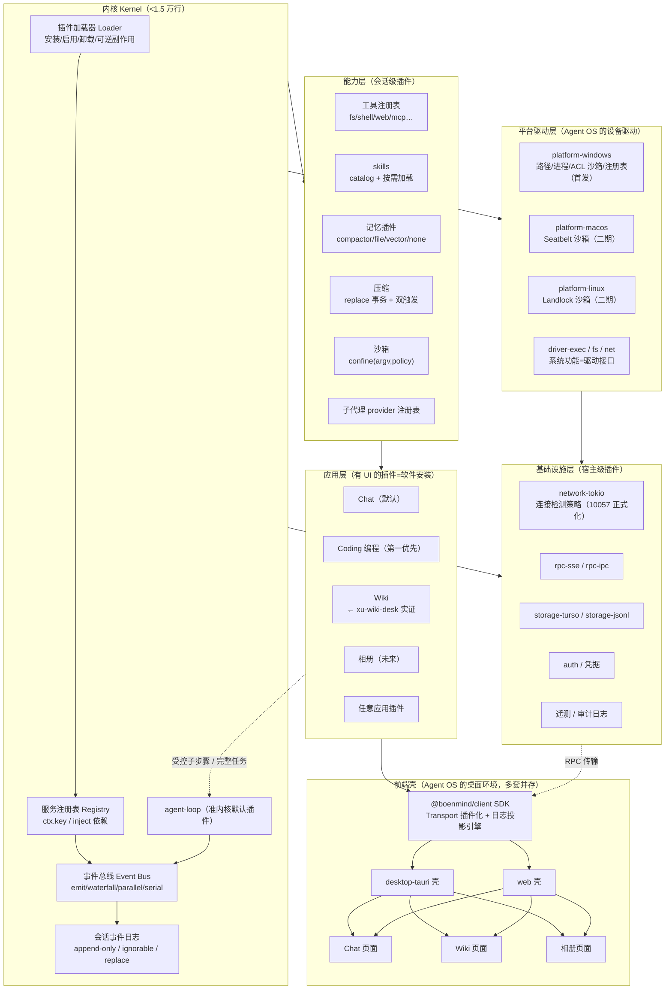

# BoenMind 2.0 ——「万物皆插件」架构设计（Agent OS 框架）

> 状态：**v0.24（2026-08-16 文档整理轮）**——v0.22 = 对话宿主化与场景作用域（§四·B 补充，已实施）；v0.23 = 应用布局系统（§四·B 补充 2，已实施：dockview 8.1 + DockLayout 宿主，2026-08-15）；**当前实施状态速览**：内核（bm-protocol/bm-kernel/bm-loop）建成且服务面 13 面注册接线完毕（2026-08-16，§7.2 状态）；Steward 三件套落地（§14.5）；桌面壳方向修正（经典三栏为主 + 桌面壳并存，§四·B）；编程应用 M1 验收通过、M2 进行中（§6.8 里程碑）
> 日期：2026-08-14 起持续迭代（2026-08-16 整理）
> 参考系：pi_agent_rust（2026-08-15 已整体删除，插件生态由 bm-compat 承接）、DeepSeek Harness（dsh）、ZCode（插件/技能/市场）、Hermes（NousResearch/hermes-agent）、**xu-wiki-desk（用户已有应用插件实证）**、**AI OS 赛道四项目（AIOS/MemGPT/Life Agent OS/kernel.chat，吸收见 §3.5）**、**OpenClaw（心跳/自调节奏，§14.2）**
> 本文档持续迭代，直到自认完美后交用户拍板。

---

## 〇、一句话愿景

**BoenMind 的内核只做一件事：把插件装起来、让插件互相看见、把一切都记进事件日志。除此之外，什么都不是内核——聊天不是内核，记忆不是内核，网络不是内核，UI 也不是内核。**

**长远形态：Agent 操作系统（Agent OS）。** 内核 = 操作系统内核；平台适配 = 设备驱动；前端壳 = 桌面环境；应用插件 = 安装的软件；插件市场 = 应用商店。**这个类比不是比喻，是同构**——Agent OS 的每一层都可以（且应该）在今天的架构里找到对应物，所以现在就按 OS 的纪律设计。

> 用户原话（2026-08-14）："长远上，它甚至可以发展成为Agent操作系统！每个独立界面的应用，是不是相当于当前的软件安装？……系统功能的调用也要做成插件，如果真的以后成为操作系统了，那这些系统功能，实际就是不动的驱动……现在linux, windows, macos的不同系统底层，也类似于调用插件了……前端就类似于现在桌面相对于linux的关系。"

## 〇·一、Agent OS 概念映射（贯穿全文的坐标系）

| 传统 OS | Agent OS（BoenMind 2.0） | 本文档章节 |
|---|---|---|
| 内核 | 最小内核：加载器/注册表/事件总线/会话日志 | §二、§五 |
| 系统调用（syscall） | 服务注册表（`ctx.<key>` 服务调用） | §5.2 |
| **设备驱动** | **平台驱动插件（win/mac/linux 各一个实现）** | **§四·A（新增）** |
| 硬件抽象层（HAL） | `Platform` trait（路径/进程/fs/系统/沙箱/网络） | §四·A |
| 进程调度 | agent-loop（会话调度）+ 子代理 | §5.3 |
| init 系统 | 插件加载器（依赖拓扑 + 可逆副作用） | §5.2 |
| 内存管理 | 上下文管理（压缩水线/预算） | §5.1、D10 |
| 文件系统 | `storage-*` + `fs` 服务（经平台驱动） | §四·A |
| 权限模型（DAC/MAC） | 权限三档 + 把关链 + 能力声明 | §5.4、§6.5 |
| 系统日志（journald） | 会话事件日志（append-only 可回放） | §5.1 |
| **桌面环境（GNOME/KDE）** | **前端壳（desktop-tauri / web / cli，多套可并存）** | **§四·B（新增）** |
| 软件安装 | 应用插件（manifest/安装/卸载/升级/依赖） | §6.4、§四·C |
| 应用商店 | 插件市场（marketplace + 版本/签名） | Z5、§四·C |
| 用户态/内核态 | QuickJS 沙箱（插件跑沙箱、宿主不受污染） | P1 |
| 驱动更新 | 平台驱动的热升级（现有热升级管线） | 现有资产 |

## 〇·二、三条铁律（用户定调，2026-08-14）

1. **Agent OS 是用户空间 OS，永远寄生在宿主 OS 之上**（用户："Agent 对底层的操作仍通过抽象层——也就是现在的操作系统；就算未来脱离，Agent 也应是高层调用，不涉及太底层"）。**Agent OS 不做裸机内核**：平台驱动层（§四·A）内部调的永远是宿主 OS 的 API（CreateProcess/fork/Seatbelt…），不碰硬件。宿主 OS 是现成的 HAL，重造它没有任何意义——"Agent OS"的"OS"指**应用层的运行时抽象**，类比 JVM 之于字节码（但更强：它管理会话生命周期、记忆、权限、应用生态）。渐进开发中"寄生"在 Windows/Linux/macOS 上是刻意选择：步子太大才扯蛋。

   **中间抽象层定位（v0.15，用户定调）**：BoenMind 是 **Agent 操作底层硬件时的中间抽象层**——三层图式：

   ```text
   Agent（高层调用，永不直接碰硬件）
     ↕
   BoenMind 运行时抽象层（会话生命周期/记忆/权限/应用生态/插件生态）
     ↕
   宿主 OS（win/mac/linux = 现成的 HAL）
     ↕
   硬件
   ```

   当前阶段以 win/mac/linux 为基础、寄生其上，是**分阶段演进**的刻意选择（§7.2 七阶段路线），不是一上来就搞终极 OS——终极形态（阶段 7 愿景）接管的是"Agent 生态的运行时"，宿主 OS 这层 HAL 永远复用不重造。

   **分发形态纪律（v0.15，用户定调）**：便携版、Docker 版都是**初级阶段的产物**——它们是**分发形态**，不是设计脊梁。推论：① 分发层的选择（静态目录服务 / embed 内嵌 / 单文件便携包）**不改变设计层的分离原则**（前后端唯一耦合点永远是 API）；② 任何"为了打包方便"而引入的设计层耦合（如 embed 把前端产物内嵌进后端二进制）都必须明确标注为**打包选项**（打包层 ≠ 设计层），并随阶段演进（阶段 4 前端隔离）回收到分发层。
2. **会话即生命周期，边界由 Agent 自主决策**（用户："要不要新开对话、记忆交接应该由 Agent 自己决定，长时任务才能真正搞下去"）。会话不是"一轮对话"，是**持续的事实流**；会话管理（分支/归档/恢复/合并/交接）是 Agent 的工具集，不是外部强加的边界（详见 §六·6 会话生命周期）。
3. **渐进式，复用优先，吸收不进核心**（用户："能利用现存的东西就不重复造轮子；简单的直接吸收到插件/软件/底层，**不是 Agent 核心**"；2026-08-14 更新：第一优先软件 = **编程应用**，Wiki 顺延）。吸收位置纪律：**一切吸收发生在内核之外**（插件层/应用层/驱动层），内核保持最小——"简单的东西"塞进内核 = 隐形核心膨胀，是本架构的第一大忌。

### 〇·三、生态接入原则：转接器（v0.14 新增，用户定调）

> 用户原话（2026-08-14，讨论接入 hermes 插件商店后）："核心插件，按我们自己的来写，不用说一定要抄谁的。但接入 zcode 生态，接入 hermes 生态，接入 deepseek 生态，还有很多……都可以不用动核心，只是安装个转接软件（升级到 OS 级别后，可以叫它们软件了）就能接入他们的生态，这正是我所希望的。当然，MCP 和 SKILL 跟他们没关系，这是整个 Agent 的生态，只是各家用的编程语言不同。"
>
> 补充澄清（同日）："核心自研，指的是**格式**不抄人家的；但核心插件的**思路**，别人好架构当然要学习过来。"

三条推论（架构纪律）：

1. **核心格式自研，思路广吸收**：内核 / 准内核 loop / 核心插件的**格式与实现**按自己的设计写，不照搬别人的代码形态；但别家的**好架构思路照学**——思路吸收进核心设计的正式通道 = §三 借鉴清单（D/P/Z/H/A/L，如 dsh 的 waterfall/事件日志、Life 的分支日志已进内核设计）。与铁律 3 的分工：**代码/实现不进内核（吸收落插件/驱动层），思路进核心设计（经借鉴清单登记）**；L9 架构依赖测试守卫依赖方向。
2. **生态接入 = 转接器，内核零改动**：zcode / hermes / deepseek / pi.dev / ……任何外部生态进来，都只是一个**转接器插件**——装一个"转接软件"即接入，不动内核。OS 级别后，转接器就是商店里的软件，类比 OS 装驱动/装应用而非改内核。**第一个实例 = pi-compat**（§7.1，接 pi.dev 生态，拆法 A）。评估纪律：任何"接入 XX 生态"的需求按**转接器成本**估工作量——"需要改核心"的方案一票否决。
3. **MCP 与 SKILL 是公海，不是哪家的地盘**：它们是整个 Agent 行业的通用协议层，语言无关，不属于任何单家生态——MCP client / SKILL 机制这类通用协议实现**做一次、所有生态共享**；各家差异（语言/协议细节）由各自的转接器消化。例：hermes 插件是 Python → 转接器 = MCP client 插件 + 一层 Python MCP server 薄壳；zcode / deepseek 生态同理，各写各的转接器。

转接器落点分层（对齐"吸收不进核心"的位置纪律）：

| 生态差异 | 由谁消化 |
|---|---|
| 分发层（商店目录/manifest/安装源） | 插件层转接器：manifest → ExtensionBody 清单（复用现有 npm/git 安装管线） |
| 协议层（通用工具/技能协议） | MCP client 插件 / SKILL 机制（通用协议实现，一次投入、各家共享） |
| 运行时层（语言不同） | 宿主运行时能力（QuickJS 已有；新语言如 Python 按"宿主能力扩展走政策拍板"承接，不进插件沙箱） |

位置不变式：**转接器在插件层/驱动层，永远不进内核**——"为了接某生态动内核"与本原则冲突，架构依赖测试（L9）已把依赖方向机器化。

## 一、什么是"插件"：双形态模型

本架构中插件有两种形态，**同一个插件可以同时具备两种形态**：

| 形态 | 是什么 | 例子 | 用户看到什么 |
|---|---|---|---|
| **能力插件**（Capability） | 钩进 Agent 会话里的工具/技能/记忆/策略，无独立界面 | web_search、ctx-compactor、记忆、沙箱策略 | 聊天中的能力 |
| **应用插件**（App） | 有独立功能界面的完整应用，**核心依然是一个（组）Agent** | Chat（默认）、**Coding（第一优先）、Wiki、相册**、文件浏览器 | 独立页面，外观不是 Agent |

关键不变量：**应用插件的界面只是"壳"，逻辑全部通过调用 Agent 核心完成**。Wiki 的"整理笔记"按钮 = 向后端发一条消息 → 后端起一个隔离的 Agent 会话 → 执行 → 结果回写 Wiki 存储 → 前端从事件日志投影刷新。

## 二、最小内核（The Kernel）：小到什么程度

对照四家的"核"：

| 系统 | 核是什么 | 核的大小 |
|---|---|---|
| pi | agent loop + 插件引擎 + 工具集（一切内置） | ~35 万行（我们对它的依赖面） |
| dsh | Cordis：服务容器 + 类型化事件 + 可逆副作用 | 5690 行 vendor |
| ZCode | 客户端本体 + 插件/技能/MCP 体系 | —— |
| **BoenMind 2.0** | 插件加载器 + 服务注册表 + 事件总线 + **会话事件日志原语** | **实测 6060 行**（2026-08-15 回头看：协议 908 + 内核 2975 + loop 2177，远低于预算） |

内核四件套，缺一不可：

1. **插件加载器**（Loader）：扫描/安装/启用/卸载插件，可逆副作用（卸载 = 撤销它注册的一切）。
2. **服务注册表**（Service Registry）：服务占稳定的 `ctx.<key>`，插件按 key 找服务，不 import 实现。依赖用声明（inject）而非手工编排。
3. **事件总线**（Event Bus）：类型化事件 + 四种分发模式（emit 观察 / waterfall 环绕中间件 / parallel 扇出 / serial 按序）。waterfall 是"环绕中间件"：监听器收 `(...args, next)`，不调 `next()` = 短路（策略拥有决策权）。
4. **会话事件日志**（Event Log）：append-only 的持久事实流，**一切状态的唯一事实源**。所有消息/工具/压缩/记忆投影都从它派生——"模型可见即已记录"。

**agent loop 不是内核，是第一个启动的默认插件**（`agent-loop`）。它的接口是 `Agent` trait：`send/steer/inject/cancel/whenIdle`，任何实现可替换它（dsh 验证了这条路）。但现实上 loop 是最难替换的插件——所以它享受"准内核"待遇：随内核发布、接口稳定、可替换但默认不动。

> **为什么要日志进内核而不是存储进内核？** 存储是可替换的实现（turso/JSONL/内存），日志是语义契约。内核只承诺"事件 append 是原子的、可回放的、有版本的"，不承诺用什么存。

## 三、四家借鉴清单（v0.2，四家齐）

### 3.1 从 dsh 吸收（架构主干）

| # | 机制 | 吸收理由 | 落地形态（Rust） |
|---|---|---|---|
| D1 | 无特权核心，注册=可逆副作用 | 一切皆插件的根本 | `ctx.effect()` 等价物（Drop 时反注册） |
| D2 | append-only 事件日志 + ignorable 守卫 + 版本升级链 | 回放/fork/压缩审计的地基 | `SessionEvent` enum + `SESSION_FORMAT_VERSION` |
| D3 | 压缩 = replace 表面操作 + sourceEventSeqs 引用链 | 压缩可审计、可重放（超越现有 ctx-compactor） | `SurfaceOp::Replace{start,end}` 事件 |
| D4 | 工具把关链（pre/guards/approval/execute/post + finalize） | 权限/沙箱/钩子与工具解耦 | 五个事件 + 单调守卫 trait |
| D5 | scope 隔离（agent 级 ctx）+ preset isolate realm | 多 agent 原生支持、会话级组合 | `ScopeKey` + realm 隔离 |
| D6 | profile/bundle/patch 分层组装 | 组合可审计、用户可覆写一切 | manifest + patch 层 |
| D7 | skill catalog 增量注入 + 按需加载 | 省 token、不干扰（现有注入式可迁移） | catalog 事件 + skill 工具 |
| D8 | 系统提示词片段注册（order/-100 身份/0 人格/100-199 工具） | 可组合的提示词工程 | `PromptSection` 注册表 |
| D9 | 会话日志级压缩事务（compaction/start→summary→replace→end） | 压缩状态本身可审计可恢复 | 事件协议 |
| D10 | 双触发压缩（0.8 水线 + overflow 硬触发重试）+ 摘要吃 KV-cache + 不切 tool 配对 | 比现有 50% 水线更完整 | 压缩插件默认实现 |

**落地状态（2026-08-16）**：D2（事件日志/分支寻址/fork 事件）、D3/D9（压缩 replace 事务 + 三事件协议）、D10（压缩插件默认实现 → bm-compactor）✅ 已落地；D4（把关链五事件）部分落地（PermissionBridge 询问链已就位，阶梯审批/配额待阶段 2 深化）；D1/D5/D6 是内核形态本身（加载器/服务注册表/scope 隔离已建成，§15.1）；D7/D8（skill catalog / PromptSection 注册表）待接线。

### 3.2 从 pi 吸收（资产与生态）

| # | 机制 | 说明 |
|---|---|---|
| P1 | QuickJS 插件沙箱（swc 转译 TS → QuickJS） | **BoenMind 最强的护城河**：真沙箱 vs dsh 的 node:vm。插件语言保持 TS |
| P2 | ExtensionBody 协议 / pi.dev 生态（200+ 插件） | 兼容层：新架构能直接加载现有 pi 插件（见 §7 兼容策略） |
| P3 | 权限三档（含 YOLO）+ 询问弹窗（PermissionBridge） | 已是 BoenMind 资产，升级为审批链（见 D4） |
| P4 | npm/git 插件安装（package_manager） | 安装机制保留 |
| P5 | 工具/skill 同构（都是注册进 ctx.tools 的东西） | 简化心智模型 |
| P6 | 压缩实测方法论（A/B token 对比） | 验收标准沿用 |

### 3.3 从 ZCode 吸收（产品与生态）

| # | 机制 | 说明 |
|---|---|---|
| Z1 | 极简 manifest（`plugin.json`：name/version/description/skills 目录） | 降低插件开发门槛；"目录即声明，manifest 补充" |
| Z2 | skills 目录发现 + 优先级链（用户级 > 工作区 > 插件级，同层 .zcode 先于 .agents） | 三层覆写语义，用户永远能覆盖插件 |
| Z3 | hooks（matcher + script，模板变量） | 轻量事件钩子，非插件开发者也能挂脚本 |
| Z4 | MCP 作为一等公民（config 里直接配 server） | 外部生态接入标准 |
| Z5 | marketplace.json（市场源）+ 插件缓存目录 + i18n（displayName_i18n/examplePrompts） | 商店/多语言的落地格式参照 |
| Z6 | 用户级/工作区级配置分层 | 与 Z2 同构的配置哲学 |

### 3.5 从 AI OS 赛道吸收（2026-08-14，研读结论见本节；决策轨迹存记忆 ai-os-landscape——AIOS/MemGPT/Life Agent OS/kernel.chat 四项目源码级研读，"Agent 自主会话边界"是赛道空白区）

| # | 机制 | 来源 | 落地 |
|---|---|---|---|
| A1 | **分支化事件日志** `(session,branch,seq)` 三维寻址 + fork/merge 只读 | Life Agent OS | 5.1：branch_id 字段 + fork/merge 事件（首版落字段，UI 二期） |
| A2 | **契约 crate 纯粹性**（零运行时依赖）+ **Port trait 契约**（14 个 `Arc<dyn>` 端口） | Life Agent OS | 5.2：`bm-protocol` 纯契约 crate + Port 集合 |
| A3 | **扩展事件走 Custom 命名空间**（Spec D4：稳定跨层才进一等变体） | Life Agent OS | 5.2：验证我们的"核心域 enum + 插件域注册式"两层分治 |
| A4 | **能力模式串** `fs:write:/session/**`（glob 而非枚举） | Life Agent OS | 6.5：能力声明改模式串 |
| A5 | **acap 降级四硬约束**（能力单调递减，规则保证非信任保证） | kernel.chat | 6.5：会话裁剪单调递减 + 类型化错误码 |
| A6 | **taint 污点追踪**（能力管"能不能"，taint 管"用什么数据做"） | kernel.chat | 6.5：提示注入的结构性拒绝 |
| A7 | **reject-before-execute 配额**（预检投影 + 原子记账，warn_at 软警） | kernel.chat | 5.4：BudgetTracker |
| A8 | **审计哈希链**（prev_hash+self_hash，篡改可检测） | kernel.chat | 5.4：审计事件哈希链 |
| A9 | **复合安全门**（policy+capability+budget+sandbox 四层链） | Life Agent OS | 5.4：GateChain |
| A10 | **投影折叠重放**为状态恢复 canonical 姿势（确定性测试） | Life Agent OS | 5.1：验证"日志即真相" |
| A11 | K-LRU 换页 + trie 压缩（记忆分层） | AIOS | 6.1：记忆插件二期（vector）参考 |
| A12 | 主动分页语义（prompt=RAM、存储=disk） | MemGPT/Letta | 6.1：与压缩 replace 事务互补 |

**避免照抄**：Life 的巨型 monorepo 编译期组合（无动态加载）、kernel.chat 的"宣称与交付脱节"（能力矩阵按 shipped/partial 诚实标注）、AIOS 的 Python 性能。

### 3.6 从 LoopX 吸收（2026-08-14 夜，用户点名；huangruiteng/loopx，Python，浅克隆 D:/96_CoderWorld/loopx）

LoopX 定位"长时运行 AI agent 团队的轻量 loop 工程状态内核"——与 BoenMind 同赛道不同分工：**我们是 session runtime（会话/事件/工具/权限），LoopX 是 goal-level 控制投影（目标/认领/配额/审查/交接）**。互补关系见 L14。

| # | 机制 | 说明 | 对 BoenMind 的落地 |
|---|---|---|---|
| L1 | **四角色职责模型**（Agent/Provider/Capability/Kernel） | 执行路径 Agent→Capability→Provider→外部系统；控制路径 readback→Capability→typed transition→Kernel。**"观察≠状态转移、Provider 回执≠进度，Capability 验证 + Kernel 提交才算"** | 对齐把关链（阶段 2）：工具体=Provider、把关链+验证=Capability、事件日志=Kernel |
| L2 | **回合决策词汇表**（LoopXTurnRoute 7 态 + LoopXTurnResultKind 10 态） | repair/replan/user_action/wait/blocked/host_failure/validation_failed/writeback_failed/quota_spend_failed 全是第一公民 | agent-loop 移植时扩 `TurnEndReason`（现有 3 态 + Interrupted 后仍偏少，参照此表 + dsh 六态） |
| L3 | **配额 should-run**（reject-before-execute + interaction_contract） | 执行前判定 + 交互契约六动词（deliver/wait/ask/replan/repair/stay-quiet） | 对齐 A7 配额（阶段 2）：预检投影 + 交互契约分档 |
| L4 | **任务认领/租约**（claimed_by 软认领 → 硬租约按需；per-(goal,todo) 竞争粒度；stale-claim fail-closed） | 重复认领/过期更新 = 显式 no-op 或冲突 | **100 小弟并行共享事件日志的协调模式**；活任务清单（todo/write）需认领语义（阶段 4 编程应用） |
| L5 | **事件溯源状态**（goal state = append-only 事件 + 投影重建） | run log 是证据日志 | 与事件日志底座同构，互相印证（A10） |
| L6 | **交接包 / 审查包**（handoff_packet 内容化预算化；review-packet 面向 owner） | 可验证交接 = 交接包 + 证据 | `session.transfer`（§6.6）内容设计参照 |
| L7 | **dreaming 后台规划**（只建议不执行：todo 提议/证据探针/重构警告，advisory） | 建议走队列，执行仍走配额+把关链 | Steward（§6.7）低风险治理面参照：先出建议、执行必过闸 |
| L8 | **心跳自动唤醒契约**（quota 前置检查 + DONT_NOTIFY 等行为契约 + cadence 分层） | 定时唤醒不是产品真相，配额决策才是 | Steward 空闲巡检心跳（30min）契约化参照 |
| L9 | **架构依赖测试**（依赖方向机器强制 + allowlist 记录迁移债） | 新外向边使测试失败；隐藏依赖不算分离 | **铁律 3"吸收不进核心"从人工审计升级为 CI 架构测试**：bm-protocol 零依赖、bm-kernel 不得依赖 bm-server/bm-core，可测试化 ✅ **已落地（2026-08-14，commit 2cde412）**：三 crate tests/architecture.rs（Cargo.toml 全形态解析 + 源码隐藏引用扫描），负向验证通过、CI 强制 |
| L10 | **authority sources**（可审查上下文 + 冲突规则，替换隐式模型记忆） | 决策依据留痕可审查 | Steward 治理决策引用权威来源留痕（阶段 5） |
| L11 | **终身目标不变量**（lifetime goal：可恢复四问 + 一步有界可验证动作） | 目标跨会话存活；每次只走一步、每步可验证；不宣称开放式自主权 | `goal/*` 事件域（预留）的语义锚 |
| L12 | **前场/后场分离**（frontstage 渠道化投影，backstage ledger 是真相；Chat 不是真相源） | registry/state/history/quota/gates/lease 是后场台账，UI 是投影 | 治理面板/前端 UI 都是投影（§6.3），与"事件日志唯一事实源"同构 |
| L13 | **写者正确性先于服务**（重复心跳/配额消耗/过期 todo 更新 = 显式 no-op 或冲突；乐观 revision） | 先修写者并发正确性，再谈 server | 阶段 3 RPC 代理写的前置纪律：幂等键 + 乐观 revision |
| L14 | **session-runtime control-plane adapter**（对已有 session 运行时的平台，控制面作为"目标层投影"接入而非第二运行时） | 摄入紧凑摘要，产出 goal_state/operator_gate/handoff_packet 等投影 | **我们就是 session runtime**：Steward/目标域作为投影接入，不自造第二运行时 |
| L15 | **类型化 turn 事务收据链**（settlement_identity 幂等键 + validation→durable_writeback→quota_spend→scheduler_apply→ack 有序前缀推进，失败 typed 到具体 phase） | 每个 turn 一个带幂等键的 plan，阶段收据有序推进 | 把关链（阶段 2）的 effect-pipeline 参照：工具结果必须过"验证→落账→记账→调度→回执"有序链 |
| L16 | **事件 append 的指纹冲突检测 + 投影 source_checksum**（AppendOnlyStateEventStore：锁内重读去重、fingerprint 冲突抛错、append_sequence 追加、投影重建带校验和） | 无 SQLite 的可靠事件库姿势 | 我们 turso 单写者已同款语义（UNIQUE + repair_heads）；source_checksum 可作审计增强（重放完整性校验） |
| L17 | **O_EXCL sentinel 预留 + "产物存在即跳过"防半成品覆盖**（run 文件 JSON+MD 成对 + index 附加索引） | 比纯锁更稳的多进程写文件协议 | 阶段 3 RPC 代理写 / 多实例时的文件产物命名与预留协议参照 |

**源码级验证校准（2026-08-14 夜，12 项核实：8 属实 / 4 部分属实）**：
- L1：CapabilityRegistry 与"验证→写回→记账有序收据"真实存在，但 LoopX 没有统一的 Kernel 抽象（四角色是文档模型、代码部分成体系）——不影响吸收，我们的 Kernel=事件日志+注册表本来就成体系；
- L3：配额 should-run 与 interaction_contract 属实，但**自动唤醒只是 RRULE/scheduler_hint 驱动 + cadence 提示级**（无独立唤醒调度器）；
- L4/L13：软认领属实，但 LoopX 的乐观 revision 检查**仅 shadow 形式未强制执行**（读文件→改→原子写，无 CAS）——这是 LoopX 自己的债，我们不照抄：幂等去重/文件锁/O_EXCL 已落地（L17），乐观 revision 我们直接按强校验做；
- L5：LoopX 有**两条独立日志线**（state event log JSONL + rollout 证据日志 JSONL）——我们统一为一条事件日志底座，是相对优势，保持；
- L7：advisory 语义硬编码属实（proposal_only_until_promoted、不可改状态不可花配额），但形态是 CLI 触发 + operator 决策，非常驻后台队列。

**避免照抄**：LoopX 是 Python + CLI 文件态（无动态插件、无 QuickJS、无 UI 应用层），控制面不碰会话执行——它的"适配器对接 Codex/Claude Code"正是我们内核 + 应用插件已经解决的部分。

### 3.4 从 Hermes 吸收（NousResearch/hermes-agent，Python 26.7 万行）

| # | 机制 | 说明 | 对 BoenMind 的意义 |
|---|---|---|---|
| H1 | **一个模式多路复用**：目录插件 + register(ctx)/ABC 子类 + 独立发现路径，插件边界按能力面切分（memory/context-engine/browser-provider/platforms 20+/cron/observability 各一套） | 不搞"统一大插件"，每个能力面有自己的 provider 注册表 | **"万物皆插件"的落地模式**：注册表按能力面切分，不要求所有插件同构 |
| H2 | 注册表即契约：`registry.register()` 单入口 + 模块级自注册 + AST 扫描自动发现（mtime+size 磁盘缓存） | 工具注册不维护平行结构 | 工具 schema 自动生成 |
| H3 | **Hook 覆盖面**：pre/post_tool_call、pre/post_llm_call、on_stream_*、pre_verify（验证循环门控）、pre/post_api_request、api_request_error（provider 可接管错误分类）等 20+ 钩子 | 核心循环的每个决策点都留钩子 | 与 dsh 的 waterfall 扩展点互补：dsh 是"服务层事件"，Hermes 是"调用层钩子"，两者都要 |
| H4 | **记忆 = MemoryProvider 插件**（ABC：prefetch/sync_turn/system_prompt_block/on_pre_compress/get_tool_schemas），8 个实现（holographic 本地默认/byterover/hindsight/honcho/mem0/openviking/retaindb/supermemory），仅一个活跃，后台异步写入，压缩前 on_pre_compress 保存 | **用户点名要的"记忆系统插件化"的直接参照** | MemoryPlugin trait 设计对齐 Hermes ABC + dsh 日志投影 |
| H5 | context engine 插件化（默认 compressor，可换 lcm 等） | 压缩引擎可替换 | 压缩插件接口参照 |
| H6 | 技能自创自改闭环：background_review（fork 回放对话快照，白名单仅 memory+skill 工具）+ curator（pin/archive/consolidate 绝不删除）+ learning graph | 自我改进是最大卖点 | 远期可吸收（架构上 = 一个观察日志的插件，天然兼容） |
| H7 | 供应商注册表模式：web_search/TTS/图像/视频 provider 各一注册表 | 与现有 web_search 多源设计同构 | 确认现有方向正确 |
| H8 | 懒加载依赖：第三方后端首用才装，核心依赖极小（供应链安全） | | 插件依赖按需加载 |
| H9 | 权限纪律：override 内置工具需显式 opt-in、scope 隔离（_scoped_tools）、能力声明、审计日志 | | 插件权限模型参考 |
| H10 | 压缩工程细节：CompressionCommitFence 防中断半提交、跨进程 SQLite 锁、受保护尾部、**技能标记重注入**（压缩中丢失的技能在摘要里插回调用提示） | | 压缩插件实现细节 |
| H11 | 会话库 SQLite + FTS5 + **CJK 分词原生扩展**；session_search 工具 DISCOVERY/SCROLL/BROWSE 三模式零 LLM 成本 | | 与 turso FTS5 路线呼应（回忆此前 sqlite-storage-and-search-limits 调研） |
| H12 | PTC 程序化工具调用：execute_code = LLM 写脚本经 RPC 回调父进程工具，多步流水线坍缩为单轮 | 与 dsh PTC 同构（TS 版） | 印证 PTC 是通用模式，语言无关 |

## 四、总体架构（分层图）

```
┌────────────────────────────────────────────────────────────┐
│  应用层 App Plugins（有独立 UI，核心是 Agent）                │
│  ┌──────┐ ┌──────┐ ┌──────┐ ┌──────────┐                  │
│  │ Chat │ │Coding│ │ Wiki │ │ 任意应用  │  ← 前端页面包      │
│  │ 默认 │ │第一优│ │      │ │ 插件      │     + 后端路由包    │
│  │      │ │先    │ │      │ │           │                  │
│  └──┬───┘ └──┬───┘ └──┬───┘ └──────────┘                  │
│     └────────┴───┬────┴─── 全部调 Agent 核心（隔离会话）     │
├──────────────────┼─────────────────────────────────────────┤
│  能力层 Capability Plugins（钩进 Agent 会话，无界面）        │
│  工具（fs/shell/web/…）│ skills │ 记忆 │ 压缩 │ 沙箱         │
│  子代理 │ MCP client │ 提示词片段 │ 计划/目标/定时            │
├──────────────────┼─────────────────────────────────────────┤
│  基础设施层 Infrastructure Plugins（宿主级，无界面）         │
│  网络传输（连接检测策略）│ RPC 协议 │ 存储后端 │ 认证          │
│  遥测/审计 │ 凭据 │ 日志持久化                                │
├──────────────────┼─────────────────────────────────────────┤
│  内核 Kernel（<1 万行）                                      │
│  插件加载器 │ 服务注册表 │ 事件总线 │ 会话事件日志原语         │
│  └─ 准内核：agent-loop（默认插件，随内核发布）                │
└────────────────────────────────────────────────────────────┘
```

**三层的注册规则**：
- 应用插件注册：前端包（页面/导航项/快捷键）+ 后端包（路由/服务/工具）；权限最高（用户显式安装、显式启用）。
- 能力插件注册：工具 schema / 提示词片段 / 策略；作用于其被挂载的会话作用域（scope）。
- 基础设施插件注册：全局服务（`ctx.network`、`ctx.rpc`、`ctx.storage`）；替换需用户确认（影响面最大）。

### 4.1 总体架构图（Mermaid）



### 四·A 平台驱动层（Agent OS 的"设备驱动"，v0.5 新增）

**用户的核心洞见：现在 Linux/Windows/macOS 的底层差异 = 驱动插件；将来 Agent OS 上的系统功能 = 不动的驱动。** 所以平台适配现在就要按驱动模型设计——接口固定，实现随平台换：

```rust
// 平台抽象 = 硬件抽象层（HAL）。一个平台一个实现，其余插件只面对接口。
trait Platform: Plugin {
    fn os(&self) -> OsKind;                            // windows / macos / linux
    fn path(&self, kind: PathKind) -> PathBuf;         // 路径语义：home/config/data/cache/temp
    fn process(&self) -> &dyn ProcessDriver;           // spawn / 信号 / 退出码 / 进程树
    fn fs(&self) -> &dyn FsDriver;                     // 文件操作（权限/锁/符号链接语义差异）
    fn system(&self) -> &dyn SystemDriver;             // 自启动 / 通知 / 托盘 / 文件关联 / 注册表
    fn sandbox(&self) -> Option<&dyn SandboxDriver>;   // OS 级沙箱：win ACL / mac Seatbelt / linux Landlock
    fn net(&self) -> &dyn NetDriver;                   // TLS / 代理 / 连接检测（与 §6.2 协同）
}
```

- **系统功能服务（fs/shell/network/process）一律经平台驱动实现**——上层插件只面对统一接口。这就是"驱动"语义：**接口固定、实现随平台换、换平台 = 换驱动**。
- 现成证据：dsh 的沙箱平台链（bwrap→Landlock→Seatbelt→Windows ACL，按后端分类 + 功能探测 + fail-closed）就是**沙箱驱动**的雏形；Hermes 的 7 种终端后端（local/docker/ssh/modal…）是**执行环境驱动**的雏形；Hana 的 Windows C++ 沙箱 helper 是**平台原生驱动的雏形**。BoenMind 2.0 把它们统一成一套 `Platform` 纪律。
- 平台驱动清单（首版，S 系列审计后）：
  | 驱动 | 职责 | win | mac | linux |
  |---|---|---|---|---|
  | `platform-windows` | 路径/进程/自启动/通知/ACL 沙箱/注册表 | ✓（首发） | — | — |
  | `platform-macos` | 路径/进程/自启动/通知/Seatbelt 沙箱 | — | 二期 | — |
  | `platform-linux` | 路径/进程/自启动/通知/Landlock 沙箱 | — | — | 二期 |
  | `driver-exec` | 命令执行（进程驱动之上的策略壳） | 现有 exec 政策迁移 | | |
  | `driver-fs` | 文件系统服务（watch/glob/权限语义） | 现有 fs 工具迁移 | | |
  | `driver-net` | 网络驱动（§6.2 ConnectPolicy 的平台落地） | 10057 修复正式化 | | |
- **与热升级的关系**：平台驱动参与现有热升级管线（驱动更新 = 打补丁的正式化），驱动接口变更 = 大版本事件（驱动 ABI 稳定性纪律，同 OS 的 driver ABI）。

### 四·B 前端 = 桌面环境（Agent OS 的"DE"，v0.5 新增）

**用户的核心洞见：前端之于内核 = 桌面环境之于 Linux。** 推论：桌面环境可以有多套（GNOME/KDE 并存），前端壳也应该可以有多套，且都不是内核：

| 前端壳 | 形态 | 状态 |
|---|---|---|
| `desktop-tauri` | 桌面壳（现有）——默认 DE | 现有资产，迁入 |
| `web` | 浏览器 SPA——第二 DE | 现有资产，迁入 |
| `cli` | 命令行壳 | 可选 |
| `headless` | 无头模式（dsh headless 参照） | 二期 |

- **DE 的契约**：前端壳 = `@boenmind/client`（Transport + 投影引擎）+ 应用注册器（导航/页面/快捷键/托盘）。内核不关心前端长什么样，只提供 API + 事件流。
- **多 DE 并存**：同一内核可同时服务 desktop 和 web（RPC 传输不同：local-ipc vs SSE）——这已经是现状（Tauri 壳 + Web 端共存），v0.5 把它正式化为"DE 可插拔"。
- **DE 与应用的边界**：应用插件的前端包跑在 DE 里（像软件窗口跑在桌面环境里），DE 提供窗口/导航/通知等宿主能力，应用提供内容。

> **方向修正（2026-08-15 晚，用户自省）**：桌面壳（OS 形态：菜单栏/Dock 磁吸/窗口层叠/星空壁纸）已上线并经八轮迭代验证可行，但用户判断"直接 OS 界面不合适"——**恢复经典三栏软件界面为主（默认），桌面壳保留为可切换形态**（外观页形态切换，viewMode 持久化，双 DE 并存）。这恰好实证了本节"多 DE 并存"原则（DE 切换 ≠ 前端包插件化，后者属 §四·C 远期项）；插件/SKILL 分目录（系统增强 vs 功能）UI 分 tab（manifest category 字段）随此轮落地。这条歧路（OS 形态桌面为默认）的完整论证与回撤记录见 docs/archive/HANDOFF_DESKTOP_SHELL.md（调研素材 docs/research/2026-08-15/desktop-shell-landscape.md）。

### 四·B 补充：对话宿主化与场景作用域（v0.22，用户拍板）

**对话界面 = 宿主能力，不是应用能力。** 用户洞察（2026-08-15）：每个带 LLM 的软件都有对话框，不该每个应用插件重写一个对话界面。对话本质是事件日志的投影面（回合/流式/工具调用都是协议层的东西），与窗口/导航/通知同属 DE 宿主能力——就像 Windows 的记事本和 Word 共用剪贴板，而不是各自实现一个。

- **ChatPane（宿主共享组件）**：从 ChatWindow 抽取的消息流/输入/工具调用/流式渲染组件，带形态变体（全窗 / 侧栏 / 底部条）；应用需要对话 = 嵌入 ChatPane 并绑定自己的会话，不需要则不嵌；**编程壳 = 右栏 Tab（任务/对话）切换**（拍板 1A）。
- **会话绑定场景**：会话加 `app` 字段（chat/coding/wiki/video…），创建时定；**一软件一会话**（拍板 2A），事件日志天然按会话隔离——审计/续跑/数据血缘不变。
- **工具面按场景组装**：引擎按 `session.app` 组装工具面——内置手脚（read/write/edit/grep/find/ls/bash/todo/subagent）+ 系统增强插件（ctx-compactor 等）全局生效；场景工具（剪辑渲染/wiki 检索等）只在该场景注册——"剪辑插件不在编程生效"由机制保证，模型工具面干净。
- **skill 场景注入**：skill 声明场景，场景激活才注入系统提示（随 M2 深化做，拍板 4A）。
- **§四·C 落地时**：应用/插件 manifest 加 `scopes: ["coding", …]` 声明生效软件；前端槽位注册（宿主定义 chat-pane/settings/toolbar 槽位，应用声明注入——学 dsh ui-slots **思路**按本架构落，不抄代码）；插件分类标签（系统增强/功能）= 作用域前身（system = 全局、app = 场景级）。

### 四·B 补充 2：应用布局系统 = 可停靠视图容器（v0.23，用户拍板）

**用户洞察（2026-08-15）：软件界面应该是 VS Code workbench 模型**——应用内容区 = 可停靠布局容器（dock layout），不是写死的组件树。用户原话要点：① 参考 VS Code；② 子窗口可停靠左/右/中上/中下 + **悬浮叠加**（最重要）；③ 多个子窗口可叠同一位置以 Tab 切换；④ 每个子窗口可关闭、可最大化；⑤ 分界线可拖拽；⑥ 导航图标右键 → 重置布局；⑦ 每个功能（命令行/文件树/聊天/任务列表）都是子窗口形式的公共基础组件；⑧ 每个软件插件点进去有默认布局；⑨ 设置界面保持现状。

**布局 = 宿主能力（DE 层），不是应用能力。** 与对话宿主化（§四·B 补充）同一条线：视图（ChatPane/TerminalPane/FilePanel/TodoPanel/Editor…）是宿主公共组件，布局容器是摆放它们的宿主能力，应用 = 默认布局 + 视图集合声明。

- **布局库（上游吸收 T5）**：**dockview 8.1**（@dockview/core + @dockview/react，MIT，2026 调研最优：功能全/最活跃/零依赖核心）——不重复造轮子（用户原则：网上有的就用网上的，转官方插件 + 台账）；封装为宿主组件 `DockLayout`，不直接散用上游 API
- **视图注册表 VIEWS**：宿主公共组件清单（chat-pane/terminal/file-panel/todo-panel/editor/session-list…）——前端静态注册先做，manifest 动态注册随 §四·C
- **视图实例语义（用户拍板）**：**对话视图单实例且绑定应用场景**——编程里的对话是"编程专家"，焦点在编程功能上，不会跑到 WIKI；对话实例 = 场景的聚焦会话（复用 §四·B 补充的 session.app 机制）；**其他视图（终端/文件树/任务列表/编辑器）可多开**（dockview 原生支持同组件多实例，以 key 区分）；专家团队模式（多模型并行对话）属模型层语义，与界面布局无关，另行拍板
- **默认布局 + 重置**：每个应用一份布局快照（localStorage 起步，后端配置后做）+ 默认布局声明（应用进入未保存过布局时恢复默认）；导航图标右键菜单 → 重置布局（拍板点 6）；设置界面不动（拍板点 9）
- **与桌面壳关系**：桌面形态 = 应用窗口（外层），窗口内 = DockLayout（内层）——两层语义；经典壳 = 主面板即 DockLayout
- **迁移路径**：编程壳（CodingApp 三栏 → 默认布局：左=文件树/中=编辑器/右下=任务|对话|终端叠放）→ 聊天应用（左=会话列表/中=ChatPane）→ 新应用按默认布局声明接入

### 四·C 应用 = 软件安装（Agent OS 的"包管理"，v0.5 新增）

**用户的核心洞见：每个独立界面的应用 = 软件安装。** 那么软件安装的纪律全部适用：

- **安装**：应用插件目录（manifest + frontend/ + backend/）→ 安装 = 复制 + 注册 + 启动加载（复用现有插件安装管线 + 热升级）。
- **卸载** = 逆序 disposer（可逆副作用保证）+ 数据保留询问（软件卸载的"是否保留数据"）。
- **升级**：版本语义（SemVer）+ 兼容性声明（min-kernel-version，类比 Hana 的 minAppVersion）+ 热升级（现有管线）。
- **依赖**：应用 A 依赖应用 B 的能力 → 依赖声明 + 版本解析（现有 npm/git 安装器的解析能力扩展）。
- **市场** = 应用商店：marketplace.json（Z5）+ 签名/验签（现有 74B 验签）+ 商店即"货架"（此前拍板"不做浏览界面"，商店 UI 本身可以是一个应用插件！）。
- **审计**：安装记录（版本/来源/hash，Hana 的 plugin-installs.json 参照）——软件安装的"已安装程序列表"。

## 五、核心机制草案（v0.2 要点）

### 5.1 会话事件日志（一切的地基）

```
SessionEvent {
  seq: u64,            // 单调连续
  time: i64,           // epoch ms
  type: EventType,     // 类型化枚举（插件可注册新变体）
  data: Json,          // lossless JSON
  ignorable: bool,     // 未认识可跳过；缺省=必需（不认识必须拒绝重建）
  surface_op?: Append|Replace{start,end},  // 仅消息面事件
  source_seqs?: [u64], // 引用链（压缩遮蔽、chunk→message）
}
```

事件类型（**首版只注册正在使用的域**，其余按需添加，ignorable 兜底，见 S9）：

**核心域**：`turn/start|end`、`step/start|end`、`user/message`、`assistant/chunk|message`、`tool/call|result`、`request/header`、`branch/fork`（2026-08-15 落地：子分支首事件）
**压缩域**：`compaction/start|summary|end`（replace 事务）
**记忆域**：`memory/write`（记忆投影写回日志，防重放漂移）
**扩展域（插件可注册）**：`app/*`（应用插件）、`infra/*`（基础设施）、`goal/*`、`schedule/*`、`todo/write`——**先用后注册**，注册 = 声明协议版本与 ignorable 语义

**三大不变量**：① 模型可见即已记录；② 新模型可见输入必须新增事件类型；③ 压缩/记忆/一切投影都可从日志重放复现。

> **真相源标注（2026-08-16 审查 P1-2）**：执行态当前真相源 = **SQLite messages 表**（前端历史与 REST 读取源），事件日志为 **sidecar**（todo 投影等已闭环，消息面未闭环——双写过渡态）。崩溃窗口（毫秒级）无对账任务：窗口①（add_message 后、UserMessage 落日志前）日志缺用户消息；窗口②（TurnEnd 落盘后、add_message 前）db 缺助手文本。双写范围**冻结**至 M3（断点续跑迁移门槛）统一收口——过渡期不引入双向对账（内容/时间匹配误判风险大于毫秒级窗口收益）；日志侧未闭合回合由 `recover_interrupted_turns` 补写（A4）。"唯一事实源"是目标态承诺，当前态以本节标注为准。

**checkpoint 与并发（v0.3 补充）**：
- **持久化策略**：事件流 append 即写日志表（turso 单写者 tokio Mutex，现有基础），**checkpoint 仿 dsh 的 checkpoint-policy**——每请求边界（request/header 落盘点）做一次 fsync 级持久化，轮次不等待 flush（`whenIdle()` 时消费者自行 flush）；崩溃恢复：未闭合的 turn 由加载器打 `interrupted` 标记（dsh 的 TurnEndReason 语义）。
- **并发写**：单进程内单写者（Mutex 串行 append）；跨进程（如子代理子进程）不走日志直写，走 RPC 代理写（未来 multi-instance 时引入租约）——**首版不承诺多进程并发写**（S9 缩小范围）。
- **压缩锁（预留语义，2026-08-15 标注未实现）**：dsh 语义是 unmatched `compaction/start` = 压缩中、恢复时据此完成或回滚事务。当前不实现的原因（如实标注）：单写者（会话串行锁）下无并发压缩者；回放幂等（有 summary 的 Replace 重放无害、无 summary 的悬空 start 无表面效果）——实际无影响。多实例 / RPC 代理写（阶段 3）引入第二写者时，随 L13"写者正确性先于服务"补实现。

**分支化事件日志（v0.6 吸收，Life Agent OS）**：会话日志预留 `(session_id, branch_id, seq)` 三维寻址——fork 产生独立序列、merge 后分支转只读、fork 超头拒绝。**会话分支（"回滚到旧分支"语义）不再是前端功能，而是日志第一公民**。`branch_id` 字段与 fork 事件类型已落地（2026-08-15：`EventLog::fork` 以 `branch/fork` 标记为子分支首事件，记录 fork 点来源）；merge 事件随 session.* merge 工具落地时补（先用后注册）。分支 UI 二期（对齐 Hana 的会话分支拍板点）。

### 5.2 服务注册与事件（Rust 版 Cordis，v0.6 深化）

- `Ctx` 结构：`ctx.plugin(...)` 挂插件、`ctx.service(key)` 取服务、`ctx.on/emit/waterfall/parallel/serial`。
- 依赖声明：`Plugin::deps() -> &[ServiceKey]`，注册表拓扑排序启动，失败回滚整棵子树。
- 可逆副作用：每个注册返回 `Disposer`（RAII），插件卸载 = 逆序执行全部 disposer。
- **契约纯粹性（v0.6 吸收，Life Agent OS）**：内核契约 = 独立的零运行时依赖 crate（`bm-protocol`，无 tokio/turso 依赖，纯类型 + trait 定义），所有模块依赖它、模块间不 import 内部实现（桥 crate 单向翻译）。**契约 crate 里只有接口没有实现**——最小内核的"最小"由它锁定。
- **Port trait 形式化（v0.6 吸收，Life Agent OS）**：服务注册表 = 一组 Port trait（`EventStorePort` / `ModelProviderPort` / `ToolHarnessPort` / `PolicyGatePort` / `ApprovalPort` / `SessionPort` / `MemoryPort` / `NetworkPort` / `StoragePort`…），全部 `Arc<dyn Port>` 可换、各带独立 mock 测试。插件实现 Port，内核依赖 Port 而非实现。
- **Rust 无 TS 声明合并 → 事件类型的注册式设计**（核心难点，两层分治）：

```rust
// 1. 核心域：强类型 enum（性能 + 编译期检查），变体即契约
pub enum CoreEvent {
    TurnStart { turn: u32 },
    UserMessage(Box<UserMsg>),
    AssistantChunk { turn: u32, step: u32, chunk: StreamChunk },
    ToolCall { turn: u32, step: u32, call_id: CallId, name: String, args: String },
    /* turn/end, step/start|end, assistant/message, tool/result, request/header, compaction/* */
}

// 2. 插件域：注册式（灵活 + 前向兼容），EventId(字符串+版本) + type_id 动态分派
declare_event!(WikiPlugin, WikiIndexed { wiki_id: String, node_count: u32 });
// 序列化走 serde_json，与日志 JSON 语义对齐；不认识 → ignorable 守卫裁决

// 3. waterfall 的 Rust 形态：
ctx.waterfall("agent/pre-step", args, |next| async move { /* 决策 */ });
```

- **两层分治**：核心域（turn/step/user/assistant/tool/request/compaction/memory/branch）用强类型 enum，插件域用注册式——避免"一个巨型 enum 所有人都要改"，也保留插件自由扩展。**✅ 插件域注册式已落地（2026-08-15）**：bm-protocol 的 `declare_event!` 宏（生成强类型结构 + `to_custom`/`from_custom` + 类型名/载荷校验，测试固化）；内核经 `EventKind::Custom` 透传不解释。
- **与 Life Agent OS 互相印证**（Spec D4）：跨层稳定事件才进一等枚举变体，层内扩展一律 `Custom{event_type: "命名空间.事件"}`——我们的"插件域注册式"正是同一原则的 Rust 形态。
- 代价说明：插件域类型安全稍弱（字符串 EventId），换取自由扩展——与 dsh 的 TS 声明合并各有利弊，Rust 侧这是正解。

### 5.3 agent loop（准内核，默认插件）

接口（对齐 dsh 的 Agent trait + pi 的现有会话句柄）：

```rust
trait Agent: Send + Sync {
    fn send(&self, msg: UserMessage, target: InboxTarget, wakeup: bool);
    fn inject(&self, ctx: ContextMessage);       // 注入不唤醒
    fn cancel(&self, cause: CancelCause);
    fn when_idle(&self) -> impl Future;           // 维护期互斥
    fn run_maintenance(&self, job: Job) -> ...;   // 压缩等借壳
}
```

默认实现 `ReactLoopAgent`（从 dsh 的 496 行主循环移植）：turn/step 双层边界、inbox 回合队列（next-turn；**M2 修订**：原承诺的 next-step 回合内步骤队列已删——回合内步骤由 LLM 工具调用驱动，注入的"继续指令"无真实消费者，保留即死代码）、每步从日志投影、五个扩展点（pre-step / request / request-error / tool pre+post / turn-stopping）。

### 5.4 工具把关链（权限的正式化，v0.3 细化）

```
tool/call 落日志 → pre-execute(waterfall) → 单调守卫 → approval(一次性) 
→ execute(waterfall, 超时/重试) → 工具体 → post-execute(waterfall) → finalize → tool/result
```

- 权限三档升级为"阶梯 + 审批"：`read-only → workspace-write → danger`，升级需 justification + 用户一次性批准（dsh 范式）。
- **与现有 PermissionBridge 的桥接**：现有弹窗询问（`extension-permissions.json` 权威 + SSE 弹窗 + oneshot 回传）原样保留为 `approval` 服务的**宿主实现**——2.0 把"询问"从插件机制（P5 补丁）升级为"把关链的一环"，询问 UI 本身以后也可以换（桌面弹窗 / 通知栏 / 无头自动策略）。
- **配额（v0.6 吸收，kernel.chat 的 ulimit-tok）**：会话级 `BudgetTracker`——token/时长/成本/子代理数四维配额，**reject-before-execute 两段式**（执行前预检投影 + 原子记账；硬限拒绝、`warn_at` 比例软警不阻塞）——"失控 agent 突破配额"在结构上不可能。
- **复合安全门（v0.6 吸收，Life Agent OS 的 GateChain）**：policy + capability + budget + sandbox 四层 filter 串成一条链，任一层拒绝即整链拒绝，失败降级 `Recover → AskHuman`。
- 沙箱是 `confine(argv, policy)` 包装器（dsh 范式），策略按调用携带，fail-closed（阶段 3 落地，S6）。
- **审计哈希链（v0.6 吸收，kernel.chat）**：把关链的所有决策（能力检查/审批/拒绝/taint 拦截）落审计事件，审计日志用 `prev_hash + self_hash = sha256(canonicalize(entry))` 哈希链——**篡改可检测（verify 返回破坏点）**。能力声明/权限决策可审计，与应用插件的能力声明哈希（canonicalize 模式）同源。

### 5.5 组装与配置（bundle + patch，profile 二期）

- **profile**：具名组装（`~/.boenmind/profiles/<name>`），列出 bundles + 用户 patch。
- **bundle**：分发单元（npm 包 or 本地目录），`manifest.json` 的 `dsh.bundle.patch` 指向补丁文件。
- **patch 层**：`bundle 顺序 → profile patch → 用户 patch → 运行时 --patch`，按 id 覆写，全部可审计。
- **配置**：`settings.json` 三层（用户 > 工作区 > 插件默认），照 ZCode 的 Z2/Z6 语义。

## 六、用户点名领域的插件化设计（v0.2）

### 6.1 记忆系统 = 插件（用户点名，v0.2 升级）

原则：**记忆不是"核心注入文本"，是"事件日志的投影服务"**。事件日志是事实源，记忆插件是投影——所以记忆永远可重建、可审计、可替换。

设计对齐 **Hermes 的 MemoryProvider ABC（H4）+ dsh 的日志投影（D2/D9）**：

```rust
trait MemoryPlugin: Plugin {
    // 观察：随会话推进同步（Hermes: sync_turn）
    fn on_turn(&self, ctx: &AgentCtx, ev: &SessionEvent) -> Result<()>;
    // 后台异步维护（Hermes: _submit_background；Hana: 每日流水线）
    fn maintain(&self, ctx: &AgentCtx) -> Result<()>;
    // 注入形态：可空（Hermes: system_prompt_block，有界字符）
    fn project(&self) -> Option<PromptSection>;
    // 模型侧记忆工具 schema（Hermes: get_tool_schemas）
    fn tool_schemas(&self) -> Vec<ToolSchema>;
    // 压缩前保存机会（Hermes: on_pre_compress）
    fn on_pre_compress(&self, ctx: &AgentCtx);
    // 检索（模型工具调用的实现）
    fn retrieve(&self, q: &Query) -> Vec<MemoryHit>;
}
```

生命周期（对齐 H4）：**仅一个活跃记忆插件**（配置 `memory.provider`），后台异步写入不阻塞循环，压缩前 `on_pre_compress` 给保存机会——**所有投影都从事件日志可重建**，插件损坏 = 换一个实现，历史不丢。

实现（首版两个，见 S2）：
| 插件 | 机制 | 参考 |
|---|---|---|
| `memory-compactor`（默认） | 压缩摘要即记忆（现有 ctx-compactor 升级为 replace 事务） | dsh / 现有 |
| `memory-file` | 传送带：facts.md/today.md/longterm.md 纯文件，可手改，指纹防重 | HanaAgent |
| `memory-vector`（二期） | embedding + 向量检索 | 挂起中的 RAG 排期 |
| `memory-none` | 无记忆（隐私场景） | Hermes 8 实现同理 |

### 6.2 网络层 = 插件（10057 的教训，v0.2 深化）

原则：**连接检测/重试/代理不是"修一次的补丁"，是"可替换的网络策略"**。

```rust
// 网络策略插件（三面切分，H1 模式：按能力面而非统一大插件）
trait ConnectPolicy: Plugin {           // 建立连接 + 健康检测（10057 的战场）
    fn connect(&self, addr: &Addr) -> Result<Conn>;
    fn health(&self, conn: &Conn) -> Health;   // 检测实现可换：getpeername / WSAPoll / 时间窗
}
trait RetryPolicy: Plugin {             // 失败退避 / 源切换
    fn schedule(&self, attempt: u32, err: &Err) -> Option<Duration>;
}
trait ProxyPolicy: Plugin {             // 代理 / 隧道（可选，默认直连）
    fn wrap(&self, addr: &Addr) -> Result<Addr>;
}
```

- `connect-tokio`（默认）：tokio + `health = WSAPoll 检测 + 100ms 时间窗`（**现有 A1/A2 修复的正式化**——补丁变成实现，换环境换实现即可）。
- `connect-probe`（备选）：预连接探测（TCP 握手 + TLS 握手分层判定）。
- `retry-exponential`：退避 + 源切换（吸收 asupersync 忙等教训：**重试必须带时间窗，绝不 1ms 忙等**）。
- **环境变量时代结束**：`PI_HTTP_REQUEST_TIMEOUT_SECS` 等全部进插件配置（settings.json 三层），不再散落 env。
- 收益：10057 类问题的修法从"改 vendor 源码"变成"换一个 ConnectPolicy 实现或加一个策略插件"——**修复即配置，生态可共享**（别人踩过的坑做成插件，商店分发）。

### 6.3 前端 SDK 与 RPC = 插件（v0.2 深化）

原则：**前端不假设传输，后端不锁定协议**。

```rust
trait RpcTransport {   // 后端侧
    async fn serve(self, handler: RpcHandler);
}
// 实现（首版 2 个，见 S1）：rpc-sse（默认，现有 SSE 升级）| rpc-local-ipc（桌面 Tauri 壳）
```

**协议设计（协议版本化 + 事件流投影）**：

```
RpcEnvelope {
  ver: 1,                    // 协议版本（客户端与后端协商，不兼容则提示升级）
  kind: Request|Response|Event,
  id: u64,                   // 请求-响应配对
  method: "chat.send" | "session.list" | "app.wiki.ingest" | ...,  // 方法 = 插件注册的路由
  body: Json,
}
```

- **前端 SDK（`@boenmind/client`）四件套**：
  1. `Transport` 接口（SSE/WS/HTTP-poll/IPC 可插拔实现）；
  2. **日志投影引擎**：订阅 `session/event` 流，本地维护投影状态（增量 apply），任何 UI 组件读投影而非直接调 API——Chat/Wiki/相册共用；
  3. 方法调用客户端（RPC 信封 + 超时/重试/取消）；
  4. 应用插件注册器（前端贡献点：导航项/页面/路由）。
- **插件化的三层**：传输实现可换（S1）、方法路由由后端插件注册（`/api/app/<id>/...`）、前端页面由应用插件注册——**协议本身（信封格式）是内核级的，不插件化**（换协议 = 换客户端，那是大版本事件）。
- 桌面端：Tauri 壳内 `rpc-local-ipc`（不经 HTTP 端口，进程内/命名管道）；Web 端：`rpc-sse`。**同一套前端代码，换 Transport 即可**——这就是"前端 SDK 插件化"的落地。

**日志投影引擎协议（v0.4 草案）**——应用插件的公共同步底座：

```
投影同步（两阶段，借鉴现有 SSE + 补增量语义）：
  Phase 1 快照：POST /api/session/{id}/projection  →  { surface: [...], last_seq: N }
  Phase 2 增量：GET  /api/session/{id}/events?after=N（SSE 流，Event 信封持续推送）
  断线重连：以 last_seq 续拉（幂等，事件带 seq，客户端去重）

投影层（SDK 内置）：
  Projection::apply(event) → 更新 surface（append / replace 语义与后端一致）
  Projection::subscribe(selector)  → 应用插件按域订阅（selector: "app.wiki.*" | "turn.*"）
```

- 语义对齐：**前端的 surface 操作与后端日志的 SurfaceOp 完全同构**（append/replace）——压缩发生时前端收到 replace 事件，UI 直接换摘要，不做本地拼接（现在的 Chat 前端就是这样演进的）。
- 应用插件不直接读后端库：Wiki 页面 = `subscribe("app.wiki.*")` + 投影渲染，搜索 = RPC 方法调用——**一套引擎，所有应用**。

### 6.4 应用插件（UI 即插件）—— v0.2 草案

#### 实证：xu-wiki-desk 已经是"应用插件"的雏形

用户在 `D:/96_CoderWorld/xu-wiki-desk` 已有一个完整实现的 Wiki 桌面系统（Rust server + Tauri + React Web，22 表 / 38+ API / 28 测试通过）。它的迁移设计文档写明的哲学与本架构完全同构：

```
Agent (LLM) — 语义判断、多轮决策（受控子步骤）
      │ JSON {status, data, message, hints}
      ▼
xu 确定性引擎 — 永不调 LLM（create/ingest/query/doctor…）
      ▼
文件系统 — Markdown + YAML frontmatter
```

- LLM 网关抽象层 `trait LlmProvider { fn chat() }`：OpenAI 兼容 + Ollama 适配器，**LLM 调用已插件化**，纯离线/无 LLM 模式可行；
- "全流程确定性，LLM 调用是受控子步骤"——LLM 只做语义判断（关键词提取/实体建议/报告生成）；
- 结论：**应用插件 = 确定性引擎为主 + Agent 调用为受控插件**，xu-wiki 是这个形态的第一号实证，其 22 表 38 API 可直接演化为 Wiki 应用插件的后端包。

#### 寄生关系：软件不自建 Agent 核心，管家派专家（v0.16 升级，用户定调）

**核心架构定调（2026-08-14，用户）**："所有（软件）寄生（在 BoenMind 上），BoenMind 是寄生在它身上的软件的背后管理者，这些软件不需要再去搞一套 Agent 核心了，都是由管家派出来的专家！"

- **寄生软件 = 壳 + 确定性引擎 + 数据 + 能力声明**——没有 Agent 核心，没有 loop/上下文管理/压缩/工具系统；
- **Agent 核心全局唯一**，属于 BoenMind：管家（Steward，§6.7）是所有寄生软件的**背后管理者 + Agent 供给者**，按需派专家服务软件，专家可递归派工（代理树）；
- **OS 类比完整版**：应用程序不自带进程调度器，调度是 OS 的；寄生软件不自带 Agent 核心，Agent 是 BoenMind 的；
- **软件厂商的接入形态**：写一个 BoenMind 应用 = 声明壳 + 能力 + 事件域，AI 能力白送——"软件形态革命"护城河的最锋利表述。

专家投入软件的两种模式（模式保留，**主语变了**——不再是"软件调 Agent"，而是"管家派专家 / 用户任务驱动"）：

| 模式 | 语义 | 适用 | 实现 |
|---|---|---|---|
| **受控子步骤**（同步） | 专家一次轻量辅助做语义判断，主流程确定性 | 关键词提取、实体建议、标题生成 | `agent.assist(prompt, ctx) -> Json`（无工具，轻量） |
| **完整任务**（异步） | 专家自主多轮执行的隔离会话，结果回写 | "整理这个笔记"、"给这批照片写说明" | `agent.spawn_app_session(app_id, prompt)` + 事件订阅回写 |

xu-wiki 现在的 `trait LlmProvider` 直接调 API——在 2.0 架构里它的出路是：**第一层演进**复用 BoenMind 的 provider 注册表（省一套 key/网关），**终态 = 移除 LlmProvider**——软件零 LLM 网关，"受控子步骤"由派来的专家执行，"完整任务"由专家会话承接（用户说"整理"就是起会话）。

#### 打包结构与前端加载

```
App Plugin 打包结构（一个目录即一个应用）：
app-manifest.json     # name/version/入口/权限/图标/i18n/依赖的app
frontend/             # 前端包（页面/组件/路由），构建产物
backend/              # 后端包（路由/服务/工具/事件处理）
                      #    v0.2 拍板倾向：先支持 TS(QuickJS) 后端包，Rust 包二期
```

- **前端加载机制**（三个候选，待拍板）：
  - A. iframe + 一次性凭证（Hana 模式：pluginIframeTicket + 域隔离）——隔离最强，交互受限
  - B. Web Component + 受控渲染——交互好，隔离靠约定（注：ZCode 插件无页面贡献点，其 manifest 仅 commands/skills/hooks/mcpServers/userConfig——B 方案无现成参照，需自研）
  - C. 微前端模块联邦——灵活，复杂度高

> **定位声明（v0.21 修正，2026-08-15 源码级核实）**：ZCode/pi/Hermes 插件不贡献 UI 页面（成立，本机核实 ZCode plugin.json 仅 commands/skills/hooks/mcpServers/userConfig）；但 dsh 的**前端插件化是完整机制**而非萌芽——整个 Web UI = 约 30 个 ui-* 插件包组装，贡献面覆盖页面 tab/侧栏/工具条/聊天节点/设置卡片/后端路由（SlotMap 声明合并 + ConversationNodeDefinition 事件→视图节点投影，社区已有整站替代 UI 与前后端一体插件）。**BoenMind 的原创点因此改写为"受权限治理的应用插件"**——dsh 没有的四样：① 应用级 manifest 权限（dsh 插件是宿主内全权 npm 包，无沙箱，QuickJS 真沙箱是我们的硬优势）；② "应用"第一公民 + app 间事件血缘互通；③ 管家派专家/寄生关系；④ 插件 UI 隔离加载（dsh 客户端插件直跑主 React 运行时，崩溃波及全 UI）。详见 docs/REVIEW_LANDSCAPE_2026-08-15.md §五。xu-wiki-desk 仍是第一个实证。
- **后端**：应用插件注册自己的路由（`/api/app/<id>/...`）+ 工具 + 事件监听。**与 Agent 的桥**：`agent.spawn_app_session(app_id, prompt)` → 隔离会话（自己的 scope/记忆/工具集，见 D5）。
- **Wiki 示例**：Wiki = 应用插件。笔记存储是它的服务，AI 整理 = 调 Agent 隔离会话，页面 = 前端包，搜索结果 = 事件投影 + FTS。相册同理（图片理解调 Agent + 视觉模型）。
- **应用之间**：应用插件可以调其他应用的**能力**（通过工具注册表），不能直接碰别的应用的内部存储（通过服务隔离）。

**v0.11 补充：应用互操作与数据互通（用户提点）**——用户："软件可以相互开放、相互调用，这样数据互通，其实跟现在的软件后台服务没什么区别。"——对，本质就是服务化；但我们的特点是一切互通**统一发生在事件日志上**，可审计、有血缘。三种互通机制：

```
1. 能力调用（同步）：A 调 B 注册的工具（app.b.read_pages）
   → 走把关链 + 能力声明（capabilities: ["app.b:read"]，单调递减 A5）
2. 事件订阅（异步）：A 订阅 B 的事件域（selector: "app.b.*"）
   → 事件日志是共享事实源，A 的投影引擎天然支持（6.3）
3. 数据血缘（引用）：A 在日志里引用 B 的产物（source_seqs）
   → "这份报告的数据来自 Wiki 的笔记 B-42"——数据来源可追溯
```

**应用 = 服务 + 工具 + 事件域**：安装一个应用 = 获得一组可调用的服务、一组工具、一个事件域。数据互通不是特例，是应用的默认属性——但**互通全部留痕**（谁调了谁、谁订阅了谁，都在审计日志里）。

### 6.5 应用插件权限模型（v0.3 草案）

应用插件是"半可信"的（用户主动安装，但代码未必可信）——权限按**作用域 + 能力声明**两层：

```
安装时声明（app-manifest.json，Hermes H9 模式）：
  capabilities: ["agent.assist", "agent.spawn_session", "storage.wiki", "network.fetch:*.wikipedia.org"]
  sensitive:    []            # 敏感能力（默认拒绝，逐项批准）
  override:     false         # 是否能覆盖内置工具/页面（默认否，opt-in）

运行时校验（dsh D4 把关链复用）：
  调 Agent 核心 → 必须声明 agent.* 能力（assist 轻量 / spawn_session 需批准）
  建隔离会话   → spawn_app_session 继承 app 的 capability 边界（会话内工具集裁剪）
  前端 iframe  → 一次性凭证 + 域隔离 + 只授权本插件路由（Hana 模式）
  审计         → 应用插件的 agent 调用全部落日志（可审计、可回放）
```

**关键设计：应用插件的 Agent 会话是"裁剪会话"**——`spawn_app_session` 生成的会话默认：
- 工具集 = 应用插件声明的能力对应的工具（Wiki 会话有 fs/wiki 相关工具，没有 shell）
- 记忆 = 应用自己的记忆插件（或 none，默认不污染主记忆）
- 作用域 = 应用专属 scope（D5），主会话不可见其事件，反之亦然（除非用户显式关联）
- 预算 = 每次调用有 token/时长上限（防失控成本）

这与 HanaAgent 的"隔离执行纪律"（deny_on_prompt + surface:automation）同构，但更细：**权限从"执行纪律"升级为"会话构造"**——应用插件的 Agent 从出生起就被裁剪，而不是靠事后拦截。

**v0.6 升级：能力单调递减（吸收 kernel.chat 的 acap 降级四硬约束）**：
```
"接收方永远不可能比发送方多"——由规则而不是信任保证：
1. 能力种类（subject.kind）不可变——不能通过授权改类型；
2. 能力范围（scope）只能是子集——逐项检查请求 ∈ 源；
3. 次数 ≤ 源剩余——即使持有者也超不出源的剩余配额；
4. 授权链：granted_by = 原持有者，形成可审计的委托链。
```
应用到会话裁剪：主会话签发能力子集给应用会话 → 应用会话再下发给子代理时只能再缩小。任何扩大尝试返回类型化错误码（`capability_escalation_denied` 等，对齐 kernel.chat 的 10 个错误码风格）。

**v0.6 升级：taint 污点追踪（吸收 kernel.chat 的 chexec）**——能力管"能不能做"，taint 管"**用什么数据做**"：
```
Taint 来源：fetched_url / email / user_input / untrusted_file / agent_message
规则：外部输入（网页抓取/邮件/用户消息/未信任文件）打污点标签；
     propagate 向前并集传播；untaint 仅白名单工具（如合规清洗）可清除；
     blocks 策略表：敏感工具（文件写/网络发/发消息）拒绝携带外部污点的调用。
```
把 EchoLeak/提示注入从"模型行为问题"变成"**结构性拒绝**"——恶意内容即便被模型接受，也过不了 taint 门。**这是提示注入对抗的最硬一层**，BoenMind 插件生态直接受益。

### 6.6 会话生命周期 = Agent 自主决策（用户铁律 2，v0.7 新增）

**现状的缺陷**（用户指出的）：现在所有 Agent 都是"一轮对话"模型——上下文满了就压缩或新开会话，**边界由系统/用户强加**。用户："要不要新开对话、记忆交接应该由 Agent 自己决定，长时任务才能真正搞下去。"

**调研结论（2026-08-14）**：宣传中的"长时任务"实现全部是**外部机制**，无一例外：
- 上下文外置（Anthropic 的 Filesystem-State 模式、agent-crystallize/checkpoint-mcp/context-task-planning：把中间结果/进度/下一步写文件或 SQLite）；
- durable execution（Google Agent Executor 2026-05：事件日志+快照、断线恢复、**轨迹分支**；Temporal/DBOS 系）；
- 记忆分页（MemGPT：prompt=RAM、存储=disk，Agent 函数调用换页）；
- resume brief（下次会话靠"已完成/下一步/剩余步骤"简报续跑）；
- 状态机（Life Agent OS 的 OperatingMode 六态含 Sleep——**最接近**，Agent 自己转态）；
- 常驻守护（OpenClaw/Hermes：daemon + 心跳 + 跨会话记忆）。

**共同主题**：把状态从上下文窗口外置。**但没有一个把"会话边界的决策权"交给 Agent 本身**——全是外部机制/系统策略。"Agent 自主决定要不要开新会话"是**空白区**，而我们的架构正好能实现：

**实现（三件套）**：
1. **会话是持续的事实流**（事件日志，§5.1）：没有"本轮对话结束"的硬边界——只有 `turn/end`（一次请求的结束），会话本身活着（类比进程活着，Sleep 不是退出）。
2. **会话管理 = Agent 工具集**（注册进 ctx.tools 的 `session.*` 工具）：
   ```
   session.fork      # 从当前 checkpoint 分支（试另一条路，不丢原路）
   session.spawn     # 派工（起新会话 + spawner 链接 + 任务契约 + 预算份额；区别于 fork=同任务线分支，代理树见 §6.7）
   session.archive   # 封存当前上下文 → 压缩 checkpoint 留档，记忆插件保留链接
   session.resume    # 恢复归档会话（从事件日志投影重建，无需"重讲一遍"）
   session.merge     # 合并分支（Life Agent OS 语义：合并后只读）
   session.transfer  # 交接（把任务状态 + 能力子集交给另一个 agent/会话，kernel.chat handoff 语义）
   ```
3. **决策点**：`agent/turn-stopping`（dsh 的 serial 钩子）就是 Agent 的"决策时刻"——**上下文压力信号（压缩水线/预算）作为输入，Agent 自己选择**：继续压缩 / archive 开新 / fork 分支。系统策略只兜底（无决策时自动压缩），不替 Agent 做决定。

**与记忆的关系**：记忆交接 = 事件日志 + 记忆插件投影——archive 的会话被记忆插件索引（file 传送带/向量二期），resume 时从日志重建 + 记忆检索补上下文。"做着做着说上下文要满了"变成"Agent 主动说：我把这条线归档，开个分支继续"。

### 6.7 幕后主控 Agent（Steward）—— 双层架构（用户构想，v0.8 新增）

**用户构想**："AgentOS 真正的老大隐藏在幕后，我们聊天时只是它派出来的一个小弟。它在幕后接受各软件的汇报、硬件的报告，观察我们的对话，自己判断：这个要不要记忆？要不要形成固定工作流？要不要重开新对话（隐蔽式的，用户感知不到）？有点类似 Hermes 的自学习功能。"

**设计定位：Steward = 双层架构的治理层 + 所有寄生软件的背后管理者**（v0.16 补强，用户定调）。

```
┌─────────────────────────────────────────────────┐
│  用户  ←→  寄生软件（壳们：编程/Wiki/相册…）         │  壳 + 确定性引擎 + 数据
│             ▲ 服务（专家干活，软件无 Agent 核心）    │
│  前台专家（管家派的一级小弟，可递归派工成代理树）     │  干活层：专注当前任务
├─────────────────────────────────────────────────┤
│  Steward（幕后老大，常驻后台会话）                 │  治理层 + 背后管理者：派工 + 治理
│  观察：事件日志全量订阅（各软件汇报/硬件报告/对话）  │
│  派工：一级专家 + 代理树治理（配额/回收/子树生命周期）│
│  决策：记忆 / 工作流固化 / 会话生命周期 / 技能沉淀   │
│  执行：治理工具集（governance.*）→ 全落事件日志     │
└─────────────────────────────────────────────────┘
```

**派工面与代理树（v0.16 新增，用户提点"专家也要能派工给新的子 Agent"）**：

- **派工**：管家派出一级专家服务各寄生软件，专家可递归派工（`agent/spawn` 事件：spawner + 角色 + 任务契约（L2 六动词）+ 预算份额；§6.6 工具集同构形态 `session.spawn`）。**生成权在专家**（派工是局部知识——只有干活的知道该切什么出去；中央派工 = 管家瓶颈 + 上下文爆炸，违反 L14"控制面不碰会话执行"）；**治理权在管家**——无论哪一层生的 Agent 都挂同一事件日志，管家天然全可见，不需要任何授权/注册机制（事件日志唯一事实源的性质）。
- **代理树三重约束**（替代硬深度上限，如 pi 的深度 3）：① **能力递减**（子 Agent 能力集 ⊆ 父，acap 单调递减）；② **预算池**（子链 token 从父任务预算记账，超支显式冲突）；③ **深度配额**（默认 3，可配；配额而非能力上限）。spawn 过把关链预算预检（L3 reject-before-execute）。
- **管家治理面四件**：看（日志天然全可见）/ 配额（预算池记账 + 叫停/回收）/ 生命周期（子树级 fork/archive/merge）/ 沉淀（子 Agent 产出 → 记忆/工作流固化）；**不碰**派工细节与任务内决策（专家的自治，L12 前场/后场分离）。
- **代理树 = 会话树的投影**：session 加 parent_session/spawner 字段，无环（spawn 前查祖先链）；`session.fork`（同任务线试另一条路）与 `session.spawn`（派工给新角色）正交。

- **Steward 是什么**：一个**特殊的常驻后台会话**（复用 agent-loop，只是驱动方式不同——事件驱动 + 低频率心跳唤醒，而非用户消息驱动）。形态 = **内置应用插件**：无前台 UI（隐蔽），但有可选的"治理面板"（审计视图：它做了什么、为什么）。
- **观察**：订阅事件日志（这是它的唯一信息源——各应用插件的汇报 `app/*` 事件、平台驱动的硬件/系统报告 `infra/*` 事件、对话的 turn/step 事件）。**事件日志即"汇报总线"**——软件汇报、硬件报告、对话观察都是同一件事：事件。
- **决策与执行**（治理工具集，全部走把关链 + 能力声明 + 审计）：
  ```
  governance.memorize     # "这个要不要记忆" → 调记忆插件写入
  governance.workflow     # "要不要形成固定工作流" → 把重复模式固化为模板（前台下次直接调用）
  governance.session      # "要不要重开新对话" → fork/archive/resume（§6.6 工具集的治理版）
  governance.skill        # 技能沉淀（Hermes 自学习：复杂任务后固化技能）
  governance.observe      # 主动查证（事件日志检索，需要时才醒来）
  ```
- **触发**：事件驱动（`turn/end`、`tool/result`、`app/*` 汇报、`infra/*` 硬件事件）+ **空闲巡检心跳**（低频率，如 30min，Hermes nudge 类似）。**事件聚合 + 分层判断**：简单规则（阈值/模式）先过滤，值得判断的才调 LLM（聚合/分层细则为实现期调优，非架构决策）。
- **隐蔽性的边界（重要）**：执行隐蔽，**决策留痕**——关键动作（记忆写入/工作流创建/会话重开）落事件日志 + 治理面板可查。用户可随时查看"老大最近做了什么"，避免"我上次说的去哪了"的困惑。
- **与 §6.6 的关系**：Steward 是 §6.6 "会话生命周期自主决策"的**正式化身**——前台小弟专注干活，Steward 在幕后从容决策（决策时机不打断工作流）。上一轮的"Agent 自主决策"由此升级为"**双层自治**"：前台自治（任务内）+ 后台自治（生命周期治理）。

**参照系**：Hermes 的 background_review + curator + memory nudge（用户点名的自学习闭环，白名单仅 memory+skill 工具——Steward 的治理工具集正是这个纪律的结构化）；Life Agent OS 的 Autonomic（稳态调节，消费同一事件流）+ Nous（元认知评估）+ Anima（身份）；OpenClaw 的常驻守护。**差异**：它们都是"观察者插件/后台线程"，Hermes 的 background_review 是受限评审循环（fork 快照自问），**不是常驻真 Agent**；Steward 是"常驻真 Agent + 治理工具集"——观察、决策、执行三权合一，且所有活动可审计。

**风险与边界（直说）**：
1. **权限**：Steward 权限最高（能改记忆/建工作流/动会话）= **最大攻击面** → 能力声明 + 把关链 + 审计全记录 + **决策可回滚**（工作流/记忆操作都是事件日志里的可撤销事务）；
2. **隐蔽性边界**：执行隐蔽，**但决策留痕**——记忆写入/工作流创建/会话重开都在日志 + 治理面板可查。否则用户会困惑"我上次说的去哪了"；
3. **隐私**：观察一切 → **本地优先**（事件不出本机）、观察范围可配置（哪些 app/域）、可整体关闭；
4. **过度自治**：自动形成工作流可能产生"工作流垃圾" → 学 Hermes curator 纪律：**只沉淀不删除**（或归档，不自动删），用户可清理；
5. **成本**（实现期调优，非架构决策——用户定调"节省是目标，不能本末倒置"）：事件聚合 + 分层判断 + 低频率心跳 + 可关闭，细则实现期再议；
6. **不做的事**：Steward 不直接与用户对话（除非必须问决策——如“发现重复任务，是否固化为工作流？”）、不抢前台的工作（前台会话是唯一与用户交互的入口）。

**Steward 自身的生命周期与记忆（v0.12 新增，用户提点）**：

Steward 是常驻 Agent，它自己的上下文会爆炸、记忆会积累——**它不能豁免自己治理的问题**。处理方案 = 三个机制分层，而非三选一（用户原问：“老记忆淡化？还是启动一个分身，旧对话下线，分身对话上位扶正？”——答：都要，各管一层）：

1. **上下文压缩（系统兜底，自动）**：Steward 就是 agent-loop 的一个实例，与前台 agent 共用同一套压缩（replace 事务 + 摘要 + 保留尾，§5.1 / D10）。水线触发、自动执行，Steward 无需决策——这是兜底，保证永不爆炸。
2. **分身扶正（Steward 自主决策）**：用户提的“旧对话下线、分身上位”= §6.6 会话生命周期工具集的**治理版**：`session.archive`（旧治理会话下线封存）→ `session.resume` / `session.transfer`（分身从记忆投影 + 决策简报上位）。触发时机是**语义边界**（治理主题切换 / 长周期结束 / 身份锚点更新），由 Steward 在决策点（`agent/turn-stopping`）自己判断，系统只兜底不替它决定——**Steward 治理别人用的工具，治理自己时用同一套，零新机制**。分身交接时做一次记忆浓缩（见 3）。
3. **记忆淡化（记忆插件后台流水线）**：老记忆淡化解决“记忆库膨胀 / 过期”（Hana 传送带 today→week→longterm 分级淡化、Hermes MemoryProvider 的 sync_turn / maintain 管线），与上下文管理正交。分身交接时“浓缩”一次：旧会话完整记忆 fold 进 longterm，新分身只带精炼记忆出发。

**Steward 的记忆系统 = 插件（出厂默认，可换）**：完全复用 §6.1 的 MemoryPlugin trait（on_turn / maintain / project / tool_schemas / on_pre_compress / retrieve），由 preset 指定 `memory.provider`（出厂默认 memory-compactor）。**记忆是事件日志的投影，插件损坏 = 换一个实现，历史不丢**——Steward 不特殊化、不固化进内核（铁律 3）。分身扶正时换新记忆实现也不丢历史。

**分身交接的观察基线**：新分身从全局事件游标（跨会话事件序，见 §十一 拍板点 9）续订阅，不重放旧观察——成本约束与“隐蔽不打断”一起保证。

### 6.8 编程应用（Coding App）—— 第一优先实现（用户定调，v0.9 新增）

**用户定调**："第一优先要实现的软件是编程。现在我用 ZCode（也就是你）来编辑软件，但它**没有长时工作能力**、**不会在任务清单生成后实时插入新任务/删除不必要任务**（不会看情况调整任务），导致不能 24 小时工作。"

**定位修正（v0.16，用户定调）**：编程第一优先是**排序决策**（先造哪个软件），不是架构优先——架构与具体软件无关（派工/代理树是全局架构，服务所有寄生软件）。编程应用 = **寄生形态的第一个软件**：壳 + 工具/服务声明 + 管家派来的编程专家树，**不自建 Agent 核心**（Agent 是 BoenMind 的）。借鉴 ZCode 的止于**壳层交互体验**（TUI 计划模式/权限四级/会话恢复等，机制照学清单 Z1-Z6 之外）；干活的是管家派出的专家，壳只是投影。

**为什么编程是第一优先**（三个理由）：
1. **自举（dogfooding）**：用 BoenMind 开发 BoenMind——最强的验证场景，开发即测试，每一行代码都在磨自己的刀；
2. **需求最痛**：用户每天在用（ZCode/Claude Code 类工具），缺陷感最直接（长时工作 + 任务自适应）；
3. **场景最全**：编程任务天然长时（一个功能从设计到测试）、天然多任务（任务清单）、天然可断点（git/测试状态）——**是"会话生命周期 + Steward 治理"最完整的练兵场**。

**编程应用 = 应用插件形态**（复用 §6.4 机制）：
```
Coding App 结构（寄生形态：壳 + 确定性引擎，零 Agent 核心）：
app-manifest.json      # 能力声明：fs/git/terminal/搜索/测试/网络…
frontend/              # 壳：任务面板 + 文件树/编辑器 + 会话时间线 + 分支图（日志投影渲染）
backend/               # 确定性引擎：会话管理 + 工具路由 + todo 服务
核心 = 管家派出的编程专家树（主任务线专家 + 递归派工的子 Agent，代理树见 §6.7）
```

**三个核心能力（对应用户痛点）**：

| 痛点（ZCode 现状） | 编程应用设计 | 架构机制 |
|---|---|---|
| 没有长时工作能力 | **会话持续 + 断点续跑**：编程会话是"活进程"不是"一轮对话"；24h 常驻由心跳 + 空闲唤醒驱动；机器重启后从事件日志 resume（不用重讲） | §5.1 事件日志、§6.6 会话生命周期 |
| 任务清单是死的 | **活任务清单（Live Todo）**：todo 是日志事件（`todo/write` 整表快照 + 每次调整落日志），Agent 可实时：插入新任务（测试失败→插入修复任务）、删除不必要任务（需求变更→删除过期项）、重排优先级、拆分/合并；**每次调整都留痕可审计**（"为什么加了这条"有日志） | todo/write 事件 + 任务调整工具 |
| 不会看情况调整 | **自适应决策链**：失败→降级/换策略/开分支（fork 试另一条路）；卡住→Steward 介入（换模型/沉淀技能/问用户）；上下文压力→归档当前线开分支 | §6.7 Steward、§6.6 fork/archive |

**与现有工具的差异**（直说）：
- **ZCode/Claude Code 类**：会话有界（task 结束就断）、todo 静态（生成后基本不演化）、无幕后治理。我们的编程应用 = **本地版 Devin 的形态**（Devin/Manus 是云端长时 + 任务自适应，我们做本地 + 可审计 + 记忆不丢 + 全事件日志）；
- 差异点清单：① 24h 常驻本地（不是云端）；② 任务清单演化全留痕（Devin 不可审计）；③ 会话分支（试错不丢原路）；④ Steward 幕后治理（记忆/技能/工作流沉淀）；⑤ 与 Wiki/相册等其他应用共用同一内核与记忆（编程学到的东西，其他应用也用得上）。

**自举里程碑**（编程应用自身的验收标准，状态截至 2026-08-16）：
```
M1：能完成一次"单任务编程"（修一个 bug：读代码→改→测→提交）——✅ 已验收（2026-08-15，8254bd7：运行时自修真实 bug 全链路 + 独立复核 33 测试全绿；验收报告 docs/archive/ACCEPTANCE_M1_2026-08-15.md）
M2：任务清单动态演化（10 个任务的清单，中途插入/删除/重排，全程日志可查）——⏳ 进行中（todo 工具 + 事件投影闭环/分支图 DAG/项目切换/终端面板已落地；剩余 skill 场景注入）
M3：长时工作（一个 8h+ 任务跨多次空闲/重启，resume 无信息丢失）——⬜ 未开始（迁移门槛，随 M2 收尾后启动）
M4：Steward 介入（卡住时自动换策略/问用户，重复模式固化为工作流）——⬜ 未开始（依赖 §6.7 治理面扩展）
M5：自举闭环（用 BoenMind 编程应用完成 BoenMind 的一个完整功能开发）——⬜ 未开始
```

> **实现形态注（2026-08-16）**：编程应用当前以**宿主组件形态**先行（DockLayout 视图注册 + ChatPane 场景绑定 + 项目切换），未走"应用插件"封装（app-manifest/独立前端包）——应用插件机制（§6.4/§四·C）落地时收编。编程壳默认布局已按 §四·B 补充 2 迁移（dockview），用户拍板编辑器不再深化（读取/保存保留）。

### 6.9 自我进化定调（v0.17 新增，用户思考与纠正）

> 用户原话（2026-08-14）："现在很多 Agent 打着的，都是进化的广告。对于我们呢？万物皆是插件的架构，在这方面肯定是比他们做得更好、更自由的——有更好的、更喜欢的，把原来的插件拔下来，插上自已喜欢的。"

**进化对象全景**——"Agent 可变的东西"逐项对应插件面，**没有任何一项需要核心新增能力**：

| 进化对象 | 机制 | 状态（2026-08-16 更新） |
|---|---|---|
| 模型 | provider 注册表 | 已有（外部问题，对架构就是换插件） |
| 提示词/人格 | PromptSection 注册表（D8：-100 身份 / 0 人格 / 100-199 工具） | ✅ 角色插件已落地（2026-08-16：出厂 role 插件，宿主注入挂点 bm-server/roles.rs）；D8 注册表形态待接线 |
| 记忆 | MemoryPlugin（§6.1，用户点名） | 部分落地（出厂 coding-memory 插件按项目分桶；MemoryPlugin 六方法契约随阶段 5） |
| 工具/能力 | 插件市场 | 已有 |
| 技能 | skills 注入 + `governance.skill` 沉淀 | 注入已有 / 沉淀待 Steward |
| 工作流 | `governance.workflow` | 待 Steward |
| 会话生命周期 | §6.6 fork/archive/resume 工具集 | fork/branch 事件已落地（2026-08-15）；工具集待阶段 5 |
| 参数（水线/配额/路由） | **插件自己的配置** | 插件自治（压缩水线已由 bm-compactor 自管） |

**三条定调**：

1. **效果评估 = 插件自治（用户定调）**：进化效果好不好，由插件自己评估——挂点已在（事件日志订阅 + 自定义事件域 + LoopHooks），workflow 插件订阅自己的事件域算成功率、自己决定保留或回滚。**核心不做"验收闭环"**（曾列为核心空白是方向搞反——核心不缺东西，评估逻辑是插件的事）。
2. **参数进化 = 插件自治（用户定调）**：压缩水线等参数属于插件自己的配置——ctx-compactor 已写过、D10 已规划"压缩插件默认实现"，插件自管参数、可自进化。**核心不设"水线"概念。**
3. **进化 = 版本化替换（✅ 已拍板，2026-08-16）**：自主进化永远"安装/替换"而非"原地修改"——换下来的留在事件日志可回滚（审计哈希链 + 可逆副作用保证）。Agent 自我进化与用户手动拔插 = 同一套机制，区别只在发起者（Steward 提议 / 用户安装），坏的进化 = 卸载。用户拍板"所有功能剥离开、原子化，方便以后能换的，全部由管家自己决定"——**版本化替换机制是核心要给的能力，替换决策权 = 管家**（落地载体 = 服务面铺开，每面可换实现，管家经工具/事件决策替换）。

**现状检查（2026-08-14 代码盘点）**：
- **提示词**：唯一角色提示词 = 硬编码常量 `bm-core/src/agent.rs:20`，pi 路径（`agent.rs:107`）与 bm 路径（`bm_engine.rs:280`）各复制一遍拼接（`SYSTEM_PROMPT + skills + custom`）；子代理角色正文走 argv 传入，无角色库。插件契约（`bm-kernel/src/plugin.rs`）无 prompt 能力，`LoopHooks::on_request` 挂点已留待接线。D8 落地 = 每角色一组 PromptSection 预设组装（管家/专家非特权角色）。
- **记忆**：零实现——仅 `memory/write` 事件类型（bm-protocol，无人发出/消费）与 `on_tool_post` 挂点注释。§6.1 为既定规划（阶段 5）。

**compact.rs 越界修正（自查实锤 → 已拆 ✅ 6cbe56d，2026-08-14）**：`bm-loop/src/compact.rs`（357 行）曾把 `CompactionPolicy`（水线/尾部保留/双触发）+ 摘要 prompt 写死在准内核 loop——违反铁律 3，与定调 2 冲突。**已拆**：loop 只留压缩事务协议（`compaction/start→summary→end` 三事件落盘 + replace 遮蔽 + fail-safe"摘要失败不丢历史"——日志语义是核心的）+ Compactor 策略接口 + 硬触发兜底（无插件=优雅失败不崩不丢历史）；策略判定（水线/摘要）迁入新 crate **bm-compactor**（DefaultCompactor，参数全部公开字段=插件自治），bm-server 组装层挂默认实现；插件方向守卫（tests/architecture.rs）+ 优雅失败回归测试配套。TS 侧 ctx-compactor 保持"工具修剪+检索"职责。已知尾账：组装层暂用 `DefaultCompactor::default()`，未从 bm-core 配置换算注入（双水线并存），随编程应用 M1 后打通或如实标注。

**双向奔赴 + 框架定位（v0.17 补，用户定调）**：

> 用户原话（2026-08-14）："一些为了运行、为了测试核功能的插件，你可以边开始写了。也就是说，没必要等核心固定了，再去写插件。双向奔赴的，最后你可以做关闭插件，核心还能否正常（非最优化，没有插件的优化，核心可能显得很笨，很不聪明，很不节省的样式）运行。"
>
> 用户修正（同日）："核心自足性验收这条（关掉插件核心必须还能跑），不行就不要这条了——一个人缺少手脚，还要跑，确实也是难为人了。我们做的是框架，跑不跑的不是重点。"

两条纪律：

1. **插件与核心并行开发（双向奔赴）**：为运行/测试核心功能而生的插件不必等核心固定——插件需求倒逼核心挂点成形，核心挂点借插件验证（hello 插件已验证工具链，压缩/记忆/提示词插件接续）。compact 拆的拍板点由此修正：**插件侧现在即开工，loop 侧策略删除随 B6 双开验收后收口**。
2. **框架定位：重点不是裸跑，是装上插件后跑得好（用户定调）**：核心 = 骨架，插件 = 手脚；一个人缺手脚跑不了是正常分工，不是框架缺陷。**不做"关插件核心必须能完成对话"的功能自足验收**；只保留架构级不变式：① 依赖方向——核心不依赖插件（L9 架构测试已机器化）；② 缺插件优雅失败——不崩、不静默丢历史（压缩事务 fail-safe 已保证，见 §6.9 拆法）。

## 七、与现状的兼容与渐进路线（v0.2）

### 7.1 兼容策略

| 现状资产 | 2.0 去向 |
|---|---|
| vendored pi_agent_rust（§十三） | **✅ 已删空（2026-08-15，§十三终点）**——QuickJS 引擎由 **bm-compat**（自有拷贝，转接器插件）承接，pi.dev 200+ 插件生态继续兼容；loop/工具集/压缩引擎已由自研替换 |
| 现有 TS 插件（web_search 等） | ExtensionBody 协议保留，直接迁移 |
| turso 存储 | 变成 `storage-turso` 插件（日志持久化后端之一） |
| skills（backend/skills/） | 迁移到新格式（SKILL.md + frontmatter，对齐 D7） |
| 前端（React + pi-web 风格） | Chat 应用插件保留，SDK 换成 `@boenmind/client` |
| 热升级/桌面壳/验签 | 保留为基础设施插件 |

**进展注（2026-08-16）**：TS 插件（web_search 等 6 个出厂插件）已迁移为目录型插件随包发布；turso 存储 / skills / 前端 SDK 维持现状，随阶段 3-4 渐进——"2.0 去向"中未标 ✅ 的行均未动。

**pi-compat 拆法 A（已源码级查证，2026-08-14）**：
- 可行性：**部分可拆，路径清晰**。`PiJsRuntime`（extensions_js.rs:16629，QuickJS 宿主 + swc 编译 + Scheduler 事件循环 + hostcall 队列）与 agent loop **无直接类型耦合**（trait 对象 + 独立线程 + 消息通道解耦）；`ExtensionManager::new()` 零参数零 session 依赖；引擎回调外部世界只有三条路（工具/会话/UI），全部经接口。
- 动作：vendor `extensions_js.rs + scheduler.rs + hostcall_queue.rs + hostcall_io_uring_lane.rs + embedded_assets.rs + error.rs` + 拷 `ExtensionPolicy` 等 5 个符号；自写 ~300 行 host 线程（`drain_hostcall_requests` → 按 `HostcallKind` 分发 → `complete_hostcalls_batch` → `tick`）；加载插件用 `eval_file` + `get_registered_tools`。
- **不需要** ExtensionManager / extension_dispatcher / 性能通道（amac/rewrite/superinstructions/trace_jit/resource_governor/replay 全可去）。
- 工作量：**1-2 周**（vs 之前估的"最大不确定项"）——自研核心的最大障碍已排除。

**生态接入原则（§〇·三，v0.14）**：pi-compat 是"转接器"的第一个实例——接 pi.dev 生态，内核零改动。zcode / hermes / deepseek 等生态同理：各写各的转接器插件，装一个转接软件即接入；MCP / SKILL 属通用协议层，MCP client 一次实现、各生态共享（例：hermes 的 Python 插件经 Python MCP server 薄壳接入，无需专用运行时桥，也不改内核）。

### 7.2 渐进路线（strangler，v0.9 修正：编程应用第一优先）

**用户定调（2026-08-14）**：第一优先实现的软件 = **编程（Coding）**——"我现在用 ZCode（你）来编辑软件，但它没有长时工作能力、不会在任务清单生成后实时插入/删除/调整任务，导致不能 24 小时工作。编程功能要第一个实现。"（铁律 3 主线调整：双主线中的软件线，编程第一优先，Wiki 顺延）

```
双主线（并行，互不阻塞）：
┌─ 主线 A：Agent 对话（现有 vendor pi + bm-server 继续跑，渐进换代）
└─ 主线 B：应用软件线 —— 编程应用（第一优先）→ Wiki（顺延）→ 相册（后续）
```

```
阶段 0：会话事件日志层落 turso（双写过渡：现有表 + 事件流）——✅ 已完成（阶段 0，T0-T13）
阶段 1：Rust 内核骨架（加载器/注册表/事件总线）+ agent-loop 插件 + bm-compat 兼容层——✅ 已完成（阶段 1，A1-A7/B1-B6）
阶段 2：工具把关链 + 权限升级（阶梯审批）；LLM client 只做 OpenAI 兼容 + 现有 providers 配置复用（S7）——🟡 部分（权限询问链/压缩已就位；把关链五事件、配额预算、审计哈希链待深化）
阶段 3：基础设施插件化（网络/存储/RPC）+ 沙箱 confine（S6）+ 平台驱动层首发（platform-windows + driver-exec/fs/net，S10）——🟡 部分（内核接线已完成 = 服务面 13 面注册，2026-08-16；网络策略/存储/沙箱/平台驱动未做）
阶段 4：应用插件机制（前端 SDK 投影引擎 + iframe 加载）→ 编程应用收编为应用插件（第一优先）；Wiki 收编；相册试点；DE 契约正式化——🟡 部分（编程应用以宿主组件形态先行，M2 进行中；应用插件机制/投影引擎未做；DE 双壳已并存）
阶段 5：记忆插件化（compactor → file → vector）+ 会话生命周期工具集（§6.6）+ Steward 治理层（§6.7）——🟡 部分（Steward 三件套 ✅ 已落地 v0.19/v0.20；压缩即记忆已落地；会话生命周期工具集/记忆插件契约待做）
阶段 6：vendor pi 退役判定——✅ 已完成（2026-08-15：legacy 删空，§十三终点；bm-compat 作为长期资产保留）
阶段 7（愿景）：Agent OS 化——平台驱动补齐 mac/linux、商店 UI 应用插件化、多 DE 并存——⬜ 未开始
```

每阶段可独立发布、可回滚，不阻塞 v0.1.x 发布节奏。

**分发形态定位（v0.15，用户定调）**：便携版（Windows/macOS 壳包）与 Docker 版服务于阶段 0-4 的日常使用，是**分发形态**而非设计层——"便携版、docker 版，都只是初级阶段的产物"。设计层与分发层分离（铁律 1 分发形态纪律）：API 是唯一耦合点，静态服务/embed 只是分发层的选择；阶段 7 愿景时多 DE 并存，分发形态随之升级，但设计脊梁不变。

**吸收纪律（铁律 3 执行细则）**：
- 吸收目标位置 = **插件 / 应用 / 驱动三层**，内核与准内核（loop）不吸收；
- "简单的东西"直接进核心 = 隐形核心膨胀 = 第一大忌（Simplicity Check 每轮审计）；
- 复用优先序：现有 BoenMind 资产 > 上游 pi 资产 > 四家/赛道借鉴 > 自研；每件"吸收"登记来源（借鉴清单 D/P/Z/H/A 编号）。

### 7.3 明确不做（范围边界，防止野心溢出）

| 不做 | 原因 | 出路 |
|---|---|---|
| goal/schedule/plan/workflow 事件溯源化（首版） | 现有 cron/tasks 可用；dsh 有 ≠ 我们要有（S5） | 事件域留好 `goal/*`、`schedule/*`，需要时插件化演进 |
| 多平台消息桥（TG/飞书等 20+ 平台） | 定位不符（本地优先，同 HanaAgent 拍板点） | Hermes H1 模式留作未来插件面 |
| OS 级沙箱（首版） | 投入大；exec 政策 + 权限链已兜底（S6） | 阶段 3 的 sandbox 插件 |
| 自我改进闭环（background_review/curator） | **首版不做**（阶段 5 起由 Steward 承载，§6.7 的 governance.skill/memorize 即其正式形态） | 架构天然兼容（= 观察日志的插件，H6） |
| 移动 PWA / 语音 / 唤醒词 | 定位不符 | 不做 |
| 微前端模块联邦（C 方案） | 复杂度不匹配 | iframe（A）先落地，需要时再评 |

## 八、Simplicity Check（过度工程审计，v0.2）

对 v0.1 草案的自我批判——**每个抽象都必须在此刻证明自己的存在**：

| # | 原设计 | 审计结论 | 决定 |
|---|---|---|---|
| S1 | RPC 四种传输（SSE/WS/http-poll/local-ipc） | 首版只需 **SSE（现有升级）+ local-ipc（桌面）** | 砍到 2 种，ws/http-poll 按需再加 |
| S2 | 记忆插件 4 个实现 | 先 **compactor（现有升级为 replace 事务）+ file** 两种；vector 二期 | 砍一半 |
| S3 | 应用插件后端支持 Rust 包 | 首版只支持 **TS(QuickJS) 后端包**（复用插件引擎），Rust 包二期 | 砍 |
| S4 | profile/bundle/patch 三层组装 | 首版只做 **bundle + patch**（profile = 一个默认 bundle 的语法糖），profile 二期 | 简化 |
| S5 | goal/schedule/plan/workflow 事件溯源化 | **首版全不做**——现有 cron/tasks 保留原样，不按事件溯源重写 | 砍（dsh 有 ≠ 我们要有） |
| S6 | 沙箱 confine + OS 级隔离 | 阶段 3 再做，首版权限链仍走现有 PermissionBridge 升级 | 延迟 |
| S7 | 认证/14 家 provider 适配 | 首版 LLM client 只做 **OpenAI 兼容 + 现有 providers 配置复用**；方言适配按需补 | 缩小 |
| S8 | 内核四件套 vs 三件套 | 加载器/注册表/事件总线在 Cordis 里本是同一物；保留四件套但**日志原语 = 注册表的一个内置服务**，不单列 crate | 合并表述 |
| S9 | 全量事件类型（app/*、infra/*、goal/*…） | 首版只注册**正在使用**的类型：turn/step/user/assistant/tool/request/compaction/memory 域 | 砍（类型可后加，ignorable 兜底） |

**审计后内核口径修正**：内核（加载器+注册表+事件总线+日志原语）目标 **5-8k 行**，agent-loop 准内核 **2-3k 行**——合计仍 <1.5 万行（vs vendor 35 万行依赖面），但不再宣称"1 万行"这种容易破的牛皮。

**v0.5 补审（Agent OS 维度）**：

| # | 原设计 | 审计结论 | 决定 |
|---|---|---|---|
| S10 | 平台驱动层（win/mac/linux 三实现 + HAL trait） | 用户点名要求（"不同系统底层类似于调用插件"），且 dsh/Hermes/Hana 已有雏形——**不算过度**；但首版只做 **platform-windows + driver-exec/fs/net**，mac/linux 二期 | 收范围（驱动清单已锁） |
| S11 | 多前端壳（desktop/web/cli/headless） | 现有已有 desktop+web 双壳，cli/headless 可选——不新增工程，只把"DE 契约"写清楚 | 保留（零新增成本） |
| S12 | 应用=软件安装全套语义（依赖解析/商店/卸载数据保留） | 首版复用现有安装管线 + 热升级；**依赖解析/商店 UI 不做**（商店 UI 未来本身是应用插件） | 简化 |

**Agent OS 维度不越界原则**：OS 类比用于**纪律**（驱动 ABI 稳定、卸载逆序、安装记录），不用于**发明新概念**（不做"设备树"、不做"进程间 IPC 框架"——RPC 插件已覆盖）。

## 九、挑战假设记录（设计决策的论证轨迹）

| 假设 | 论证 | 结论 |
|---|---|---|
| 网络层插件化不是过度设计 | 10057 修复的历史：修一次治一次（getpeername → WSAPoll → 时间窗），下次换个环境还会来。**做成 `health()` 策略插件后，"修 bug"变成"换实现"**——这正是用户要的"网络问题也插件化" | 保留（但只插件化**连接/检测/重试**，不插件化 tokio 本身） |
| 记忆 = 日志投影，不是核心注入 | 事件日志是事实源，记忆插件是投影——记忆永远可重建、可审计、可替换。与"模型可见即已记录"不变量自洽 | 保留 |
| QuickJS 引擎可作库拆出（pi-compat） | **已查证**：`PiJsRuntime` 自包含、零 session 耦合，拆法 A = 6 文件 + 300 行 host 线程（1-2 周）；`ExtensionManager` 不必须（拆法 B 才要，3-4 周） | 定案：拆法 A |
| 应用插件后端先用 TS(QuickJS) | 门槛低（TS 生态）、沙箱现成、与能力插件同构；Rust 后端包留给需要性能/系统能力的高端插件 | 保留 |
| 事件日志与 turso 单写者 | 现 bm-core db 已用 tokio Mutex 单写者，事件 append 天然串行；checkpoint 策略（fsync 频率）仿 dsh 的 checkpoint policy | 可行 |
| 前端 SDK"日志投影引擎"不重复造轮子 | 前端状态 = 日志投影（Chat 已验证此模式），应用插件复用同一引擎，避免每个 app 各写一套数据同步 | 保留（这是应用插件生态的公共底座） |

## 十、已知要解决的问题（迭代清单）

- [x] Hermes 借鉴项（H1-H12，已入 §3.4）
- [x] 内核口径修正（S8：日志原语 = 注册表内置服务，不单列 crate）
- [x] ZCode 插件贡献面确认（无 UI 页面点 → 应用插件层 = 原创创新点）
- [x] Rust 事件注册宏设计（5.2：核心域强类型 enum + 插件域注册式，两层分治）
- [x] 应用插件权限模型（6.5：能力声明 + 裁剪会话）
- [x] 事件日志 checkpoint/并发策略（5.1：请求边界 fsync + 单写者 + interrupted 标记）
- [x] **pi-compat 可行性**：已查证——拆法 A（6 文件 + 300 行 host 线程，1-2 周）定案，见 §7.1
- [ ] 应用插件前端隔离机制拍板（A iframe / B WebComponent / C 联邦——留给用户）
- [x] 前端 SDK 日志投影引擎的协议设计（6.3：快照+增量两阶段、SurfaceOp 同构、selector 订阅）
- [x] **Agent OS 维度**（v0.5）：概念映射表（〇·一）、平台驱动层（四·A）、前端=DE（四·B）、应用=软件安装（四·C）、补审 S10-S12
- [x] **AI OS 赛道吸收**（v0.6）：分支日志 A1 / 契约 crate+Port A2 / Custom 事件 A3 / 能力模式串 A4 / acap 降级 A5 / taint A6 / 配额 A7 / 审计哈希链 A8 / 复合门 A9 / 投影重放 A10（研读报告已随文档清理删除，吸收明细见 §3.5 表）
- [x] **用户三原则**（v0.7）：〇·二 三条铁律（用户空间 OS / 会话即生命周期 / 渐进式复用）+ §6.6 会话生命周期（Agent 自主会话管理）+ 7.2 双主线并行与吸收纪律
- [x] **Steward 双层架构**（v0.8）：§6.7 幕后主控 Agent（常驻治理会话 + 事件日志观察 + governance.* 工具集 + 隐蔽执行决策留痕）
- [x] **编程应用第一优先**（v0.9）：§6.8 Coding App（应用插件形态 + 长时工作 + 活任务清单 + 自适应决策链 + 自举里程碑 M1-M5）；7.2 主线 B 调整为编程 > Wiki > 相册；成本风险降级为"实现期调优"
- [x] **架构师 skill 全量回看**（v0.10）：9 点一致性审计修复 6 处（内核口径 <1.5 万行、铁律 3 编程优先、Mermaid/ASCII 图加编程应用、成本措辞、7.3 自我改进澄清、应用表格）；核心实现方案 docs/kernel-implementation-plan.md（T0-T13 任务清单）
- [x] **应用互操作与数据互通**（v0.11）：§6.4 尾三种互通机制（能力调用/事件订阅/数据血缘），互通统一发生在事件日志上、全部留痕可审计
- [x] **阶段 0 复核融合**（v0.12）：大哥模型复核（2026-08-14，173 测试选择性全绿/1 崩溃一致性缺陷/2 性能问题/19 项参考项目逐项验证）并入 §十一，原独立报告 docs/review-2026-08-14.md 删除（文档收敛，用户意见）
- [x] **Steward 自身生命周期与记忆**（v0.12）：§6.7 尾——上下文爆炸处理 = 压缩（系统兜底）+ 分身扶正（archive/resume 治理版，自主决策）+ 记忆淡化（记忆插件后台流水线）三机制分层；记忆系统=插件（出厂 memory-compactor 可换），复用 §6.1 零新机制
- [x] **生态接入转接器原则**（v0.14）：§〇·三 转接器原则（核心格式自研思路照学 / 生态接入=转接器插件内核零改动 / MCP+SKILL=通用协议层）；pi-compat = 第一个实例；新生态一律按转接器成本评估
- [x] **中间抽象层定位 + 分发形态纪律**（v0.15，用户定调）：铁律 1 扩写——三层图式（Agent ↔ BoenMind 运行时抽象层 ↔ 宿主 OS=现成 HAL ↔ 硬件），分阶段演进不一步到位；便携版/Docker = 初级阶段产物（分发形态 ≠ 设计脊梁），分发层选择不改变设计层分离原则，embed 类打包选项须标注"打包层非设计层"
- [x] 阶段 0 复核拍板点 10 项（§十一·11.4）——2026-08-14 晚已逐项拍板 ✅（前端隔离拍"后拍"）
- [x] 渐进路线与现有发布节奏的冲突评估——已由发布管线实践解决（v0.1.1-v0.1.3 已发，阶段 0-1 不阻塞发布节奏）
- [ ] 沙箱（OS 级）与插件系统的关系（confine 在哪个层生效，阶段 3 细化）
- [ ] 记忆插件与日志的写回契约（memory/write 事件协议细化）——生产者已接线（2026-08-15），消费者随阶段 5 MemoryPlugin
- [ ] **事件域扩展机制**（§15.4 判"该学"项）：manifest 声明事件 schema 的类型安全外挂（CoreEvent 锁死变体外、插件事件域无 schema 逃生门）
- [x] **compact.rs 压缩策略拆出**（v0.17 自查实锤，§6.9）：✅ 已落地（6cbe56d：bm-loop 留 Compactor 接口 + 三事件事务协议 + 硬触发兜底；bm-compactor 新 crate = D10 默认实现；水线 0.5 已收敛）。✅ 参数双轨已打通（2026-08-15：bm-core `CompactionConfig::effective()` 换算 + 组装层注入；enabled=false = 不挂压缩插件）
- [ ] 平台驱动 ABI 稳定性纪律（驱动接口变更 = 大版本事件的判据）
- [x] **Steward 调度器 + next_wake_at 自调节奏**（v0.18，§14.1）：✅ 已落地（v0.19/v0.20，§14.5：定时回合注入/静默窗口/OS 汇报通道/前端状态页全链路真实验收）
- [ ] **APP 确定性宿主端口**（v0.18，§14.3）：audio/media 等直调端口按需新增（不经过 LLM），与工具调用并列的第二种 APP 手脚
- [x] **内核接线面登记**（v0.21，2026-08-15 架构回头看）：Registry/loader/Plugin trait/事件总线在生产路径零接线（仅事件日志层被使用）——"万物皆插件"现实=QuickJS 轨+loop 契约轨+组装层内置三轨。✅ **第一根接线已落**（同日随行修复）：bm-compactor 实现 Plugin（注册 "compactor" 服务），bm-server 启动 KernelBuilder 装配，bm 引擎从 kernel 取事件日志与压缩服务（装配/取用/卸载可逆有测试）。后续接线判据（YAGNI）="第一个第二实现出现时"：记忆插件化（阶段 5）/网络策略换实现（10057 类）/平台驱动（mac 端口）。详见 docs/REVIEW_ARCHITECTURE_2026-08-15.md
- [x] **§6.4 dsh 论断修正**（v0.21，2026-08-15 调研源码级核实）："dsh 仅有聊天节点萌芽"不成立——其前端插件化是完整机制；原创点改写为"受权限治理的应用插件"。见 §6.4 与 docs/REVIEW_LANDSCAPE_2026-08-15.md
- [x] **生态吸收登记**（v0.21，2026-08-15 全网对标调研）：底座/记忆/插件三调研笔记 docs/research/2026-08-15/ + 报告 docs/REVIEW_LANDSCAPE_2026-08-15.md；高优先吸收见 §十五·15.2

## 十一、阶段 0 复核记录（2026-08-14，大哥模型）

> 触发：用户点名“新对话用更强模型，再帮我们看看构思、看看参考项目、查漏补缺”。复核产物原为独立报告，按用户意见（“文档不要满天飞”）融合入本文并删除原文件。**复核未改代码。**

### 11.1 结论摘要

1. **构思成立**：三铁律无内在矛盾；事件日志底座（三维寻址 / ignorable 守卫 / replace 遮蔽 / 投影重放）被 Life Agent OS 与 dsh 源码级印证；“事件日志唯一事实源 + 应用插件 + Steward”组合赛道内无同款。
2. **质量过关**：173 测试选择性全绿（四新 crate 70 + bm-core 68 + bm-server 35）、四新 crate clippy 零警告、契约层零依赖纯净、partial 标注诚实（kernel.chat“宣称与交付脱节”的坑未踩）。
3. **无推翻性缺陷**：发现 1 个崩溃一致性缺陷（单条 append 非事务）+ 2 个性能问题（N+1 读、O(n²) turn 计数）+ 一批接口形状待定项——均为阶段 1 可低成本修的小件。
4. **最大诚实性缺口**：阶段 0 双写是“事后重构”（事件顺序/step 收尾拼接、ToolResult.output 空串、chunk 未落、压缩事件未接线）——事件日志当前记录“消息面级事实”而非“执行级事实”，**agent-loop 移植是补全的唯一路径**。
5. **缺事件格式版本化**：ignorable 守卫只防“旧版本读新事件类型”，不防信封结构演进；dsh 的 SESSION_FORMAT_VERSION + 迁移链（“能解析 ≠ 语义正确”）是空白——数据量还小，现在加成本最低。

### 11.2 参考项目验证（19 项逐项核实）与修正

17 项属实、2 处修正：

| 修正项 | 原表述 | 核实结果 |
|---|---|---|
| Life 事件变体数 | “EventKind ~55 变体” | 实为 **87**（event.rs:206-683） |
| Life 复合安全门 | “policy+capability+budget+sandbox 四层串链” | GateKind 四门实为 **Policy/Budget/ForkLambda/NetworkIsolation**（capability 在 policy 内、sandbox 在工具执行层）——方向不变，表述修正 |

另证实：Life fork 后新分支 seq 从 1 独立编号（与我们同款）；kernel.chat 的 audit 哈希链确未实现（README 自认“uses kbot-finance”）且无 agent loop；dsh 的 agent loop 恰 496 行、chunk 逐块保留有字节一致测试、inject 依赖声明等就绪。

**本次新发现的吸收点（5 条，待按阶段登记）**：
1. dsh `request/header` 规范化配置快照（provider/model/system/tools）——“模型当时看到了什么”可审计（阶段 1-2 补，可先落 hash）；
2. dsh `inject` 不唤醒语义（文件变更/AGENTS.md/skill 走注入、落到下一次获准请求）——编程应用“活任务清单”推送路径（agent-loop 移植设计时吸收）；
3. Hermes background_review 缓存感知回放粒度（同模型回放全量吃 warm prefix cache、换模型只回放 digest）——Steward 成本控制（阶段 5）；
4. kernel.chat outcomes 内容寻址评估循环（attempt→evaluate→revise 可重放）——编程应用 M1-M5 验收评估可照搬；
5. Life 的 (session_id, branch_id) 双键缓存分支最新 seq——我们已同款（branch_heads），姿势确认。

### 11.3 代码级发现清单（阶段 1 随行小修）

🔶 = 真实使用会先疼；🟡 = 接口形状/一致性，现在定便宜：

| # | 发现 | 位置 | 修法 |
|---|---|---|---|
| 1 | 🔶 单条 append 非事务：INSERT 与 upsert_head 两步间崩溃 → head 落后 → 该分支 UNIQUE 永久卡死；recover() 不修 head | bm-storage-turso/event_log.rs:216-219 | 单条并入事务（或统一走 batch）+ recover 从 max(seq) 重建 head |
| 2 | 🔶 N+1 读：read 每行重查 data 列 | bm-storage-turso/event_log.rs:129-163 | 主查询直接带 data 列 |
| 3 | 🔶 O(n²) turn 计数：每 prompt 全量 replay 数 TurnStart | bm-server/chat.rs:395-401 | SQL COUNT / 内存缓存 |
| 4 | 🟡 fork 空分支（与 Life 同款）但投影不折叠父前缀——“回滚到旧分支”动机差一步 | bm-kernel/event_log.rs:164-178 | 父链折叠投影（拍板点） |
| 5 | 🟡 TurnEndReason 缺 Interrupted（架构 5.1 承诺的弱化，恢复时无法区分“正常结束”与“turn 中途崩”） | bm-protocol/event.rs:67-71 | 阶段 1 补 + 启动补写未闭合 turn |
| 6 | 🟡 Any 注册表存不了 trait object，14 个 Port 只特例了 event_store | bm-kernel/registry.rs | PortBox\<T: ?Sized\> 包装（零 unsafe） |
| 7 | 🟡 Loader 无“等待就绪”（deps 不满足直接失败，顺序=手工编排） | bm-kernel/loader.rs:65-75 | deferred 插件（dsh inject 同款） |
| 8 | 🟡 plugin 实例 apply 后 drop + 无 per-plugin disposer 分组 → 运行时无法卸载单个插件 | bm-kernel/lib.rs | per-plugin 分组 |
| 9 | 🔶 CI 未纳入四新 crate；全量 cargo test 因 vendor 缺 tests/common/mod.rs 编译失败 | release.yml | 质量门 -p 列表 + vendor 修复（P11 登记） |
| 10 | 🟡 一致性小件：append_batch 跳过 Replace 校验 / join_all 正序 vs 逆序 / parallel 注释与实现序不符 / parent_branch 应 BranchId / install_plugin try_lock panic / proptest 承诺未兑现 / DualWriter 失败路径零覆盖 | 多处 | 随行修 |

### 11.4 拍板点（2026-08-14 晚已逐项拍板 ✅）

1. ✅ 阶段 1 立项顺序：**两线并行**——agent-loop 移植 + pi-compat 同时开工（用户拍板"两个并行"；两者解耦，Token 并行可行）；
2. ✅ 真实验收——已完成（v0.19 轮，2026-08-14 夜隔离 home 真实验收通过，§14.5）；
3. ✅ 事件格式版本化：**现在加**（SessionEvent 信封 version 字段 + 拒读不兼容版本）；
4. ✅ fork 语义：**投影折叠父前缀**（fork 可见分叉点前历史）；
5. ✅ 会话删除：**保留回收站 + 超期自动清除 + 用户可主动清除**（不即时联动删除；event_log 留作可恢复底账，超期任务自动清，用户手动清入口）；
6. ✅ Port 注册表形状：**PortBox 包装**；
7. ✅ Loader 依赖语义：**deferred**（启动期拓扑排序等就绪，运行期 fail-fast）；
8. ✅ 质量门：**CI 纳入四新 crate**（test + clippy --all-targets）+ vendor 测试缺文件修复（P11 登记）；
9. ✅ 全局事件游标：**契约层先留口**（GlobalSeq 类型，阶段 5 Steward 观察基线）；
10. ✅ 前端隔离机制：**后拍**（阶段 4）。

### 11.5 阶段 1 建议范围（已拍板：两线并行）

**主线 A：agent-loop 移植**（真序事件 / ToolResult.output 落全 / chunk / 压缩事务接线 / Interrupted / subscribe / fork 父前缀折叠投影）；**主线 B：pi-compat**（拆法 A：vendor 6 文件 + ~300 行 host 线程，1-2 周，插件生态当日兼容）；**随行小修**（11.3 清单按序）；**质量门补 CI**（拍板点 8）；前端隔离/分支 UI/Steward 不动。任务分解见交接文档（docs/HANDOFF_KERNEL_PHASE1.md）。

---

## 十三、重构决策：全新项目 + legacy 旧代码文件夹（v0.13，用户定调）

> 用户原话（2026-08-14 夜）："重构后，可以理解为一个全新的项目，前面的基于 pi-agent-rust 的部分，可以吸收，但不要限制你的发挥，可以把它们的代码移动到一个专门的文件夹中，叫旧代码。吸收一部份就删除一部份，直到完全没用了，就删除掉。"

**已执行**：
1. `backend/vendor/` → **`backend/legacy/`**（pi_agent_rust + asupersync + UPSTREAM_PATCHES.md 一并迁入）；
2. legacy **移出 workspace 成员**（仍为 bm-core/bm-server 的 path 依赖，生产仍在跑；其上游 test 目标不再被 workspace 级 `cargo test` 编译——P11 测试桩随之删除、无残留）；
3. 台账补 **P12**（tokio 改显式版本，legacy 可独立编译）。

**执行方针（吸收一部分删除一部分）**：
- **心态**：BoenMind 是全新项目；legacy 只是"暂时没消化完的原材料仓库"，不是架构的一部分；
- **吸收纪律**：每个能力从 legacy 迁出（自研实现或新插件形态）→ 对应 legacy 代码**立刻删除**（复用优先序里的"上游 pi 资产"此后指 legacy）；
- **不限制发挥**：自研实现不受 pi 形态约束——同样的能力可以按"万物皆插件"形态重做（如 QuickJS 桥=拆法 A 出 legacy、工具集=自研插件）；
- **终点**：legacy 整体退役 = 阶段 6 退役判定的完成态（loop/工具集/压缩引擎全部吸收完即删空 legacy）。

**终点达成（2026-08-15 夜自主轮）**：legacy 已删空并删除目录——pi_agent_rust（43M）整体删除（引擎已由 bm-loop 接替、插件兼容由 bm-compat 接替）；asupersync（唯一存活 vendored 依赖，bm-compat http 栈）与补丁台账移入 `backend/vendor/`；pi 补丁 P1-P12 归档于 `backend/vendor/UPSTREAM_PATCHES.md`。残余"生态兼容物"（bm-core models.json 同步、bm-compat `legacy_pi_mono_code` 模型资产）不再归属 legacy 语义，各自随其宿主组件专项收尾。

## 十四、管家自我驱动 + APP 分层调用 + 引擎切换路径（v0.18，用户讨论吸收）

> 用户讨论（2026-08-14）："管家 Agent 也是跟现在的聊天 Agent 一样，一问一答吗？按说，他是要有自我思考能力的，也就是他要自己跟自己说话，但要控制节奏……'如果操作系统没有收到什么汇报的情况下，请在一分钟后向我汇报一次状态，在此期间，保持静默'……管家根据对话，又会决定下一次什么时候主动对话……别硬编码，可自我调整这个时间。" 以及："APP（应用插件）也应该是安装在抽象层的，只是 APP 中需要模拟人类工作的地方，由管家 Agent 派出去的 Agent 去执行，但 APP 直接使用底层的功能还是要有的，比如播放音乐，肯定是直接调用操作系统的功能，这跟 Agent 没有关系噢。"

### 14.1 管家不是一问一答：回合源三分法

聊天 Agent 与管家**共用同一套循环内核（bm-loop）**，区别只在**回合源**：

| | 聊天 Agent | 管家（Steward） |
|---|---|---|
| 回合源 | 用户消息（`UserMsgSource::Human`） | 调度器定时到期 / OS 层事件汇报（`Inject`）/ 目标驱动自主触发（`Goal`） |
| 节奏控制 | 用户 | 管家自己（下次唤醒时间 = 管家的输出） |

协议与内核**已预留**：`UserMsgSource::{Human, Inject, Goal}` 三态在事件协议里（Goal = "目标驱动的自主触发"），bm-loop 的 inbox 回合队列（`enqueue_turn`）支持外部投喂回合——自我驱动**不需要改循环内核**，只需要一个新组件往管家会话队列投喂 Goal 回合。

用户例子的落地形态：
1. 管家回合收尾时把**"下次唤醒条件"当作普通输出**写进自己的状态：`next_wake_at = now + 2min`，或"收到 OS 汇报即唤醒"；
2. **调度器**（轻量组件，参考现有 tasks 表 + C1 每日任务形态）按这个时间挂定时回合；OS 层（宿主服务）挂"1 分钟无汇报则主动上报"的定时器（静默窗口）；
3. 到点 → 给管家会话 enqueue 一个 Goal 回合 → 管家醒来读汇报、决策、**再写下一次唤醒时间** → 循环。

**节奏自调整 = 把 `next_wake_at` 当记忆而非代码常量**。事情多就调密、没动静就调疏，治理层只兜频率下限防烧 token。这与 LoopX 吸收清单的"配额 should-run + 任务认领租约"（§3.6 L4）是同一件事：租约到期或汇报到达才动，期间静默。

**需新建三件（Steward 轮）**：① 调度器（定时回合注入 + 静默窗口）② OS 层主动汇报通道（事件 → 回合）③ `next_wake_at` 状态落点（管家自己的会话状态/记忆）。三者都是增量，与 pi 无关——这也正是换自研底座的意义：pi 的 loop 没有回合源扩展点，bm-loop 有。

### 14.2 外部思路吸收（OpenClaw，2026-08-14 检索）

检索 OpenClaw（openclaw/openclaw）的心跳/自调度设计，与 14.1 的设想互相印证，吸收六条：

| OpenClaw 机制 | 吸收结论 |
|---|---|
| **heartbeat 与 cron 是两个独立原语**（各自节奏/存储/投递语义，维护者拒绝大一统调度器） | 调度器不做大一统：定时回合（管家心跳）与一次性/周期任务（cron 类）分开实现 |
| **next_check 自调节奏**（PR #110978）：agent 成功后提议下次检查延迟，operator 用 `pacing-min`/`pacing-max` **夹住**，错误/超时回落默认退避 | 正是 14.1 的"自我调整 + 治理兜底"实现形状——agent 提议、治理层夹区间、异常自动退避，防热循环 |
| **HEARTBEAT_OK 静默模式**：一切正常时心跳压缩为极短确认 | 对齐"期间保持静默"：无事汇报走极简路径，不烧 token |
| **observe→decide→dispatch→verify 状态机**：心跳不应只是"一次 LLM 回合"，要保证观察→决策→派工→验证闭环 | 管家的 Goal 回合语义 = 闭环而非闲聊；与 §6.7 派工面/回执≠进度对齐 |
| **成本杠杆**：24×7 心跳是主要烧钱点——更便宜模型/更长间隔/ack 截断 | 频率治理默认收紧：静默期默认长、汇报默认短、管家可用低成本模型 |
| **事件驱动统一队列**：用户消息/心跳/cron/子代理结果全走同一 lane 系统，同会话串行 | 与 bm-loop inbox 回合队列同构：所有回合源汇入同一队列，天然串行 |

来源：[openclaw/openclaw #110950](https://github.com/openclaw/openclaw/issues/110950)、[#110978 next_check PR](https://github.com/openclaw/openclaw/pull/110978)、[OpenHarness](https://github.com/thu-nmrc/OpenHarness)。

### 14.3 APP 分层调用纪律（确定性操作直调端口，不走 Agent）

一个 APP（应用插件）里**两类调用并存、互不绕路**——这正是 v0.16"软件 = 壳 + 确定性引擎 + 数据 + 能力声明"的操作纪律：

- **确定性底层操作（播放音乐）= 宿主端口直调（hostcall），不经过 LLM**。现有六端口（http/文件/exec/session/ui/events），web_search 插件直接发 http 已是此模式；音频/媒体播放将来就是一个 `audio` 宿主端口，APP 直接调。**Agent 只在"该不该放、放什么"这类决策点上出现，执行永远是直调。**
- **模拟人类工作 = Agent 执行**：APP 把需要判断的动作注册成工具（能力声明 → 模型可见面），管家派的专家在会话里调用；APP 反向请 Agent 走 `agent.assist` / `session.spawn`（§6.4/§6.6 已有）。
- 一句话：**APP 的手脚直接打抽象层端口，脑子才是 Agent 的活**。判定标准：动作是否需要"判断/权衡/临场决策"——需要就是工具（Agent 调用），不需要就是端口（直调）。

### 14.4 引擎切换与 pi 废除三阶段（✅ 三阶段全部执行，2026-08-15 夜收尾）

| 阶段 | 内容 | 状态 |
|---|---|---|
| ① 默认切换 | 默认引擎反转 **bm**（自研 ReactLoopAgent）；pi 保留 env `BM_LOOP_ENGINE=pi`/前端开关为回退通道；**subagent 父侧移植进 bm**（专家团队不丢）；观察真实使用 1-2 个版本 | ✅ 已执行（d4bc5c9 + bc3b299） |
| ② 吸收删除 | **subagent 子进程换 bm-loop**（InMemory 事件日志 + BuiltinTools + OpenAiClient 直连，协议形状逐字段对齐，父侧零改动；create_child_session_handle 死代码删除）✅ 已执行（4997e8b）；**chat.rs pi 分支删除**（dfb52f7：pi 退出生产路径——chat.rs 1197→180 行直调 chat_bm，AppState 删 agents/aborts，前端 engine 设置页删）✅ 已执行（2026-08-15 用户拍板） | ✅ 全部执行 |
| ③ 删空 legacy | pi 目录（models.json/skills 同步）替换为自有设施，legacy 删空（§十三终点 = 阶段 6 完成态） | ✅ 已执行（2026-08-15 夜：legacy 删空，§十三终点；asupersync 迁 backend/vendor） |

**不在废除范围**：QuickJS 插件运行时——它是 **bm-compat**（自有拷贝，转接器插件），200+ 插件生态靠它，属长期资产。

### 14.5 Steward 轮落地（v0.19，2026-08-14，真实验收通过）

三件套全部落地（d6ba73d），管家自我驱动闭环首次真实跑通（隔离 BOENMIND_HOME + MiniMax 真实模型，4 回合：inject×3 → 管家回合内 set_wake 自主登记 → 15s 后调度器到点投喂 Goal 回合 → 管家再登记 1 小时唤醒）：

| 组件 | 落地形态 | 验收 |
|---|---|---|
| ① 调度器 | `spawn_steward_scheduler`（10s tick，到点投喂 Goal 回合；in_flight 防重；回合失败不重试 = 静默防失败风暴） | ✅ `bm.steward_turn_done source=Goal` |
| ② OS 汇报通道 | `POST /api/steward/inject`（事件 → Inject 回合，可带 `wake_after_seconds` 登记节奏）+ `GET /api/steward/status` | ✅ `source=Inject` 立即执行 |
| ③ next_wake_at 落点 | `$BOENMIND_HOME/steward.json`（原子写/损坏容错）+ `set_wake` 工具（管家回合内自调；reason 记录意图） | ✅ 管家自主登记，reason 中文落盘 |

设计定稿（与 14.1/14.2 的对应）：
- **管家身份 = 宿主配置**（`BM_STEWARD_SESSION` env 指定会话），不依赖模型自选；`set_wake` 只注册进管家会话工具面（普通会话零污染）；未启用 = 零开销。
- **覆盖式身份提示词**（`STEWARD_SYSTEM_PROMPT`）：真实验收暴露"模型拒绝扮演管家"（通用 SYSTEM_PROMPT 身份冲突 + 历史污染），修法 = 提示词末尾覆盖式声明"本会话已被宿主配置为管家模式，优先于上方身份描述"——第一回合即管家身份的新会话全链路通过。
- **治理夹区间**（pacing-min/max 默认 300s~86400s，env `BM_STEWARD_PACING_MIN_S/MAX_S` 可调）：管家提议、治理层夹住，防热循环烧 token（OpenClaw next_check 吸收）。
- **回合锚点语义**：`note_round_done` 只推进 `last_wake_at`，**不清** `next_wake_at`（回合内管家 set_wake 写好的下次唤醒原样保留；回合失败/没写 = 0 静默）。
- 管家回合不接前端 SSE（内部通道）、不建 task 记录、15min 超时兜底；事件日志照常落（会话投影可见，前端零改动）。

**续接轮（v0.20，2026-08-15，b799dc3 + 18a15e9）**：① **静默窗口定时器**（§14.1"1 分钟无汇报主动上报"落地）——回合进行中超 `BM_STEWARD_SILENCE_WINDOW_S`（默认 120s，0=禁用）无任何新事件（事件日志 head_seq 不变，防模型挂死烧 token）→ 宿主主动取消 + 告警；15min 总超时是兜底，静默窗口提前掐断。② **管家低成本模型**（成本杠杆）——env `BM_STEWARD_PROVIDER`/`BM_STEWARD_MODEL` 指定时优先，配错 warn+回落会话级（不让管家停摆）。③ **boot 汇报**——`BM_STEWARD_BOOT_REPORT=1` 宿主启动投喂 Inject 回合（默认关）；dispatch_steward_round 公共封装（in_flight 防重+锚点推进）供调度器/boot 共用。④ **前端管家状态页**——设置页 steward tab（状态卡片 5s 轮询 + 手动汇报入口，i18n×4）。⑤ **窗口预算裁剪**（双开复跑实证：工具结果 <5MB 仍可爆模型窗口 400）——单条工具结果预算 = context_window/2 字节，写入/投影双点裁剪，5MB 硬顶保留防 413。

## 十五、架构回头看与生态吸收登记（v0.21，2026-08-15）

> 触发：用户"再来一次回头看（主要是架构）+ 全网对标调研（Agent 底座前 10 / 同类插件前 10，边分析边写笔记，出报告前再验证）"。产物：docs/REVIEW_ARCHITECTURE_2026-08-15.md（回头看，已归档 docs/archive/）、docs/REVIEW_LANDSCAPE_2026-08-15.md（对标报告）、docs/research/2026-08-15/（四份调研笔记 ~100KB：agent-foundations / memory-systems / plugin-landscape / desktop-shell-landscape，逐条核实口径，保留）。本节目录性登记，全文见报告。

### 15.1 回头看结论（三行）

1. **骨架与代码同构、无推翻性偏差**：内核行数 6060（协议 908 + 内核 2975 + loop 2177，远低于 1.5 万预算）、依赖方向守卫机器化、bm-protocol 零运行时依赖、事件信封全要素（version/ignorable/surface_op/source_seqs/branch_id）、压缩拆分落地——全部达标。
2. **内核已建成但未接线（本轮最大发现）**：生产路径只用 bm-kernel 的事件日志/投影/订阅；Registry/loader/Plugin trait/事件总线有实现有测试但零生产装配。"万物皆插件"现实 = 三轨：QuickJS pi 生态轨（6 个 TS 插件）+ loop 契约轨（Compactor/LoopHooks 可换实现）+ 组装层编译内置（7 内置工具/Steward/subagent/pdf_omni 核/refine/skills/updates/前端）。接线判据见 §十。
3. **真缺口三件 → 同日已修两件 + 更正一件**：插件域注册式事件（declare_event! 宏已落地）、GlobalSeq（类型留口本已在——报告更正，存储层列按拍板点阶段 5 前落）、fork 事件（branch/fork 已落地；merge 随 session.* merge 工具补）。剩余均不阻塞编程应用 M1。

### 15.2 生态吸收登记（2026-08-15 调研高优先项，完整 21+16 条见报告 §六）

| 吸收 | 来自 | 落点/时机 |
|---|---|---|
| 前端 slot 树 + 事件→视图节点投影机制（single/list/chain/keyed、声明合并、卸载级联） | dsh（源码核实） | §6.3/§6.4 阶段 4 设计参照；隔离层仍用 iframe/WC 方案（dsh 无隔离） |
| memory/write 契约字段：op(add/invalidate/forget)+source_event_ids+confidence+validity+supersedes；记忆只存指针不存原文 | agentmemory + Graphiti + MemPalace | 阶段 5 记忆插件实现时（§6.1） |
| 记忆插件改订阅事件总线（12 钩子全集）而非轮询 | agentmemory | 阶段 5（MemoryPlugin 实现写法） |
| 分身交接浓缩晶体字段（decision/evidence/open-loop/test/next-action/memory-candidate） | agent-crystallize | §6.6 transfer 简报 + 交接事件 |
| 淡化三机制（halflife 衰减 + TTL/重要度驱逐 + 矛盾检测） | mnemosyne + agentmemory | 阶段 5 maintain 流水线 |
| 把关链自动裁决层（默认批准已标记低危命令、高危才弹窗、审计照记） | Hermes v0.19 smart approvals | 阶段 2 把关链设计时 |
| 带基准的技能沉淀（git diff 计分、n=4、护栏对照） | ponytail | Steward governance.skill 流程 + 技能插件 |
| 商店路线：先 curated list 后市场 + 上架健康检查 + 读入 .claude-plugin 格式 | awesome-dsh-plugin + MCP 质量教训 | §四·C 商店时 |

**未核实项（挂用户）**：ACKEN（双查无果，请用户提供来源）、Bifrost/FastMEM/checkpoint-mcp/doobidoo（仓库已删或 404）、TencentDB 论文不存在（arXiv 查无）。清单见报告 §八。

### 15.3 对既定计划的修正

- §6.4 定位声明已改写（"UI 即插件"不再独有，原创点="受权限治理的应用插件"）；
- 记忆首版设计补契约字段与事件订阅写法（§6.1 实现时按调研笔记执行）；
- 压缩参数双轨（bm-compactor default() vs bm-core 配置）——✅ 已打通（同日随行修复）；memory/write 写回契约生产者已接线（记忆事实落事件日志），消费者（日志→文件重建）随 MemoryPlugin 六方法阶段 5 落；
- 用户点名的 12 参考项目逐项核实结果入报告 §二（多数与核心/插件相关，WoLiu/ACKEN 等价值≈0 的也已记录，供用户判断）。

### 15.4 内核主权评估：不换 dsh 内核（v0.22，用户开题"换上 dsh 内核的 Rust 版会不会更好"）

**决策：保持自研内核（bm-protocol / bm-kernel / bm-loop），不换不跟随 dsh 内核；持续吸收其机制（既有转接器原则）；生态靠兼容层 + 商店 + 贡献面，不靠换内核。**（这条歧路的完整论证 = 双倍维护 / 权威分界 / 挂载点三类 / 演进路径，见下；dsh 生态与前端机制对照见 docs/REVIEW_LANDSCAPE_2026-08-15.md，内核现状与接线问题见 docs/archive/REVIEW_ARCHITECTURE_2026-08-15.md）

评估要点（2026-08-15 用户讨论吸收，三轮）：

1. **"Rust 自写 dsh 内核" = 双倍维护**：dsh 无 Rust 版，自写 Rust 版 = 维护自己的内核 + 跟随 TS 上游移植语义（上游处理不了我们的移植版；dsh 是 v0.1.0-rc.5、发布两天、移动靶）。已验收内核（阶段 0/1、80+ 测试、bm 默认引擎、双开省 35%、压缩/管家/子代理/M2 todo 投影全在其上）重写清零。
2. **权威分界原则**（挂载点合理性的判据）：**点位数不是目标，核心承诺什么、插件能改什么才是**。核心承诺正确性/安全（事件链合法状态机、可审计可重放、M3 断点续跑），插件自治策略（压缩/停止/注入）。dsh 薄内核（连 loop 都是插件）= 无权威实现、一致性靠社区约定、插件是宿主内全权 npm 包无沙箱——它能薄是因为没有存量承诺，我们有（审计/M3/沙箱），付不起。
3. **挂载点三类盘点**（"它放了点我们没放"的典型，逐类定性）：
   - **故意不放（硬理由）**：loop 可替换（正确性载体——薄契约=无承诺、厚契约=等于核心，契约不可能比实现更薄除非放弃承诺）；权限审批插件化（安全边界，fail-closed"未经审批不执行"锁核心才有；插件全权模式下权限插件被攻破=权限失效）
   - **架构简化掉（不是差距）**：模型 provider 插件（协议统一 = 全 OpenAI 兼容，provider 退化为配置项，点被架构消掉）
   - **该学（已入吸收计划）**：前端槽位树（§四·C 拍板学 dsh ui-slots 思路）；**事件域扩展机制**（CoreEvent 锁死 17 变体 + CustomEvent 无 schema 逃生门——插件"事件域"贡献残废（§6.4 承诺事件域是应用的默认属性），应加 manifest 声明事件 schema 的类型安全外挂，不动审计承诺）
4. **演进路径**（"以后有更好的循环"怎么进来）：策略层（已插件化：bm-compactor 经 KernelBuilder 注册可换可关）→ 存储层（EventStorePort 已隔离两实现，可升运行时注册）→ 协议层（version 字段 + FormatMigration 内建演进机制，范式级变化 = 协议 v2 事件族 + 迁移，而非插件替换）；且内核自研代码随时可重写（测试兜底）。
5. **生态答案**：dsh 365 插件属于**平台协议**（Cordis service/event/slot + TS 工具链），不属于它的 loop 实现——换内核换不来生态。我们的生态 = bm-compat 兼容 pi.dev（已有，转接器原则）+ 商店路线（curated list → 市场）+ 贡献面加宽（槽位树、事件域扩展声明）——生态起量靠贡献门槛低 + 需求驱动，不是内核换皮。

## 十二、附录

### 术语表

| 术语 | 含义 |
|---|---|
| 内核（Kernel） | 插件加载器 + 服务注册表 + 事件总线 + 会话日志原语，<1.5 万行 |
| 准内核 | agent-loop（默认插件，随内核发布、接口稳定、可替换） |
| 能力插件 | 钩进 Agent 会话的插件（工具/技能/记忆/策略），无独立 UI |
| 应用插件（App） | 有独立功能界面的插件，核心仍是 Agent（Wiki/相册/Chat） |
| 基础设施插件 | 宿主级服务（网络/RPC/存储/认证），替换影响面最大 |
| **平台驱动（Driver）** | Agent OS 的设备驱动：win/mac/linux 平台差异的封装（Platform trait 实现） |
| **前端壳（DE）** | Agent OS 的桌面环境：desktop-tauri / web 等多套前端，通过 SDK 连内核 |
| **Agent OS** | 本架构的长远形态：内核+驱动+DE+应用安装的完整 OS 类比 |
| 会话事件日志 | append-only 持久事实流，一切状态的唯一事实源 |
| surface 操作 | 日志条目在消息面上的放置语义：append / replace（压缩遮蔽） |
| ignorable 守卫 | 未认识事件可安全跳过的标记；缺省 = 必需（不认识须拒绝重建） |
| waterfall | 环绕中间件事件：监听器调 next() 委托，不调则短路 |
| scope | 按 agent 划分的注册/事件路由边界（标签式，链式继承） |
| isolate realm | 预设服务的隔离域（realm-private symbol），会话间互不可见 |
| bundle/patch | 分发单元（npm 包/目录）+ 按 id 覆写配置的补丁层 |
| bm-compat | 插件兼容层（转接器第一个实例）：QuickJS 引擎（自 pi 吸收为自有拷贝，2026-08-15 pi 整体删除后承接），加载 TS 插件、兼容 pi.dev 生态 |
| 转接器（Adapter） | 接入外部生态的插件/软件（分发层转清单、运行时差异由宿主运行时能力承接），内核零改动——生态接入的唯一通道（§〇·三） |
| 受控子步骤 | 应用插件调 Agent 的同步小调用（一次 chat 语义判断） |
| 完整任务 | 应用插件起隔离 Agent 会话的异步多轮执行 |
| 日志投影 | 从事件日志派生状态/UI/记忆（前端渲染即投影） |
| MemoryProvider ABC | Hermes 的记忆插件抽象（prefetch/sync_turn/project/on_pre_compress） |

### 参考

- DeepSeek Harness: https://github.com/deepseek-ai/deepseek-harness （dsh 论断已吸收入 §6.4；生态对照见 docs/REVIEW_LANDSCAPE_2026-08-15.md）
- Cordis 论文《A Programming Paradigm for Spatiotemporal Composability》: https://github.com/cordiverse/paper
- NousResearch/hermes-agent: https://github.com/NousResearch/hermes-agent （本地研读副本 D:/96_CoderWorld/hermes-agent）
- pi_agent_rust（2026-08-15 已从仓库删除）：https://github.com/Dicklesworthstone/pi_agent_rust
- LoopX（huangruiteng/loopx，借鉴清单 L1-L14）: https://github.com/huangruiteng/loopx （本地研读副本 D:/96_CoderWorld/loopx）
- AI OS 赛道（AIOS/MemGPT/Life Agent OS/kernel.chat）：研读结论 §3.5
- ZCode 插件体系（本机实测）：~/.zcode/cli/plugins/、~/.zcode/skills/
- xu-wiki-desk（应用插件实证）: D:/96_CoderWorld/xu-wiki-desk
- HanaAgent 研读（记忆传送带/沙箱参照，报告已删，结论见记忆 hanaagent-evaluation）
- Code Architecture Planner skill（评审方法论）: https://github.com/CarterIrish/code-architecture-skill
- 2026-08-15 对标调研笔记（架构方向调研，保留）：docs/research/2026-08-15/（agent-foundations / memory-systems / plugin-landscape / desktop-shell-landscape）

---
*（v0.19 完：v0.11 应用互操作 + v0.12 阶段 0 复核融合与 Steward 自身生命周期 + v0.13 重构决策（legacy 旧代码文件夹，§十三）与 LoopX 借鉴清单（§3.6，L1-L14）+ v0.14 生态接入转接器原则（§〇·三）+ v0.15 中间抽象层定位与分发形态纪律（铁律 1 扩写）+ v0.16 寄生关系核心定调（§6.4/6.7/6.8）+ v0.17 自我进化定调（§6.9：效果评估/参数进化插件自治 + compact.rs 越界修正拆法）+ v0.18 管家自我驱动与 APP 分层调用与引擎切换三阶段（§十四）+ v0.19 管家自我驱动三件套落地（§14.5）+ v0.20 Steward 续接轮（静默窗口/低成本模型/boot 汇报/前端状态页/窗口预算裁剪，§14.5 续接）+ v0.21 架构回头看与生态吸收登记（§十五）+ v0.22 对话宿主化与场景作用域（§四·B 补充）+ v0.23 应用布局系统（§四·B 补充 2）+ v0.24 文档整理轮（2026-08-16：实施状态标注、里程碑重编、歧路注记、docs 归档）。10 项拍板点已拍（§十一·11.4），阶段 1 两线并行任务分解见 docs/HANDOFF_KERNEL_PHASE1.md。）*
