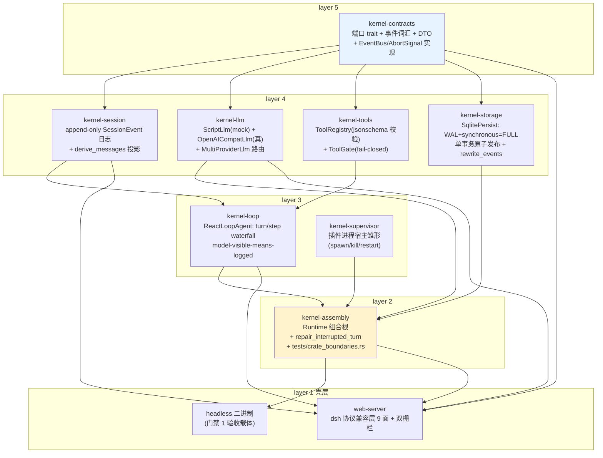

# BoenMind 微内核（DSH 核心 Rust 移植版）架构审查报告

- 审查日期：2026-08-18
- 审查方式：只读自主审计（code-architecture SKILL Step 3A，无交互采访）
- 审查范围：kernel-contracts / kernel-session / kernel-llm / kernel-tools / kernel-storage / kernel-loop / kernel-supervisor / kernel-assembly（核心 8 crate 全量）；headless 与 web-server 仅以"核心边界健康"视角阅读
- 验证：`cargo test --workspace` 91/91 通过（含 crate_boundaries 守卫）；`cargo clippy --workspace --all-targets -- -D warnings`（仓库惯例，最近轮次为 0 警告）
- 结论速览：**架构健康、分层真实执行、DSH 对齐质量极高；无 P0/P1；6 个 P2 集中于错误路径、守卫盲区与壳层契约漂移；若干 P3 属文档/DRY/性能债。值得继续按此骨架推进 M5。**

---

## 1. 架构映射

### 1.1 Crate 依赖图（实际 Cargo.toml，非纸面）



### 1.2 各 crate 职责与关键公开接口

| Crate | 职责 | 关键公开接口 |
|---|---|---|
| **kernel-contracts** | 跨层形状：端口 trait、事件词汇、DTO、统一错误。**另含两个具体实现**：EventBus（进程内观察者总线）、AbortSignal（取消信号） | `LlmPort`(stream/resolve_model/list_models)、`SessionPersistPort`(append_events/create_session/load_events/rewrite_events/list_sessions/delete_session)、`FsPort`/`ShellPort`/`PluginRuntimePort`、`SessionEvent`/`SessionRecord`/`SessionHeader`、`LlmError`/`PortError`/`ToolError`/`FailureInfo`、`EventBus`/`AbortSignal`、`StreamChunk.to_wire()` |
| **kernel-session** | append-only 事件日志（唯一事实源）+ 投影 | `Session`(new/from_log/append/events/derive_messages)、`SessionStore`(create/restore/get/list)、`SessionError`(EmptyLog/SeqNotConsecutive/MissingSessionStarted/HeaderMismatch) |
| **kernel-llm** | LlmPort 实现集：mock 脚本 + OpenAI 兼容真适配器 + 多 provider 路由 | `ScriptLlm`/`MockTurn`、`OpenAICompatLlm`(set_base_url_override/set_api_key_override/list_models_remote)、`MultiProviderLlm`、`OpenAiProviderConfig`/`ModelListEndpoint` |
| **kernel-tools** | 工具注册 + 门控 | `ToolRegistry`(register/get/schemas/execute)、`ToolGate`(enable/disable/enabled_schemas/execute_guarded) |
| **kernel-storage** | sqlite 持久化后端 | `SqlitePersist::open`(WAL+FULL+busy_timeout) + `SessionPersistPort` 全实现、`StorageError` |
| **kernel-loop** | 回合循环（核心业务语义） | `LoopRuntime`(llm/store/tools/gate/persist/provider/model/max_steps)、`ReactLoopAgent`(run_turn/abort/set_model_override/session)、`TurnOutcome`、`LoopError`、`DEFAULT_MAX_STEPS=32` |
| **kernel-supervisor** | 插件进程宿主雏形 | `Supervisor`(spawn/status/is_healthy/kill/restart/list)、`ChildHandle`/`ChildStatus`、`PluginSpec`、`SupervisorError` |
| **kernel-assembly** | 组合根 + 崩溃恢复 | `Runtime`(headless/headless_with_max_steps/create_session/restore_session/list_sessions/plugin_availability)、`AssemblyError`、`repair_interrupted_turn` |
| **headless**（壳） | 门禁 1 验收：roundtrip/abort/resume/verify-tail/dump | CLI 5 模式 |
| **web-server**（壳） | dsh 前端协议兼容层（RPC 信封/WS 下行/信任双栅栏/静态 SPA） | `router()`、`api::dispatch` 52 方法表子集、`trust::is_trusted_api_request` |

### 1.3 数据流（一个回合的垂直切片）

```
session.prompt (web-server)
  → ReactLoopAgent.run_turn
    1. append UserMessage → persist（单事务）
    2. loop steps:
       append Step Started → persist
       derive_messages（日志投影）+ gate.enabled_schemas → GenerateOptions
       llm.stream(request) → 逐 chunk: append AssistantChunk → persist → BlockAssembler
       finish 分派: append AssistantMessage(usage) → persist
                    ToolCall → append ToolCall → execute_guarded → append ToolResult → persist
       append Step Ended → persist
       （文本或 max-tokens）append Turn Ended{reason} → persist
  → EventBus.emit（每次 append）→ web-server attach_event_bus → WS mux 实时下行
  → SQLite events 表（唯一事实源）；sessions 表仅 header 索引
kill -9 → restore_session: load_events → repair_interrupted_turn → rewrite_events 写回 → Session::from_log
```

---

## 2. 分层/边界实际执行情况

### 2.1 守卫与事实对照

守卫实现：`kernel-assembly/tests/crate_boundaries.rs`（Rust 集成测试，`cargo test --workspace` 即门禁）。
- 层表：contracts=5，session/llm/tools/storage=4，loop/supervisor=3，assembly=2，headless=1。
- 规则：`dep_layer >= my_layer`（依赖层号必须不小于自身层号，即只许向下）。
- 实测：9 个 manifest 全部通过（本次运行 crate_boundaries 1/1 pass）。

实际依赖（Cargo.toml 逐项核对）：

| Crate | 声明依赖 | 是否向下 |
|---|---|---|
| kernel-contracts | 仅外部 crate | ✓ |
| kernel-session | contracts | ✓ |
| kernel-llm | contracts | ✓ |
| kernel-tools | contracts | ✓ |
| kernel-storage | contracts | ✓ |
| kernel-loop | contracts, session, tools | ✓ |
| kernel-supervisor | contracts | ✓ |
| kernel-assembly | contracts, session, llm, tools, storage, loop, supervisor | ✓（见 ARCH-008：supervisor 是未使用依赖） |
| headless | contracts, llm, assembly | ✓ |
| web-server | contracts, session, loop, assembly, llm | ✓（**但 web-server 不在守卫层表内**，见 ARCH-004） |

### 2.2 边界健康观察（壳层视角，非全量审查）

核心边界被壳层使用的健康度整体良好：web-server 只通过 `Runtime`、`SessionPersistPort`、`SessionEvent`、`ReactLoopAgent` 与核心交互，未绕过端口直达 sqlite；事件翻译集中在 `events.rs`。三处越界/漂移见关切清单：

- 壳层直接 poke `Runtime` 的 pub 字段重新装配（web-server main.rs、headless main.rs）——组合根形同虚设（ARCH-005）。
- 壳层 `session_fork` 手动复刻 loop 的 append+persist 序列（api.rs:665-675）——持久化纪律第二实现点。
- 实时流与历史流由两个独立翻译器维护且游标不同源（ARCH-006）。

---

## 3. 做得好的地方（具体到代码）

1. **分层不是纸面纪律，是自动执行的门禁。** `crate_boundaries.rs` 是 Rust 集成测试而非文档约定，`cargo test --workspace` 即验收；违规直接编译失败于 CI。本次实测 9/9 manifest 通过。
2. **"事件日志 = 唯一事实源" 真正落地，且有故障注入证明。** `SqlitePersist.append_events` 每次 append 单事务、seq 从磁盘 MAX 续算（`kernel-storage/src/lib.rs:150-197`），杜绝内存/磁盘 seq 漂移；`kernel-storage/tests/persist.rs:165-226` 用原生连接装触发器让批内第三条 INSERT 失败，验证整批回滚、零残留——这是对 kill-9 无 torn-tail 不变量少见的硬证明。`logged-means-persisted` 在 loop 里逐事件执行（`kernel-loop/src/lib.rs:299-306`）。
3. **interrupted-turn 修复闭环完整。** `restore_session` 首条校验 → `repair_interrupted_turn` 尾部配对修剪 → `rewrite_events` **写回磁盘**保证磁盘与内存一致（`kernel-assembly/src/lib.rs:102-154`）；恢复后 turn 编号接续（`next_turn` 从日志 max+1，`kernel-loop/src/lib.rs:286-297`）；headless 提供 abort/resume/verify-tail 三模式端到端验收。
4. **错误归一化对齐 DSH 源码的精度罕见。** `LlmError.to_failure()` 镜像 `normalizeLlmFailure` 两条兜底（空 message→"LLM adapter failed"、缺 code→"UNKNOWN"，`kernel-contracts/src/error.rs:150-166`）；`map_http_code` 分类顺序（AUTH 最优先→QUOTA→RATE_LIMIT→400 内容分类→≥500 SERVER，`kernel-llm/src/openai.rs:896-927`）与判词正则逐字镜像 DSH error.ts，且每个镜像行为都有对应单测断言（openai.rs 测试区 1300+ 行）。
5. **torn 纪律全链路一致。** 端口契约"流必须以 Finish 收尾，Err 即 torn"（`kernel-contracts/src/llm.rs:346-349`）→ loop 对 Err/缺 Finish 显式 `Turn Ended{Error}` 收尾绝不静默（`kernel-loop/src/lib.rs:386-431`）→ MultiProviderLlm 未知 provider 以 `NO_ADAPTER` finish 呈现而非 Err chunk，避免上层覆盖错误码（`kernel-llm/src/multi.rs:45-62`）。
6. **fail-closed / fail-loud 一致贯彻。** ToolGate 空名单全禁用且执行前 schema 校验（`kernel-tools/src/lib.rs:82-127`）；`rewrite_events` 默认实现返回 NotAvailable（`kernel-contracts/src/ports.rs:67-73`）；`PluginRuntimePort` 是显式可探测能力 + `UnavailablePluginRuntime` 默认实现（`ports.rs:83-105`）；keyless 装配→请求时 `MISSING_CREDENTIAL`（openai.rs:456-466）。
7. **取消语义实现正确且无竞态。** `AbortSignal` 用 AtomicBool + tokio watch 并保留 keep-alive receiver，保证"订阅前预中止"也能被 `wait_aborted` 立即观察到（`kernel-contracts/src/llm.rs:28-87`）；adapter 三阶段 abort 穿透（预发送/发送中 select/流中 select_biased 优先流分支避免正常 EOF 误判，`kernel-llm/src/openai.rs:447-605`）；loop 的取消槽用 RAII Drop 清理防止跨回合残留（`kernel-loop/src/lib.rs:327-335`）。
8. **对齐 DSH 的注释文化是资产。** 几乎每个非平凡函数都有"对齐 DSH xxx.spec / 台账 §x"指针，wire 形状用 `#[serde(skip_serializing_if)]` 保证精确形状（错误类字段 None 不上 wire），追溯成本极低。
9. **测试把语义当第一公民。** 91 个测试中相当比例是"镜像 spec 断言"而非实现细节断言：translate 拆条/哨兵/reasoning passback、Retry-After 三种形态、astral 边界 snippet 回归（api.rs:1689-1706，含真实 bug 回归注释）、seq 连续性与 updated_at 排序语义。
10. **错误路径不吞错。** `Session::from_log` 四种校验（空日志/seq 不连续/首条非 SessionStarted/header 不匹配）全 fail-loud（`kernel-session/src/lib.rs:61-92`），恢复链路把持久层错误全量映射为 `AssemblyError` 而非静默降级。

---

## 4. 关切清单（按影响排序）

### ARCH-001（P2，正确性）EventBus::clone 派生独立 id 计数器，监听器 id 可碰撞
- 位置：`kernel/kernel-contracts/src/bus.rs:64-73`
- 证据：
```rust
impl Clone for EventBus {
    fn clone(&self) -> Self {
        Self {
            slots: Arc::clone(&self.slots),
            next_id: std::sync::atomic::AtomicU64::new(
                self.next_id.load(std::sync::atomic::Ordering::Relaxed),
            ),
        }
    }
}
```
- 问题：`slots` 共享但 `next_id` 按 clone 时刻的值重建。两个 clone 各自注册监听器会拿到**相同 id**；drop 任一 `Disposer` 会 `retain` 掉共享 slots 里所有同 id 条目——误删另一个 clone 的监听器（事件静默丢失）。
- 现状：`Session` 持有的 bus clone 不注册监听器，web-server 只在原 bus 注册一次，故当前不可触发；但 `Runtime.bus` 是 pub 字段、`EventBus` 公开可 Clone，任何消费方二次注册即踩雷。
- 建议：`next_id` 改为 `Arc<AtomicU64>` 共享；或 `on_event` 用 `slots.len()+1` 反查唯一 id；并加一条"双 clone 注册互不干扰 + disposer 只注销自己"的单测。

### ARCH-002（P2，正确性/重放保真）事件时间戳 write-only：持久化 timestamp 列从不读回
- 位置：`kernel/kernel-storage/src/lib.rs:200-219`（load_events 返回 `Vec<SessionEvent>`，无 seq/时间戳）；`kernel/kernel-assembly/src/lib.rs:141-147`（恢复时全部 `SessionRecord::new` → `Utc::now()`）；写入点 `kernel-storage/src/lib.rs:140,178,264`
- 证据：
```rust
// storage: SELECT event_json ...  → 时间戳列被丢弃
let rows = stmt.query_map(params![session_id], |row| row.get::<_, String>(0))...;
// assembly: 恢复时所有记录统一 Utc::now()
.map(|(i, e)| kernel_contracts::SessionRecord::new((i + 1) as u64, session_id, e.clone()))
```
- 问题：循环文档与 README 宣称"raw chunk 入日志保 replay 保真"，但保真的时间维度在端口边界被剪掉：kill-9 恢复后所有事件的 timestamp 变成"现在"；`session.history`/`session.export` 经 `events.rs:36`（`Utc::now()`）翻译后全部事件时间相同。dsh 前端按 time 展示/排序会失真。
- 建议：`load_events` 改为返回 `(SessionEvent, DateTime<Utc>)` 或直接 `SessionRecord`（seq 由行号给出）；restore 时用落盘时间戳；翻译器用 record.timestamp 而非 now。

### ARCH-003（P2，可靠性）终态路径 persist 失败静默吞掉，logged-means-persisted 在 IO 故障下静默破裂
- 位置：`kernel/kernel-loop/src/lib.rs:350, 399, 427, 447, 465`（5 处 `let _ = self.persist(&rec).await;`，全部在 Turn Ended 收尾路径；其余路径均 `?` 传播）
- 证据：
```rust
let rec = self.session.append(SessionEvent::Turn(TurnEvent::Ended { ... }));
let _ = self.persist(&rec).await;   // ← IO 失败被丢弃
return Err(LoopError::Llm(e.message));
```
- 问题：内存日志已含 Turn Ended、磁盘没有；`append_events` 的 seq 从磁盘 MAX 续算，下一次持久化会拿到与内存 `SessionRecord.seq` 不同的编号——内存/磁盘双日志漂移且无任何告警。更糟：若随后 kill-9，磁盘上回合看似未闭合，恢复时 `repair_interrupted_turn` 会把**整个已完成回合**（含已落盘的 step）全部修剪——单事件持久化失败放大成整回合丢失。上游 web-server 侧 `let _ = agent.run_turn(...)`（api.rs:742）再吞一层，错误完全不可见。
- 建议：这 5 处至少 `tracing::error!` 记录失败（含 session/seq）；Turn Ended 的 persist 失败也应向上传播（或折中：失败时同步重置内存日志到磁盘水位）；可选硬措施：`append_events` 增加 expected-seq 参数，磁盘 seq 与内存 seq 不一致即 fail-loud。

### ARCH-004（P2，守卫盲区）crate_boundaries 不覆盖 web-server，且依赖解析是行级朴素字符串匹配
- 位置：`kernel/kernel-assembly/tests/crate_boundaries.rs:16-25`（`layer_of` 无 `"web-server"` 条目）、`:29-42`（`workspace_deps` 按行找 `=` 拆分）、`:75`（`checked >= 8` 不含 web-server）
- 证据：
```rust
fn layer_of(crate_name: &str) -> Option<u32> {
    Some(match crate_name {
        ...
        "headless" => 1,
        _ => return None,          // web-server 落进 None → 不检查
    })
}
```
- 问题：web-server 是 workspace 成员且依赖 5 个内核 crate，但它的 Cargo.toml 完全不受"只许向下"守卫约束——今天健康（只依赖层 2+），明天有人在内核 crate 里加 `web-server` 依赖（例如复用其事件翻译）不会被门禁拦截。朴素解析还会误读注释行/`workspace.dependencies` 段中的 `kernel-*` 字样，且任何非 `name = ...` 一行式写法（换行的依赖块）会漏检。
- 建议：`layer_of` 加入 `"web-server" => 0`（并注明壳层），`checked >= 10`；解析改用 `cargo metadata`（dev-dependencies 现无 dep 依赖）或至少按 `[dependencies]` 段切分。

### ARCH-005（P2，边界软化）组合根 Runtime 全 pub 可变字段，真实装配靠壳层事后 poke
- 位置：`kernel/kernel-assembly/src/lib.rs:36-48`；消费方 `kernel/headless/src/main.rs:73-86`（`rt.llm = Arc::new(...)`）、`kernel/web-server/src/main.rs:231-233`（`runtime.llm = ...; runtime.provider = ...; runtime.model = ...`）
- 证据：
```rust
pub struct Runtime {
    pub llm: Arc<dyn LlmPort>,
    pub store: Arc<SessionStore>,
    ...
    pub bus: EventBus,
    pub max_steps: u64,
}
```
- 问题：README 宣称 kernel-assembly 是"组合根（Runtime）"，但真实 provider 的装配发生在 web-server 二进制里通过改写 pub 字段完成——组合责任被壳层接管；任何消费方可在回合运行中换掉 `persist`/`llm` 而无任何约束（web-server 的回合是 tokio::spawn 并发跑），构成内存/磁盘日志分叉的又一入口（与 ARCH-003 叠加）。
- 建议：改为构造函数注入（`Runtime::new(ports, config)` 私有字段 + 只读 getter），保留 `headless()` 与新增 `with_providers(...)` 作为便捷构造；`install_scripted_llm` 之类的 headless 需求改为构造参数而不是事后赋值。

### ARCH-006（P2，wire 契约漂移）实时流/历史流双翻译器 + 重启后 wire seq 从 0 回退
- 位置：`kernel/web-server/src/api.rs:222-244`（attach_event_bus：per-session seq 计数器进程内从 0 起）、`kernel/web-server/src/events.rs:156-168`（translate_events：历史翻译另一套游标）、`kernel/web-server/src/ws.rs:26-40`（mux 基线 `lastSeq = 历史 wire 长度 - 1`）
- 证据：
```rust
// attach_event_bus：进程启动时表为空；重启后该会话第一个实况事件 seq = 0
let (trans, seq) = table.entry(...).or_insert_with(|| (EventTranslator::new(), 0));
wire.seq = *seq; *seq += 1;
// mux 基线却告知前端 lastSeq = K（K = 历史翻译条数 - 1）
let last_seq = ... translate_events(&events).len() as i64; ... wire_count - 1
```
- 问题：重启后前端先收到 `session/subscribed{lastSeq:K}`，随后实况事件从 seq 0 重来——按"seq 单调、已见即去重"语义处理的前端会把 K 之后的新事件全部当重放丢弃。根因是内核 EventBus 无重放/续流语义，壳层用两个独立的进程内游标模拟，二者不同源必然漂移。
- 建议：短修——实况 seq 起点初始化为该会话历史 wire 长度（从持久化日志翻译一次）或基线用 0；根治——给 EventBus 增加 per-session 持久化游标（或让 wire seq 直接复用持久化 seq 语义），翻译器收敛为一处。

### ARCH-007（P3，可观测性）EventBus::emit 吞掉监听器 panic 且零日志
- 位置：`kernel/kernel-contracts/src/bus.rs:54-61`
- 证据：
```rust
for (_, listener) in &slots {
    let _ = std::panic::catch_unwind(std::panic::AssertUnwindSafe(|| listener(record)));
}
```
- 问题：web-server 的唯一实况下行监听器（事件翻译闭包）若 panic，会被静默吞掉且监听器仍注册——**下行流永久静默死亡**，无任何日志可查。catch_unwind 纪律（主链路不受观察者影响）是对的，但静默吞错不是。
- 建议：catch 到 panic 时 `tracing::error!` 记录（含 payload 截断信息），必要时计数熔断。

### ARCH-008（P3，装配完整性）kernel-supervisor 是 kernel-assembly 的未使用依赖
- 位置：`kernel/kernel-assembly/Cargo.toml:20`（依赖声明）；`kernel/kernel-assembly/src/lib.rs` 全文无 `Supervisor` 引用（grep 证实）；`PluginRuntimePort` 在 Runtime 中仍恒为 `UnavailablePluginRuntime`（lib.rs:79）
- 问题：组合根声明依赖却从不接线——插件宿主能力在装配层"隐形"；且 `Supervisor` 本身没有 `impl PluginRuntimePort`，即使想接线也没有适配器。当前无害，但依赖是死的，README 的"M3 接 supervisor 完整实现"未兑现。
- 建议：要么补 `impl PluginRuntimePort for Supervisor` 并在 Runtime 构造时注入；要么移除该依赖，等插件运行时真实接入 M5 时再加。

### ARCH-009（P3，文档/职责一致性）contracts 宣称"只定义形状"，实际承载两个具体实现
- 位置：`kernel/kernel-contracts/src/lib.rs:4`（"本 crate 不包含任何业务实现，只定义形状"）vs `bus.rs:26-62`（EventBus 完整实现）、`llm.rs:23-88`（AbortSignal 完整实现）
- 问题：文档与事实矛盾——EventBus 的 Clone 缺陷（ARCH-001）正是"实现住进了本应是纯契约的底座层"的代价：该层所有消费者共享一份实现，修 bug 需动底座。AbortSignal 实现质量高（keep-alive receiver 处理预中止），可继续留在底座；但措辞应如实。
- 建议：把 EventBus（及其 Disposer）下沉到 kernel-session（它是唯一发布者），contracts 只留 `EventListener` trait 形状；或至少修正 lib.rs 文档措辞。

### ARCH-010（P3，DRY）headless 复刻 loop 的 append+persist 序列，配对校验逻辑三处并存
- 位置：`kernel/headless/src/main.rs:148-177`（abort 模式手写 UserMessage/Step/Chunk 的 append + `persist.append_events` 双写）、`:232-261`（verify_tail 与 `kernel-assembly/src/lib.rs:185-225` repair_interrupted_turn、`:231-261` 的配对规则第三份实现）
- 问题：`append 内存 + append_events 磁盘` 的"logged-means-persisted 序列"在 loop 与 headless 各有一份；Step/Turn 配对判定在 assembly、headless（两处：verify_tail + 测试内 check_tail）各有一份。事件词汇新增配对类型（如将来 subagent/attachment 事件）时需三处同步，漏一处即门禁失真。
- 建议：headless 改为复用 `ReactLoopAgent`/`Runtime` 暴露的注入断点（或让 abort 模式走 loop 的一个测试注入钩子）；`verify_tail` 直接调用 assembly 的 repair 函数对比长度，而不是重写配对算法。

### ARCH-011（P3，语义文档）repair 丢弃"整个未闭合回合"（含其中已完成 step 的事件）无文档明示
- 位置：`kernel/kernel-assembly/src/lib.rs:185-225`
- 问题：算法从尾部回溯，遇到未配对 Turn Started 即截断到该点——一个已完成 3 个 step 但未写 Turn Ended 的回合（kill-9 恰落在 Turn Ended persist 前）其全部事件被删。这是"回合级原子回滚"的合理设计（模型可见历史与日志一致），但代码/README 只描述为"修剪尾部未配对事件"，未声明整回合回滚语义；未来维护者可能误判为数据丢失而"修复"出更坏的行为。
- 建议：在函数与 README 补一句"未闭合回合整体回滚（turn-level atomicity），续跑从该回合起点重演"；并加一条 3-step 已完成回合被整体修剪的单测固化语义。

### ARCH-012（P3，文档漂移/内聚）kernel-llm 的定位描述已过期
- 位置：`kernel/kernel-llm/Cargo.toml:5`（"mock 实现（门禁 1 用，不接真实 API）"）vs `src/openai.rs`（1984 行，全仓最大文件，真实 API 底座）
- 问题：crate 从"M1 mock 集"演化为"LLM 适配器层"，描述与模块级文档（lib.rs 已更新）不一致；openai.rs 单文件承担 SSE 解析状态机 + 消息序列化 + 错误分类 + 大量测试，内聚靠注释维持。
- 建议：更新 Cargo.toml description；openai.rs 可在下次大改时拆为 translate/error/sse 三模块（非紧急）。

### ARCH-013（P3，并发模型）同步阻塞 sqlite 直接在 async 端口方法内执行
- 位置：`kernel/kernel-storage/src/lib.rs:16,46-49,100-105`（`Mutex<Connection>` 无 `spawn_blocking`，模块文档自认"M1 下单连接串行化，同步阻塞可接受"）
- 问题：单用户规模完全合理（文档诚实记录了这个取舍）；但 web-server 已是多会话并发回合（tokio::spawn），长事务（如 future 的大 rewrite_events）会阻塞 tokio worker 线程。这是"已知取舍"而非缺陷，标记为成长路径的待办。
- 建议：当会话数/并发回合数上升时改为 `spawn_blocking` 或专用存储线程；在此之前维持现状并保留文档说明。

### ARCH-014（P2，安全，壳层）双栅栏只装在 handle_rpc 与 WS 升级，/api/respond 与 /api/session.export 未过栅栏
- 位置：`kernel/web-server/src/lib.rs:196-220`（handle_respond 仅校验 content-type，无 Host/Origin/sec-fetch-site 检查）、`:305-370`（handle_session_export 同样无栅栏）；对比 `:80-89,165-167`（handle_rpc/WS 均有栅栏 A/B）
- 问题：DNS-rebinding 场景下（attacker.com 解析到 127.0.0.1，浏览器侧与服务器同源），攻击页面可直读 `/api/session.export?sessionId=...` 下载会话日志 ZIP（提示词/内容），或 POST `/api/respond` 应答 pending 审批——两处都绕过为防 rebinding 而建的信任栅栏，栅栏一致性被打破。攻击者仍需猜中 sessionId/rpcId（UUID，难度高），但 export 端点对"已泄露/可枚举 id"毫无第二道防线，且与台账"所有 API 面过双栅栏"的设计意图不符。
- 建议：把栅栏判定抽为 axum middleware 或对这两个 handler 复用 `is_trusted_api_request`；respond 与 export 至少过栅栏 A。

### ARCH-015（P3，壳层）ProviderKind 解析后从未使用，minimax 专属模型列表端点未实现
- 位置：`kernel/web-server/src/provider_config.rs:50-58`（三态枚举）vs `kernel/web-server/src/main.rs:171`（`let list_endpoint = ModelListEndpoint::Standard;` 恒定）
- 问题：文档声明 minimax 走 `GET /models/list`，但装配层对所有 provider 恒用 Standard；`ProviderKind` 成为死配置面。真 provider 的 llm.discoverModels 因此对 minimax 可能探测失败（依赖实测回退）。
- 建议：实现 minimax 列表端点形态，或在未实现前明确降级注释并把枚举裁剪为实际使用的形状。

### ARCH-016（P3，壳层）session_list 的 updatedAt 硬编码 1970
- 位置：`kernel/web-server/src/api.rs:397`（`"updatedAt": "1970-01-01T00:00:00.000Z"`）
- 问题：会话列表排序/显示依赖 updatedAt 的前端会得到恒定纪元时间；持久层其实存了真实 updated_at 且 `list_sessions` 已按它排序，这里只是没有把值带出端口。属于壳层契约 bug，但暴露了端口粒度问题：`list_sessions` 只回 id 不回元数据，迫使壳层硬编码。
- 建议：`SessionPersistPort::list_sessions` 返回 `(id, updated_at)` 或 header 投影，壳层填充真实值。

### ARCH-017（P3，性能/演进）每 chunk 一次单事务 fsync
- 位置：`kernel/kernel-loop/src/lib.rs:299-306`（每次 append 即一次 `append_events`）+ `kernel/kernel-storage/src/lib.rs:12-14,148-197`（单事件单事务 + synchronous=FULL）
- 问题：长流式回复的每个 SSE delta 都是"一次 sqlite 事务 + fsync"——正确性（kill-9 无 torn-tail 的最强形态）与吞吐的显式交换；本地单用户可接受，多会话并发长流时磁盘压力明显。
- 建议：保持每事件落盘纪律不变，但演进为"每 step 一次批量事务"（DSH 也是批量提交粒度），保留 kill-9 恢复不变量（事务内 seq 连续已支持）。

---

## 5. 诚实结论（verdict）

**架构是健康的，分层是真实执行的，DSH 对齐质量是全仓最突出的资产。** 这不是一句场面话，具体到证据：边界门禁是能跑的测试而不是文档；存储层用故障注入证明了"无 torn-tail"；错误归一化、abort 语义、wire 形状对齐到了"镜像官方 spec 逐条断言"的精度；91 个测试全部通过、clippy 零警告。

**没有发现 P0/P1 级问题。** 6 个 P2 全部落在同一类病灶上：**错误路径与守卫盲区**——持久化失败被静默吞掉（ARCH-003）、时间戳在端口边界被剪掉（ARCH-002）、总线克隆缺陷潜伏（ARCH-001）、守卫表漏了 web-server（ARCH-004）、组合根被壳层 poke 架空（ARCH-005）、重启后 wire seq 回退（ARCH-006）。它们不需要架构重构，是可以在不破坏现有分层的前提下逐个修复的加固项。P3 层是文档漂移、DRY 与已知取舍的清单，不阻塞任何里程碑。

**是否过度设计？** 反向结论：核心 8 crate 在"一个 agent 运行时微内核"的目标下**恰好适度**——没有多余的抽象层，端口数量克制（5 个 trait 覆盖真实需要），事件词汇最小集（10 个变体），单连接 sqlite 是诚实记录的单用户取舍。真正的债在**壳层**（AppState 十三个 Mutex 的大袋子、wire 契约的硬编码补丁），但那不在内核审查范围内，且与内核边界通过端口隔离得基本干净。

**建议的下一步顺序**：修 ARCH-003（错误传播）与 ARCH-004（守卫补全）→ 修 ARCH-002/006（时间戳与 seq 保真，同属"重放保真"命题）→ ARCH-001/005（总线与组合根硬化）→ 其余 P3 随轮次顺手清理。在此之后，该骨架具备支撑 M5（插件运行时真实接线、多会话并发）的架构基础。
