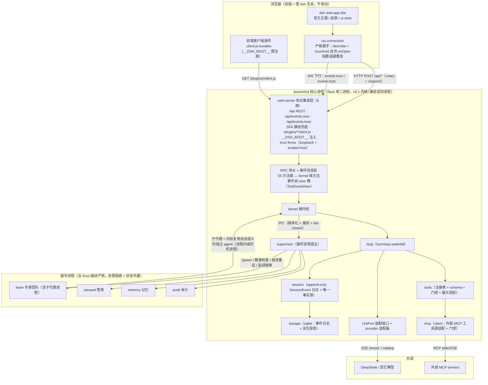

# 工具 A · code-architecture（Step 3A）架构评审报告

> 2026-08-17。评审对象 = `docs/design/DSH_PROJECT_V2_2026-08-17.md`（仅此一份，不评 v1、不评代码）。
> 参照系 = dsh 官方（`D:/96_CoderWorld/deepseek-harness`，TS/Cordis 全插件化）与 bobleer Rust 移植（`D:/96_CoderWorld/bobleer-dsh-rust`，编译期静态装配）。
> 方法 = SKILL Step 3A：先复述架构，再讲亮点，再按影响排问题，给结论，给增补。
> 不修改任何源文件。

---

## 1. 评审结论

### 1.1 总评

方向正确，脊梁成立。**"前端借 dsh 生态 + Rust 微内核 + web-server 兼容层直连"是可行的架构，且三方资料互相支撑**：bobleer 验证了"以分层 crate + 端口抽象实现 dsh 语义"的 Rust 路线；dsh 官方的契约面（`packages/host/apiproxy/src/api/*`、`packages/client/connection`、`packages/host/webserver`、`packages/client/modules`）确实是可以逐行对表的公开合同。计划对 6 面传输层契约的刻画准确（路径、WS 帧模型、trust fence、SPA 兜底语义均与源码一致），§3.4"逐字对齐"铁律是对的且可落地。

问题不在方向，在**未设计的接缝**：计划把"最大工程点"（兼容层）与"最硬前提"（状态外置、插件进程化）都写成了决议，却没有给出可执行的接缝设计——插件进程模型二义、LLM 适配端口整缺、kernel 分层无结构保障、55 个 RPC 方法面的宿主概念缺位、IPC 协议只有一句话、存储模型"事件日志 vs sqlite 双表"自相矛盾。这些不是"以后细化"级别的缺位，而是**不拍板就无法开工 M1/M2 的结构性缺口**。

分级发现：

| 级别 | 数量 | 主题 |
|---|---|---|
| **P0 必须修正** | 7 | 插件进程模型未拍板、LLM 适配端口缺失、kernel 分层未定义、兼容层方法面 scope 未定、插件 IPC 协议无设计、存储模型歧义 + 崩溃恢复缺设计、沙箱风险被弱化 |
| **P1 建议细化** | 9 | 状态外置可验证化、工具模型对齐 dsh、事件总线与日志追加权、契约台账机器化 + conformance harness、`__DSH_BOOT__` 合成源、M2 双后端切换、MCP 接缝、前端插件与"全 Rust"边界、附件/搜索投影 |
| **P2 可选优化** | 4 | 台账生成式、前端升级回归成本量化、Tauri 壳走 HTTP 还是 IPC、kernel 自身重起的监督者归属 |

### 1.2 亮点（先说对的）

- **兼容层 6 面契约刻画与源码一致**：`/api` 前缀 + `events.mux`/`events.host` 双下行 WS + SPA 兜底 405/403/200/octet-stream + `/plugins/<id>/client.js` + `__DSH_BOOT__` tap 注入，对照 `client/connection`、`host/webserver`、`host/frontend-static`、`client/modules` 源码全部属实。
- **trust fence 沿用决策正确**：dsh 的 fence 是"Host 头绑定 + Origin 核对 + sec-fetch-site 拒绝 + 特权方法 loopback 锁定"的组合，直接继承比自创安全模型划算。
- **"前端不用动"的收益判断正确**：dsh 前端客户端插件是纯浏览器 JS，经 `ctx.connection` 单点连宿主；只要 web-server 六面 + 连接握手（`host.describe` + 双流 onOpen）逐字实现，官方 UI/皮肤/ui-slots 原样可用。
- **M0→M4 的总路线（前端宿主→微内核→兼容层→插件 Rust 化→发布）顺序合理**，聊天闭环优先于全 API 面的次序（§3.5）与 dsh 前端的真实依赖（白屏最先死）一致。
- **bobleer 的分层 crate 是一个可照搬的组合模型先例**（contracts→execution→services→adapters→assembly→apps + `check-crate-boundaries.py` 依赖守卫 + `PortError{NotAvailable}` fail-loud），计划应显式吸收而不是只字不提。

---

## 2. v2 目标架构图

> 注：`plugins/skins` 与 `plugins/audit` 的"展示/皮肤"部分是前端 JS 客户端插件，不落在 Rust 插件进程边界内（见 P1-8）。

---

## 3. 逐条修正 / 细化建议

### P0 必须修正

#### P0-1 插件进程模型未拍板（cdylib vs 独立进程），supervisor/无感重起/蓝绿的前提悬空

- **现状**：§一.3 推论写"插件模型 = cdylib **或**独立进程 + 状态外置纪律"；目录树 `plugins/` 注释写"进程隔离"；M3 又写"插件 = Rust 进程"。三处不一致，未拍板。
- **问题**：蓝绿替换、崩溃自动拉起、"服务器无感重起"在架构上**要求插件是独立进程**（cdylib 在进程内，无法热换、无法隔离崩溃）。cdylib 路线会把 supervisor 变成摆设。这一条不拍板，M1 supervisor 雏形、M3 全部内容、§六风险表的"进程编排"对策都无法设计。
- **建议改法**：在 §一 或 §七 补拍板：**插件 = supervisor 拉起的子进程**（v0.1 即进程模型）；cdylib 仅作为"受信首方工具"的**未来优化项**明确降级为 P2，并写明触发条件（IPC 开销成为可测量瓶颈时）。同时明确 supervisor 与 kernel 是**同一进程内的两个模块**还是 supervisor 本身独立进程——建议 v0.1 supervisor 与 kernel 同进程（少一个进程边界），但它管理的**插件必须是子进程**。
- **影响**：决定 IPC 协议、状态外置粒度、蓝绿替换实现方式、崩溃隔离收益。不修则 M3 无法开工。

#### P0-2 LLM / 模型适配层缺失——AI 平台没有模型端口

- **现状**：kernel 六件套 = loop/session/tools/storage/mcp/supervisor，**没有 llm**。全文未出现 LLM 适配、provider 路由、模型目录。
- **问题**：(1) 门禁 1"headless 回合全链路"没有 LLM 就无法跑；(2) 兼容层 55 方法面里有 `llm.providers` / `llm.models` / `llm.discoverModels`，会话域有 `session.models` / `session.selectModel`，前端模型选择器依赖它们；(3) dsh 语义（`llm/stream`、reasoning effort、模型目录、流式 SSE）必须吸收进内核。bobleer 的先例正好：`LlmPort`（contracts）+ `llm-deepseek`/`llm-mock`（adapters），mock 用于无 key 测试。
- **建议改法**：kernel 增 `llm` 模块（或 kernel 邻接 adapters 层）：定义 `LlmPort` trait（list_models / resolve_model / stream），首供 DeepSeek adapter + **mock adapter（测试必需）**；`session.models` 的 ModelSelection/ModelCatalog 形状抄 `apiproxy/src/api/sessions.ts` 与 `llm.ts`。把"mock LLM 全链路"写进门禁 1（不依赖 key 的 CI 可测）。
- **影响**：缺此端口，M1 与门禁 1 不可达；前端模型选择器直接白屏级断链。最高优先级补件。

#### P0-3 kernel 内部分层与依赖方向未定义，"核心做小"无结构保障

- **现状**：目录树把 supervisor、mcp、storage 与 loop/session/tools 并排放在 `kernel/` 下；全文没有 kernel 内部 crate/模块分层与依赖规则。
- **问题**：bobleer 用"contracts→execution→services→adapters→assembly→apps + 边界脚本"保证了依赖单向向下、核心可编译隔离。我们如果 6 个模块平铺，supervisor（进程编排）与 loop（回合循环）互相 import 的冲动会立刻出现，微内核的"小"会退化成口号。另外 supervisor/mcp/storage 严格说是 services 层而非核心，混在 kernel 核心里会污染"可审计心智"的最小信任面。
- **建议改法**：显式写一节"kernel 内部分层"，照 bobleer：`contracts`（事件/端口/错误码）→ `execution`（loop/session/tools）→ `services`（storage/mcp/supervisor/llm adapters）→ `assembly`（web-server 接线 + 运行配置）→ `apps`。加一个 `check-crate-boundaries.py` 同款守卫（拒绝向上依赖）作为 M1 交付物之一。
- **影响**：无分层则门禁 1 可过但门禁 3/4 的复杂度会失控；"核心做小"失去可验证性。

#### P0-4 兼容层方法面 scope 未定：55 个 RPC 方法 + 6 个宿主概念在 kernel 里不存在

- **现状**：计划把兼容层定义为"6 面传输合同"，门禁 2 只验"建会话→发消息→流式回复→工具调用可见 + 皮肤"。但 dsh 前端的 RPC 面远大于此：`apiproxy/src/api/rpc-map.ts` 列出 **55 个 unary 方法**，跨 `session.*`（13）、`subagent.*`（4）、`host.*`（5）、`workspace.*`（7）、`skill.list`、`agentPreset.*`（6）、`goal.*`（5）、`settings.*`（4）、`credentials.*`（3）、`llm.*`（3），外加 `events.mux`/`events.host` 双流与 `respond`。其中 workspace/skills/goals/agentPresets/subagent/jobs **在计划的 kernel 六件套里根本没有对应物**。
- **问题**：门禁 2 的验收面与真实契约面严重不对等。前端左侧栏、模型选择器、设置面板、workspace 分组、fork 按钮等 UI 流都会调用这些方法；方法 404 或语义不符会引发 UI 断链，且"逐项对比"清单里根本没有这些项。这是 M2 最大的 scope 炸弹。
- **建议改法**：在 §三.4/§四.M2 显式写"方法面分域决策表"：
  - **v1 必做**：`session.list/search/create/history/models/selectModel/rename/fork/prompt/updateQueue/cancel` + `host.describe` + `settings.*` + `llm.providers/models` + 双事件流。
  - **v1 降级为最小 stub 或前端禁用对应 UI**：`workspace.*`（可退化为"单一根 workspace"）、`credentials.*`（env 直读版）、`agentPreset.*`（list/select 空实现）、`goal.*`、`skill.list`、`subagent.*`（M3 team 插件落地后再接）。
  - 每个降级项写清**前端会观察到什么**（方法不存在 → `internal` 错误码 → UI 具体哪块失效/隐藏），并纳入台账作为显式验收行。
- **影响**：不修，M2 的"全部勾销"目标会无限膨胀或自欺；修了，M2 有明确边界可交付。

#### P0-5 插件 IPC 协议只有一句话，无任何设计

- **现状**：M3 与 §六只有"IPC 版本化+鉴权"八个字。无传输、无帧、无关联、无 RPC 清单、无错误码、无生命周期握手。
- **问题**：两个参照系都没给出 IPC 答案（Cordis 进程内，bobleer 的 `PluginRuntimePort` 是 fail-loud 空壳），我们必须自证。没有协议设计，插件如何注册工具、工具执行如何回传、插件主动事件如何上送、蓝绿替换时新老进程如何交接、版本不匹配时如何 fail-closed，全部悬空。另外 `apps/`（独立 Rust APP）连到 kernel 的方式也没定义。
- **建议改法**：M1 就产出一节"插件 IPC 合同"，至少定：**传输**（建议 stdio JSON-RPC，借 bobleer ACP 先例，或 Unix socket/本地 TCP；Windows 上 stdio 最稳）、**帧**（rpcId 关联 + 版本号 + 请求/响应/事件三分）、**方法面初版**（`plugin.describe` / `tool.register` / `tool.invoke` / `session.subscribe` / `event.push` / 生命周期 `health` / `prep-blue-green` / `shutdown`）、**鉴权**（握手时 kernel 下发能力 token，插件只能用它声明的工具面）、**版本化**（握手版本协商，不匹配 → 拒绝拉起 + 明确报错）。`apps/` 建议**走 web-server `/api` 公开合同**而非私有 IPC（复用已设计的 6 面，天然多端）。
- **影响**：这是插件化的地基；不设计则 M3 门禁 3 无法构造，supervisor 的蓝绿/崩溃计数都是空中楼阁。

#### P0-6 存储模型歧义 + 会话持久化/崩溃恢复缺设计

- **现状**：`session/` 注释"append-only SessionEvent 日志（唯一事实源）"，而 `storage/` 注释"sqlite（sessions/messages/tool_calls/事件）"。
- **问题**：`messages`/`tool_calls` 独立表意味着"会话日志之外还有一份关系型副本"，与"唯一事实源 + model-visible-means-logged"直接冲突（两份写、两份可能分叉，dsh 明确禁止平行持久化类型）。且无崩溃恢复设计：dsh 的 `persistence.md` 规定了 interrupted-turn 修复（合成 `turn/end{reason:'interrupted'}`）、`SESSION_FORMAT_VERSION` 版本拒绝、`ignorable` 未知事件标记——这些是"服务器无感重起"的**前提**，计划只字未提。
- **建议改法**：写一节"持久化模型"：**权威 = append-only SessionEvent 日志**；sqlite 只做两件事——(a) 按 `(session_id, seq, type, time, data, surface_op, source_event_seqs)` 逐事件存日志（抄 dsh sqlite 后端），(b) 存派生投影（会话列表摘要、搜索、标题、投影缓存）。继承 dsh 的版本戳 + interrupted-turn 修复 + `ignorable` 语义。崩溃恢复测试进门禁 1（见 §4）。
- **影响**：不修则"可审计心智"护城河与无感重起都不可靠；修了则重起后会话可完整重建。

#### P0-7 沙箱风险被弱化："进程隔离本身就是沙箱"不成立

- **现状**：§六风险表"无沙箱问题 → Rust 插件进程隔离本身就是沙箱（进程级隔离 > 无隔离）；第三方插件 worker 降权运行"。
- **问题**：进程隔离**不是**沙箱：插件进程以用户身份运行，可读全盘文件、可联网、可执行任意代码。dsh 用 `landlock-run`（Linux landlock/seccomp）做 OS 级限制；bobleer 干脆没碰。我们面向"部分 APP 可能闭源、第三方隔离 worker"，把进程隔离当沙箱会给人错误安全感。
- **建议改法**：风险表改写为：**进程隔离只解决崩溃/重起/资源边界，不解决权限**；补两档明确承诺——官方/自研插件：全权（等同宿主）；第三方插件：kernel 侧工具面 allow-list + 状态外置强制 + OS 级沙箱（Linux `landlock`/`seccomp`，Windows `AppContainer`）**列为 v0.2 排期项**（不承诺 v0.1）。同时把"第三方 worker 能碰哪些路径/端口"写进 IPC 能力 token（接 P0-5）。
- **影响**：修后安全模型可验证、可对外宣称；不修则"闭源可选、同事使用"场景有真实漏洞风险。

### P1 建议细化

#### P1-1 状态外置纪律从口号变成可验证合同

- **现状**："状态外置纪律（进程只持可重建状态）"在 M1 出现一次 + 风险表一句，无定义、无门禁。
- **问题**：什么算"可重建"？插件内存里的缓存/进度/会话归属算不算状态？没有判据就没有验收。
- **建议改法**：写死三条：(1) 一切**必须跨重起存活**的事实写入 kernel 会话日志或 sqlite 派生投影；(2) 插件只允许持有可由 (1) 确定性重建的进程内缓存；(3) 门禁 1 增加 kill -9 测试：turn 中途杀插件 → supervisor 拉起 → 事件流不丢、会话状态与未杀时一致。给"状态外置"一节独立标题而不是散句。

#### P1-2 工具模型需对齐 dsh，否则 tool/result 展示与门控都对不上

- **现状**：计划 `tools/` = "工具注册表 + 门控（enabled 名单 + fail-closed）"。
- **问题**：dsh 工具面远比这厚：`ToolDefinition`（name/description/parameters **+ 强制 output schema** + `presentCall`/`presentResult` 展示投影 + `isConcurrencySafe` + `timeoutMs`）、`tools/pre-execute/execute/post-execute` waterfall、单调 `guard`、`ask` 审批。前端 mux 帧的 `tool/call`/`tool/result` 带 `view` 槽（ToolEventView：terminal/diff/read/search/web 卡片），且 `approval/requested` 帧依赖"ask"语义。我们的工具模型不支持展示投影，兼容层就得为每个工具手写卡片视图；不支持 approval，前端审批弹层永不触发（可接受，但要声明）。
- **建议改法**：kernel `tools` 模块最小化对齐：注册表 + 参数 schema + **强制 output schema** + 纯函数展示投影（presentCall/presentResult）+ allow/deny 名单 + 单调 guard；approval 留端口（v0.1 未装 → ask 一律 deny）。插件工具经 IPC 注册时同样要带这三件（schema/output/present），能力 token 里声明工具面（接 P0-5）。

#### P1-3 事件总线与日志追加权设计（事件流上游接口）

- **现状**：`loop`/`session` 的接缝未写。谁可以往会话日志追加事件？插件能不能主动上送事件？
- **问题**：dsh 区分为"durable session event（进日志）"与"live bus event（不落盘）"两种，追加权基本在 loop；`agent.inject()` 只注入未来请求。我们计划里 steward wake、memory 写入、browser 自动化回传这类**插件主动事件**需要通道。
- **建议改法**：写"事件总线"小节：(1) kernel 内部总线分 emit / waterfall / serial 三态（抄 dsh/bobleer）；(2) **日志追加权 = loop 独占**（含工具结果、注入消息），插件只能经工具执行结果或显式 `event.push` 端口上送，且上送的事件必须经 loop 转译成受支持 SessionEvent 才落盘；(3) "model-visible means logged"作为运行时不变量断言（bobleer 已有 `derive_messages()==request.messages` 先例，照抄）。web-server 的事件流投影只读总线 + 日志，不直接 append。

#### P1-4 契约台账需机器可读 + conformance harness，否则门禁 2 不可验

- **现状**：§3.4 定"CONTRACT_LEDGER_DSH.md 从源码逐条提取"+"同一前端分别连 Node/Rust 行为逐项对比，对一项勾一项"。手工台账 + 手工对比。
- **问题**：台账是手工抄写的（dsh 有 `gen-persistence-catalog.ts` 从源码生成 + `verify-*` 校验的先例，手工抄写必然漂移）；"行为逐项对比"目前无工具、无流程、无测试基座，门禁 2 不可复现。
- **建议改法**：
  1. 台账改**数据文件**（YAML/JSON + schema），字段对齐 dsh 真实结构：RpcMethodMap 55 方法签名、`RpcErrorDetailsMap` ~40 错误码、`MuxFrame`/`HostFrame` 联合体、SessionEvent 词汇子集（前端可见的 `session/event` 直传事件）、`__DSH_BOOT__` WebBootEntry、`host.describe` 载荷、settings 命名空间白名单、转发事件 allowlist（`API_REMOTE_FORWARDED_EVENTS`）。
  2. 台账头部记录 **dsh 版本 pin（commit SHA + 校验和）**，升级 = 显式重跑提取脚本（把 dsh 的 `gen-*` 思路在 Rust 侧做成只读提取器）。
  3. 门禁 2 配套 **conformance harness**：同一份前端 dist + 两个后端（Node dsh / Rust），Playwright 驱动 UI 流（建会话/流式/工具卡片/模型选择/设置/侧栏/皮肤/重载），**录制双侧 wire 轨迹（HTTP body + WS 帧）做归一化 diff（剔除 rpcId/timestamp/随机 uuid）+ DOM 结构对比**；台账每行要么对应一条自动检查，要么显式登记为手工检查。
- **影响**：这是把"逐字对齐"从誓言变成工程的关键一步；不做则门禁 2 永远"看着像过了"。

#### P1-5 `__DSH_BOOT__` 图合成源未定义

- **现状**：6 面里有"`__DSH_BOOT__` 注入"与"`/plugins/<id>/client.js` 服务"，但没写**图从哪来**。
- **问题**：dsh 的 boot 图是 `client-modules` 在**运行时扫描 Cordis loader 的已加载插件**生成的（每个插件声明 `dsh.client`）。我们的 Rust 内核没有 Cordis loader，无法"扫描"；若直接原样服务 prebuilt dist，dist 的 index.html **不含** `__DSH_BOOT__`（它运行时才注入），前端将无法 boot（官方明确：无有效 manifest 直接 loud throw）。
- **建议改法**：写"boot 图 = 静态 manifest"：前端构建时输出 `dsh.client` 清单（bundle 路径 + rev hash），Rust 侧 web-server 读 manifest 合成 `__DSH_BOOT__` 并服务 `/plugins/<id>/client.js?rev=`。manifest 的生成纳入前端构建管线（CI 里校验 rev 与实际文件 hash 一致）。

#### P1-6 M2 期间双后端切换机制

- **现状**：计划说 M2 前端"直连 Rust 后端（不再起 Node 后端）"，但没说前端如何被指向某一个后端。
- **问题**：前端 dist 在同一浏览器地址只能连一个后端；M2 分 5 步渐进替换，每步都要能切回 Node 做参照对比。无切换机制则"逐项对比"无法执行。
- **建议改法**：规定切换机制（最简：同一 port，Rust 侧配 `backend=dsh` / `backend=rust` 转发开关；或 `frontend/` 构建时注入 base URL）。写进 M2 起点。

#### P1-7 MCP 接缝：是"工具源适配器"，server 侧 scope 需拍板

- **现状**：`kernel/mcp` = "MCP client/server（bm-mcp 语义迁入）"一句。
- **问题**：MCP client 本质是**工具源适配器**——外部 MCP server 的工具要过 kernel 工具门控（schema 转换 + allow 名单 + fail-closed），否则 MCP 工具变成门控旁路。MCP server 侧（向外部暴露我们的工具）涉及访问控制，与 trust fence / IPC 鉴权叠加，scope 需显式决定。
- **建议改法**：明确 MCP client = 工具源适配器，工具必须走 `tools` 注册 + 门控 + 展示投影；server 侧 v0.1 只做 client，server 面排期 v0.2 起（写进拍板点或风险表）。

#### P1-8 前端插件（浏览器 JS）与"全 Rust"的边界澄清

- **现状**：§一.3 定"插件/APP 全 Rust"。但前端客户端插件是浏览器里跑的 `client.js`，物理上只能是 JS/TS 编译产物。
- **问题**：`plugins/skins`、`plugins/audit` 的 UI/皮肤部分（`--dsw-*` 令牌映射、trajectory 摘要键）本质是前端 JS 插件；硬说全 Rust 会要么无法落地、要么把前端逻辑硬搬进 Rust 做傻事。
- **建议改法**：措辞改为"**后端插件/APP 全 Rust；前端客户端插件为 JS/TS 编译产物**（浏览器生态决定）"，并明确我们自研的前端客户端 bundle 的清单也进 `__DSH_BOOT__` manifest（接 P1-5）。

#### P1-9 附件/图片与 session.search/rename 投影

- **现状**：计划无 attachment 设计；`session.prompt` 接收 `PromptContentPart`（含 image base64），`session.attachment` 服务持久化图片引用。
- **问题**：聊天闭环含图片（dsh 默认 100MiB 聚合图片限额、`maxRequestBodyBytes` 160MiB body 缓冲），不做则图片发送断链；`session.search` 与 `session/rename`（title）是前端常用面。
- **建议改法**：M2 方法面清单里显式包含 `session.attachment`（sqlite 存引用 + 文件存盘）与 `session.search`（sqlite 投影）的最小实现；body 缓冲上限对齐 dsh 默认值并写明 `413` 语义（`http-bridge.ts` 有 413 + destroy 行为要逐字对齐）。

### P2 可选优化

- **P2-1 台账生成式**：把 CONTRACT_LEDGER 做成从 dsh 克隆**只读提取**（对齐 `gen-persistence-catalog.ts` / `gen-tool-catalog.ts` 先例），而不是手工抄写；升级核对成本从"人工重抄"降为"重跑提取 + diff"。可在 P1-4 落地后追加。
- **P2-2 前端升级回归成本量化**：系统整体 pin 在 rc.5 附近（pre-1.0 快速迭代期）；每次前端升级 = 全量 conformance 重跑 + 可能的兼容层修补。建议写明升级触发策略（不追新，只有明确需要的 bugfix/皮肤才升）并记录每次升级的回归工作量。
- **P2-3 Tauri 壳走本地 HTTP 还是 file://+IPC**：dsh 官方 webserver **只服务浏览器**，Electron 走 `file://` + IPC bridge。我们 M4 的 Tauri 壳建议直接加载 `http://127.0.0.1:<port>`（复用 6 面契约与 trust fence），比照抄 dsh 的 IPC 桥简单；但需在 shell 里程碑写一句决策，避免后置时重蹈 dsh 的双传输维护。
- **P2-4 谁监督 kernel 自身重起**：supervisor 只管插件；"服务器无感重起"对 kernel 自身（内核升级、崩溃）同样成立，需要一个 kernel 自举监督（外层 systemd/docker restart 策略 + 崩溃恢复读取）。建议在 M4 发布小节补一句，不设里程碑。

---

## 4. 里程碑与门禁增补建议

| 门禁 | 现状 | 增补 |
|---|---|---|
| **门禁 1**（M1） | headless 回合全链路（消息→工具→回复） | ① 加 **mock LLM**（CI 无 key 可跑，P0-2）；② 加 **kill -9 恢复测试**：turn 中途杀 kernel/插件 → 重起 → 会话从日志完整重建、不丢事件（P0-6/P1-1）；③ 加 **crate 边界守卫** 脚本进 CI（P0-3） |
| **门禁 2**（M2） | 同一前端分别连 Node/Rust 行为逐项对比一致；台账全部勾销 | ① 台账先过"可机器校验"关（P1-4）；② 交付 **conformance harness**（Playwright + wire 轨迹 diff + DOM diff）；③ 新增 **方法面 scope 决策表**作为门禁前提，未选入 v1 的面显式列"降级行为 + 前端失效清单"（P0-4）；④ 加双后端切换机制验证（P1-6） |
| **门禁 3**（M3） | 禁用插件→蓝绿替换→会话不中断；专家团队全链路 | ① 拆子门禁：M3a 插件进程框架 + IPC（**1 个简单插件**跑通注册/调用/重起）→ M3b 迁移 memory/audit/team/steward → M3c supervisor 完整（蓝绿/崩溃计数/IPC 版本+鉴权）；② "会话不中断"必须实测为**流式进行中**替换（WS 推流不掐断、事件序不重不漏），而不是空闲时替换；③ 加 IPC 版本不匹配 fail-closed 用例（P0-5） |
| **门禁 4**（M4） | 全量回归 + 便携包真实启动 | ① conformance 套件对**打包后的单二进制**重跑（干净机器、无 Rust 工具链、无 Node）——防"只在 dev 环境绿"；② 便携包启动后跑一次崩溃重起恢复（P2-4） |

**M0–M4 结构完整性总评**：路线本身连续（前端宿主 → 微内核 → 兼容层 → 插件 Rust 化 → 发布），但有两处中间态缺失：(a) M1 与 M2 之间缺"**状态外置 + 崩溃恢复可验**"这一微内核自证（现在被并入门禁 1，需显式列项）；(b) M2 内部缺"**方法面 scope 决策**"这一里程碑级产物（现在只有 §3.5 的传输层 5 步）。补齐这两处后，M0–M4 才算覆盖完整路径。

---

## 5. 一句话裁决

**方向对，可开工——但 M1 之前先把 P0-1（进程模型）、P0-2（LLM 端口）、P0-3（crate 分层）、P0-6（存储事实源）四个"开工前提"拍成设计；M2 之前先产 P0-4（方法面 scope）与 P1-4（台账 + conformance harness）。** 其余为细化项，不阻塞启动。
