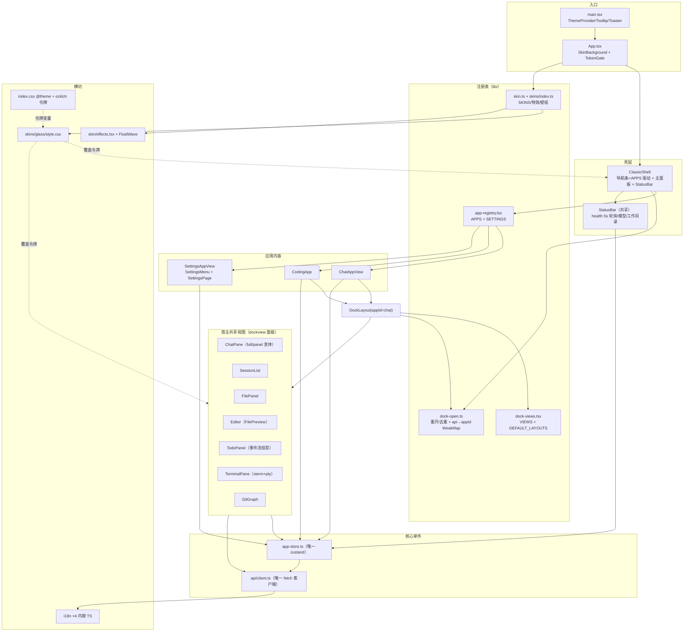
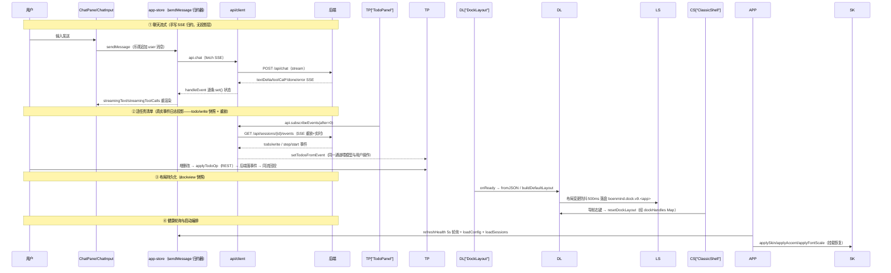

# 前端架构评估报告（工具B code-architecture 独立审查）

> **工具B code-architecture 独立审查，未看其他两份报告。**
> 方法：code-architecture skill Step 3A（现状映射 → 亮点 → 按影响排序的担忧 → 诚实结论）+ 架构文档输出结构（现状地图 / 组件与系统 / 数据流 / 权衡与坑 / Simplicity Check / 演进建议）。
> 范围：**仅前端** `frontend/`（src/ 84 文件 16,259 行、package.json、vite.config.ts、index.html、tsconfig*.json）。不含 backend/、src-tauri/、node_modules/、dist/。
> 参考：docs/everything-is-plugin-architecture.md（§四·B/C、§6.3）、docs/archive/HANDOFF_DESKTOP_SHELL.md、docs/archive/HANDOFF_BG_EFFECT_ANIMATION.md、docs/REVIEW_TOOLS_CROSS_2026-08-16.md（上轮全库审查，仅作背景，未依赖其结论）。
> 日期：2026-08-16。只读审查，未改代码。

---

## 〇、一句话结论（Verdict）

> **前端骨架方向正确、登记表模式是真功夫，"可停靠视图容器 + 宿主共享组件"的布局层是全库最接近远期插件化的部分；但当前处于"静态注册表世界"与"动态插件世界"之间的中间态——桌面时代遗产（2 个死依赖、2 个死应用条目、2 个死组件、1 套不可达导航状态）未清、API 客户端仍是单体、聊天状态仍是手写 SSE 归约而非文档承诺的日志投影。动手 §四·C 之前应先清遗产、把 DockLayout/VIEWS 从"壳内实现"升格为"可动态注册的接口"。**

---

## 一、现状地图（用自己的话）

### 1.1 分层结构

前端是**单页无路由**应用：`main.tsx`（next-themes ThemeProvider + TooltipProvider + sonner Toaster）→ `App.tsx`（皮肤背景层 + ClassicShell + TokenGate 令牌门）。没有路由库，导航 = zustand 单一 store 的 `activeNav`（应用级）+ `settingsTab`（设置级）两个枚举字段。

从外到内五层：

```
┌─ 入口层：main.tsx → App.tsx（SkinBackground z-0 + 内容 z-10 + TokenGate）
├─ 壳层：ClassicShell（左 48px 导航条 + 主面板 + 底部 StatusBar）
├─ 注册表层（单一数据源，全部是"登记一行"表）：
│   ├─ APPS：Record<AppId, AppEntry>（chat/coding/wiki/settings/plugins/steward）
│   ├─ SETTINGS：Record<SettingsTab, SettingsEntry>（13 项，分组 app/system + tier）
│   ├─ VIEWS：Record<ViewId, DockViewEntry>（7 个可停靠视图）
│   ├─ DEFAULT_LAYOUTS：每应用默认布局声明（coding 5 面板 / chat 2 面板）
│   └─ SKINS + BACKGROUND_EFFECTS + PRESET_WALLPAPERS：皮肤/特效/壁纸注册表
├─ 应用内容层：ChatAppView / CodingApp（= DockLayout）/ SettingsAppView /
│   PluginsAppView / StewardAppView / WikiPlaceholder
└─ 视图层（dockview 面板包裹的宿主共享组件，零业务改动嵌入）：
    ChatPane / SessionList / FilePanel / Editor / TodoPanel / TerminalPane / GitGraph
```

数据与基础设施：`api/client.ts`（947 行扁平 `api` 对象）单通道打通全部后端端点；`stores/app-store.ts`（898 行唯一 store）承载导航/设置/皮肤/健康/配置/会话/聊天流/项目/文件/todo/权限约 60 个字段；i18n 四语言内联 TS；皮肤 = `data-skin` 属性 + `--skin-*` CSS 变量。

### 1.2 组件与系统依赖图（Mermaid）



### 1.3 数据流（四条主线）



**依赖方向纪律**：注册表（lib/）只被壳与布局层消费；组件只依赖 store 与 api 两个单件，不反向依赖注册表（除 VIEWS 包装器）；store 不 import 组件。方向总体干净。

### 1.4 双壳实际状态（已核实）

**Desktop 壳已全删**：`src/components/desktop/` 不存在；grep 全库无 BootScreen/StartMenu/Taskbar/AppWindow 组件。残留仅三处：
- `app-store.ts:100-101,294-298` — `viewMode` 状态 + `setViewMode`（localStorage `boenmind.viewMode`）；
- `App.tsx:4` — 注释"渲染恒为 ClassicShell"；
- `AppearanceSettings.tsx:187-204` — 形态切换卡片，桌面卡片点击 `toast.info("desktopRemoved")` 占位。

这是用户 2026-08-16 拍板"全删除、留切换开关占位"的结果，**壳结构现状合理**（单一 ClassicShell + 一个保留状态字段），开关占位是有意为之而非债务。附带代价：桌面时代的死字段/死条目留在 APPS 里（见 §五·4）。

---

## 二、什么做得好（有证据）

1. **登记表模式是真实的、一致的架构主线**：APPS/SETTINGS/VIEWS/SKINS/BACKGROUND_EFFECTS/PRESET_WALLPAPERS 六张表全部是"新增即登记一行"，且 `Record<AppId, AppEntry>` 的映射类型让漏登记在编译期报错（`app-registry.tsx:71-122`、`dock-views.tsx:43-62`、`skins/index.ts:29-70`）。这在 1.6 万行规模下成本极低、收益真实——新设置页/新视图的接入路径单一。

2. **DockLayout 封装是"上游库隔离"的范本级实践**：dockview 的 API 只出现在 4 个文件（DockLayout.tsx / dock-views.tsx / dock-open.ts / StatusBarActions.tsx），视图组件零 dockview 依赖；布局快照**版本化**（`boenmind.dock.v9.<app>`，DockLayout.tsx:53，bump 语义与代价在注释里明说）；默认布局声明式（DEFAULT_LAYOUTS），重置经模块级注册表 `dockHandles`（DockLayout.tsx:60-72）避免 ref 穿透壳层——这是有意为之的旁路，注释交代了理由。配合 watermark 重开 + 标题栏"+"菜单（StatusBarActions.tsx:118-180），"关了就开不回来"的产品洞已闭环。

3. **TodoPanel 是架构承诺的最小实证**：`api.subscribeEvents(after=0)` 重放全量 + 实时增量，todo/write 全量快照语义幂等，模型与用户的操作走同一条事件通道（TodoPanel.tsx:37-52）——这正是 §6.3"日志投影引擎"的雏形，**证明了事件投影方向在前端可行**，是"万物皆插件"文档与代码同构度最高的部分。

4. **皮肤系统工程素养高**：可逆（`data-skin` 属性挂/卸，`applySkin` skin.ts:127-130，无属性 = 完整还原）；令牌级覆盖零组件改动（glass/style.css 只覆 CSS 变量）；参数化经 `--skin-<key>` 变量 + 每皮肤默认值 + 单位归一化（applySkinParams skin.ts:154-160）；**性能纪律文档化**（backdrop-filter 不作用于滚动容器、静态区才 blur，glass/style.css 注释明确 Chromium 限制）；自动配色有降级路径（sampleImage 跨域污染捕获）。这是 84 个文件里注释与实现质量最一致的部分。

5. **Tauri/Web 双部署零 Tauri 代码**：src/ 内 grep 不到任何 `@tauri-apps` import——桌面端只靠 index.html 注入 `window.__BOENMIND_API__`，client.ts:371-379 统一取基址。前端壳对传输实现完全无感，正是 §四·B"DE 不关心内核"的对偶面。

6. **状态与数据单件化控制住了复杂度**：无路由、无 redux 中间件、无 server-state 库——一个 zustand + 一个 api 对象覆盖全部需求；`refreshHealth` 对健康字段逐项 diff 才 set（app-store.ts:429-440），避免 5s 轮询引发全页重渲染，是值得保留的细节。

7. **i18n 与令牌体系扎实**：四语言内联 TS 有 `isLang` 类型收窄、后端 config.toml 为语言权威源（loadConfig 校正 localStorage）；Tailwind v4 无 config 文件、令牌全在 index.css `@theme inline` + `:root/.dark` oklch 两套（index.css:1-60,215-260），dockview 主题经 `--dv-*` 变量桥接同一令牌（index.css 尾部），明暗自动跟随。已知坑（react-markdown v10 无 className prop）在 MessageItem.tsx:84-90 以"外层容器 + Markdown 子组件"模式规避且注释标注，三处使用一致。

8. **设置分级与作用域体系有真实产品语义**：SETTINGS 的 group（app/system）+ tier（expert）双维度过滤（SettingsMenu.tsx:39-45），与后端 plugin_scopes/skill_scopes 配置呼应，不是空壳 UI。

---

## 三、权衡与坑（已在代码中识别并标注的）

1. **布局快照版本化以"重置用户布局"为代价**（DockLayout.tsx:44-52 明说"bump 可接受"）——当前阶段正确，但插件默认布局落地时应升级为快照指纹迁移，否则每轮布局迭代都清一次用户自定义。
2. **模块级可变注册表**（dockHandles Map + apiAppMap WeakMap，DockLayout.tsx:60 / dock-open.ts:66）——壳与面板间的跨层通信旁路，当前规模正确；但**动态加载/卸载插件时会成为泄漏点**（见 §七）。
3. **桌面形态的切换开关是"鬼 UI"**：AppearanceSettings 里桌面卡片点击只弹 toast（AppearanceSettings.tsx:197），用户拍板保留——保留合理，但建议把文案从"占位"升级为明确的"形态已移除"，避免新用户困惑。
4. **聊天消息不是事件投影**：历史走 REST `getSession`、流式走手写 SSE 归约（app-store.ts:692-786）、todo 走事件流——三套数据通道并存，与 §5.1"唯一事实源"的文档叙事有距离（后端双写过渡态是已冻结的已知事实，前端只是如实映射，非前端之过，但前端 chat 消息层确实没有投影语义）。

---

## 四、担忧（按影响排序）+ 可执行建议

### P1：聊天流式状态是"手写 SSE 归约器"，与文档承诺的投影引擎脱节

**证据**：`app-store.ts:692-786` sendMessage 内嵌 60 行 switch 归约器（textDelta/toolCallStart/toolCallEnd/permissionRequest/taskProgress/done/error 七种事件）；`finalizeStream` 用 `Date.now()` 造消息 id 并本地拼接 assistant 消息（app-store.ts:253-282）；断线重连无 last_seq 续拉（subscribeEvents 恒 `after=0` 全量重放，client.ts:815）。文档 §6.3 承诺"快照 + 增量两阶段 + last_seq 幂等续拉 + 投影订阅"，**前端目前只实现了 1/4**（todo 一条通道）。

**影响**：M3 断点续跑、Steward 治理面板、多会话并行（专家团队）都要在前端重建状态——每加一个消费者就多一份手写归约；这也是 §四·C 应用插件公共底座（§6.3"投影引擎是应用插件生态的公共底座"）的缺失。

**建议**（按成本递增）：
- 立即：把 `client.ts` 中三段 SSE 解析循环（chat:728-793 / subscribeEvents:810-853 / subscribeTerminal:858-897）抽成一个 `createSSEStream(url, headers, onData)` 助手——三段逻辑逐行相同，先消重复（上轮交叉审查亦标注此点）；
- M2 收尾/M3 前：给 subscribeEvents 加 `after` 游标参数（后端已支持），TodoPanel 消费"重放 + 增量"而非每次全量；
- 阶段 4 前：把"会话消息面"从 REST+SSE 双通道收敛为"事件流投影 + 快照"单一通道（与 §6.3 协议对齐），届时 api/client 才配叫 SDK。

### P2：api/client.ts 与 app-store.ts 是双单体，SDK 化是 §四·C 的最大缺口

**证据**：client.ts 947 行扁平对象约 50 方法 + 30 个接口类型；app-store.ts 898 行约 60 字段横跨 10 个域（导航/设置/皮肤/健康/配置/会话/聊天/项目/文件/todo/权限）。无 transport 抽象（§6.3 承诺 `Transport` 接口可插拔，实际只有 fetch）、无 RPC 信封、无投影引擎、无注册器 API。文档说"前端壳 = @boenmind/client + 应用注册器"——**@boenmind/client 尚不存在，它目前就是这两个单件文件本身**。

**影响**：动态 bundle 插件无法 import 这个单体（打包冲突/版本漂移），必须先抽公共 API 面。这是"插件化"从静态到动态的**结构性闸门**，不是修修补补能过的。

**建议**：§四·C 设计时把"抽 @boenmind/client（client.ts 的公开方法面 + 投影原语 + 类型）"列为首任务；store 侧为插件预留"切片注册"（或至少文档化"插件状态必须走后端事件，不直接塞前端 store"的边界纪律）。

### P3：桌面时代遗产未清——2 个死依赖 + 2 个死应用条目 + 2 个死组件 + 死字段

**证据（全部核实）**：
- `react-rnd ^10.5.3`、`react-resizable-panels ^4.12.2`（package.json deps）——src/ 零 import（全库 grep 仅 pnpm-lock 命中）；
- `APPS.plugins` / `APPS.steward` 条目（app-registry.tsx:106-121）及其视图 `PluginsAppView`/`StewardAppView`——`setActiveNav` 唯一调用方是 ClassicShell（ClassicShell.tsx:52），而 ClassicShell 导航只暴露 chat/coding/wiki + 设置齿轮（NAV_APPS=ClassicShell.tsx:30），plugins/steward 实际经 SETTINGS 设置页可达——**APPS 里的两条目不可达**；
- `AppEntry.defaultSize` + `gradient` 字段（app-registry.tsx:56-65）——grep 全库除注册表外零消费（桌面窗口层已删）；`APP_LIST`（app-registry.tsx:124）零消费；
- `ChatWindow.tsx`（11 行，零引用）、`ExpertTeamDocs.tsx`（零引用，还挂着 react-markdown import）——死组件。

**影响**：小，但持续误导（未来接插件的开发者在 APPS 里看到"应用"与 SETTINGS 里同名"设置页"两套，会困惑 plugins/steward 究竟以哪种形态存在）。

**建议**：一次清理轮——pnpm remove 两个死依赖；删除 APPS.plugins/steward 条目与两个包装视图（内容组件本身在 SETTINGS 里活着）；删除 defaultSize/gradient/APP_LIST（桌面回归或插件化需要时从 git 历史取回）；删除 ChatWindow/ExpertTeamDocs。viewMode 开关按用户拍板保留。

### P4：应用概念双轨——AppId 与 SettingsTab 重叠且指向不同组件

**证据**：plugins/steward 同时是 `AppId`（APPS.plugins → ScrollPage 包装）和 `SettingsTab`（SETTINGS.plugins → SettingsPage 容器包装），两个包装器布局不同（app-registry.tsx:173-197 vs 316-326）。wiki 有 AppId 但无 SettingsTab；chat/coding 两个都有。**"应用"的边界在注册表里没有单一表达**。

**影响**：§四·C 的"应用 = 独立软件"语义需要一个清晰的注册面；当前双轨会让"应用插件注册哪些贡献点"（导航项/设置页/视图/默认布局）无从声明。

**建议**：借 §四·C 设计把 AppEntry 扩展为"贡献点集合"（导航 + 设置页 + 默认布局 + 视图集），一次定形；在此之前至少把 APPS/SETTINGS 的重叠条目收敛（见 P3）。

### P5：BackgroundEffect 是"为第二个消费者预建的注册表"，且唯一消费者动画是坏掉的

**证据**：BACKGROUND_EFFECTS 注册表（skin.ts:85-95）只有 none/wave 两项；wave 动画有完整交接文档证明"用户真实浏览器确认不流动"（HANDOFF_BG_EFFECT_ANIMATION.md，WebGL 各环节正确但合成器不提交帧，最可能假设 = WebGL canvas + mix-blend-overlay 组合怪癖，2D canvas 重写方案已备好）；`backgroundEffect` 默认 wave（skin.ts:101）——**默认开启一个用户确认不可见的特效**。

**影响**：小（性能层面 canvas 仍在 30fps 跑），但"注册表抽象先于第二个消费者"与项目自定的 YAGNI 判据（"第一个第二实现出现时"）相悖，且默认开着一个坏功能。

**建议**：按交接文档假设 A 做 2D canvas 重写（改动局限 effects.tsx，签名不变）；若 2D 也不动则按 C 排查双 WebGL context；修复前把默认值改为 none 或标注"实验性"。修复后 BACKGROUND_EFFECTS 保留即有价值（第二个特效出现时注册即可）。

### P6：i18n ×4 与设置页条目的扩散成本随轮次线性增长

**证据**：SETTINGS 13 项、APPS 6 项、VIEWS 7 项、SKINS/PRESET_WALLPAPERS/BACKGROUND_EFFECTS 各若干——每个注册表条目都要 ×4 语言补键；settings 相关组件 24 个文件占 components 近半。上轮交叉审查与 handoff 均确认这是已知成本。

**影响**：低（键漏了 fallback zh 兜底，i18next 配置了 fallbackLng），但§四·C 插件自带 i18n 资源时需要一个**注册式补键通道**（现在资源是 4 个静态 TS 文件，插件无法注入）。

**建议**：现阶段不动；§四·C 设计时把 `i18n.addResourceBundle` 封装为 SDK 注册 API 的组成部分。

---

## 五、Simplicity Check（过度工程自审，逐条）

| # | 抽象 | 审计结论 | 决定 |
|---|---|---|---|
| S1 | **AppRegistry（APPS）** | 注册表本身值得（DE 契约种子）；但 6 条目中 2 条不可达（plugins/steward）、AppEntry 3 个字段/1 个导出零消费 | **保留但瘦身**（见 P3） |
| S2 | **SETTINGS 注册表** | 13 项全活、双维度过滤真实使用 | 保留，不动 |
| S3 | **VIEWS + DEFAULT_LAYOUTS + DockLayout（~500 行）** | 最大抽象，服务于 2 个应用；但用户拍板的 VS Code workbench 语义、布局持久化/重置/重开三入口都在真实使用；编程壳默认布局是 M2 主战场 | **保留**——不是过度，是产品方向（§四·B 补充 2）的落地；若编程壳只是固定三栏，这 500 行确实过剩——但"应用 = 默认布局声明"正是插件化的形态，现在的投入是提前买对了容器 |
| S4 | **双壳** | Desktop 已删，剩 viewMode 占位状态 + 1 个占位开关 | 按用户拍板保留；其余桌面形态代码零残留（App.tsx 注释已明） |
| S5 | **皮肤参数化（hue/alpha/blur + 自动配色 + 自定义背景 + 预设壁纸 + 背景特效）** | 五层表面服务于一个美学诉求，但实现总量小（skin.ts 297 行 + 1 个 CSS 117 行 + 2 个 WebGL 组件），全部可逆、组件零成本；参数只有 3 个滑杆不是过度参数化 | 保留皮肤/壁纸/背景图；**特效层单独处理**（S6） |
| S6 | **BACKGROUND_EFFECTS 注册表 + WebGL 特效层** | 一个真实条目 + 动画确认不可见 + 默认开启——"先建注册表等第二个消费者"是唯一一处与项目 YAGNI 判据（第一个第二实现出现时）相悖的地方 | **修复或降级**：2D 重写后保留；否则默认 none |
| S7 | **TokenGate + 权限模式 UI + 作用域 UI** | 全部有后端对应语义，非空壳 | 保留 |
| S8 | **subscribeEvents/subscribeTerminal 双 SSE 订阅 + chat 内联 SSE** | 三份复制，应合一 | 收敛（P1） |
| S9 | **dockHandles/apiAppMap 模块级 Map** | 当前规模下是合理的旁路（避免 ref 穿透）；插件动态化后需要重审 | 保留 + 标注（§七） |
| S10 | **设置分级（tier）/分组（group）** | 两维元数据成本极低、语义真实 | 保留 |

**总评**：这轮自审没有发现"为抽象而抽象"的大型设计——最大的两笔投入（dockview 布局系统、皮肤系统）都有真实消费者与用户拍板背书。真正的过度是**残留**（死依赖/死条目/死组件）与**一处抢跑**（特效注册表），不是设计本身。

---

## 六、对远期"界面插件化（§四·C，dsh 式 ui-slots + 同域 bundle 动态注册）"的适配度

### 6.1 现状距离 dsh 机制还差什么

| dsh 机制 | 本项目现状 | 差距 |
|---|---|---|
| **宿主 SDK 契约**（平台 module table：客户端插件不自带 React，从壳取依赖） | `@boenmind/client` 不存在；api/store 是单体文件 | **最大缺口**：无公共依赖表，bundle 插件无法 import React/zustand/i18n 而不冲突 |
| **ui-slots 槽位树**（SlotMap 声明合并 + 注入 + 卸载级联） | VIEWS + DEFAULT_LAYOUTS 是**声明式视图槽的雏形**（"面板 = 宿主共享组件，布局 = 声明"）——但槽位类型只有 dock 面板一种，无 toolbar/settings-card 等其余槽位；params 是 `Record<string, unknown>` 无类型契约；无卸载语义 | 半程：VIEWS 升格为 `registerViews(plugin, views)` + 类型化 params + disposer 即得 dsh 槽位的前端形态 |
| **同域 bundle 动态加载**（`/plugins/<id>/client.js` CJS factory → window.__ModuleLoader__.load + CSS 内联） | Vite 单包构建（仅 vendor 分组拆 chunk）；无加载器、无 manifest client.js 字段 | **零存在**：需要新构建形态（同域 bundle 产出）+ 加载器 + manifest 契约 |
| **RPC 桥**（插件 ↔ 宿主） | 有 fetch + SSE 直连，无 RPC 信封/方法路由（方法 = 后端插件注册路由的语义已存在：`/api/app/<id>/...` 规划） | 中等：client.ts 已集中全部端点，加一层信封包装成本可控 |
| **事件→视图投影**（ConversationNodeDefinition） | TodoPanel 已验证投影模式可行 | 模式已实证，机制未通用化（P1） |
| **隔离** | 无（静态 import 世界天然无隔离） | 用户拍板项：iframe（Hana）vs 同域 bundle（dsh）——**当前静态结构最接近同域 bundle**（无隔离但依赖共享简单），iframe 需要把现有 APPS 全部迁出壳，成本高一个量级 |

### 6.2 当前结构中"可直接继承"的资产（好消息）

1. **DockLayout 就是 VS Code workbench 容器**——插件视图天然应该跑在 dockview 面板里，VIEWS 注册表的"登记一行"模式可以直接扩展为"插件注册视图"；
2. **skin 的 data-skin 可逆机制**——插件皮肤 = 注入一个 `:root[data-skin="<plugin-skin>"]` CSS 文件即可，零宿主改动；
3. **APPS/SETTINGS 的 Record 表 + 编译期穷尽**——可机械翻译为"运行时合并的注册表"（宿主表 + 插件表叠加，冲突策略按 Z2 覆写语义）；
4. **后端已有 scopes 配置**（plugin_scopes/skill_scopes，client.ts:41-43）——前端槽位可按作用域过滤注入，权限边界不是从零开始；
5. **todo 投影实证**——应用插件的公共同步底座（§6.3 投影引擎）已在最小形态跑通。

### 6.3 建议的过渡路径（务实版）

```
阶段 A（顺手，1 轮）：清 P3 遗产 + 抽 createSSEStream + subscribeEvents 加游标
阶段 B（M2 收尾期）：VIEWS/DEFAULT_LAYOUTS 数据驱动化（类型化 params、注册/注销 API、
                     卸载 disposer——内核"可逆副作用"哲学的前端翻译）
阶段 C（§四·C 拍板后）：定隔离形态（推荐同域 bundle 起步，理由见 6.1 末行）→
                     抽 @boenmind/client（公开方法面 + 投影原语 + 依赖表）→
                     加载器 + manifest client.js 字段 + i18n 注册通道
```

**判断**：现有结构对 §四·C 的适配度 = **"容器与注册表已就位，契约与加载器未就位"**。VIEWS/DockLayout 是意外的好起点（当初为布局系统拍板，恰好是插件视图容器的正解）；真正的工程量在 SDK 抽取与 bundle 加载形态，不在壳本身。

---

## 七、演进建议（按优先级汇总）

1. **清理轮（P3）**：两个死依赖 + 两个死应用条目 + 死字段/导出 + 两个死组件——一次定调，半天量。
2. **SSE 收敛（P1 第一步）**：三段解析合一 + 游标参数。
3. **特效修复（P5）**：按 HANDOFF_BG_EFFECT_ANIMATION 假设 A 做 2D canvas 重写；修复前默认 none。
4. **VIEWS 契约化（阶段 B）**：类型化 params + 注册/注销 API——这是 §四·C 前端侧第一块正式拼图。
5. **§四·C 立项时**：@boenmind/client 抽取列为前置任务；隔离形态建议同域 bundle 起步（与现有静态结构顺滑过渡，iframe 需整体迁出 APPS，成本差一个量级）；插件状态边界纪律（"插件状态走后端事件，不塞前端 store"）写入设计文档。
6. **文档对齐**：§6.3 的"投影引擎已承诺"与前端现状（仅 todo 一条通道）之间补一段"实施状态"标注（与 §5.1 双写标注同款诚实姿态）。

---

## 附录：审查边界与核实记录

- 未审：backend/、src-tauri/、node_modules/、dist/、docs/（仅读文档作背景）。
- 核实清单：Desktop 壳已删（无 desktop/ 目录、无相关组件）✓；react-rnd/react-resizable-panels 死依赖 ✓（仅 package.json + pnpm-lock）；dockview-react 真实使用 ✓（4 文件）；APPS.plugins/steward 不可达 ✓（setActiveNav 唯一调用方在 ClassicShell，导航不暴露这两项）；ChatWindow/ExpertTeamDocs 死组件 ✓；react-markdown v10 className 坑已在三处一致规避 ✓；皮肤可逆机制与参数注入 ✓。
- 上轮交叉审查（docs/REVIEW_TOOLS_CROSS_2026-08-16.md）已覆盖"SSE 解析三处复制"（QUAL-005）与"ChatWindow/ExpertTeamDocs 死代码"（A-14）——本报告独立复核后采信并归入 P1/P3。
