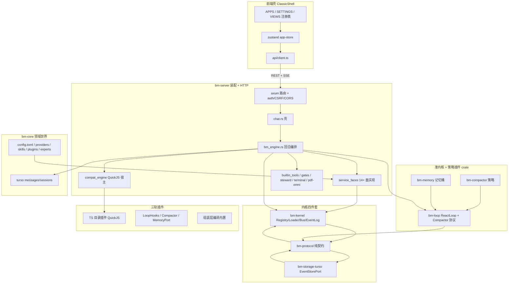

# Tool A — code-architecture 3A Review（2026-08-17）

> 审查日期：2026-08-17 ｜ 方式：只读代码审查（未改任何文件）
> 审查工具：code-architecture skill（Step 3A Architecture Review）
> 范围：`frontend/src/**` + `backend/crates/**` + `backend/plugins/**`（6 个 TS 插件）。
> **硬排除**：`backend/crates/bm-wiki/**`、前端 wiki 视图/组件/API 功能本身、`bm-server` 纯 wiki 路由/`wiki_*` 工具语义、`vendor`/`target`/`node_modules`/`dist`/`docs` 正文。组装层被 wiki 污染仅作边界观察，不把 wiki 功能当问题。
> 上轮基线：`docs/review-tools-2026-08-16/TOOL_A_code-architecture.md`。已修项不复报，除非代码里仍未修。
> 用户定调：扩展点/挂点一律不删，只评估合理性。

## 架构地图

BoenMind 是一台寄生在宿主 OS 上的本地 Agent 运行时：事件日志承诺语义，loop 是准内核，策略与能力走插件。真实分层（以 Cargo 依赖与调用边为准，不以文件夹名为准）如下。

**依赖方向（Cargo.toml 实测）**

| crate | 依赖 | 角色 |
|---|---|---|
| `bm-protocol` | 仅 serde | 契约：Event / Port / 错误码。零运行时依赖物理锁死 |
| `bm-kernel` | protocol | EventLog 语义、Registry、Loader、EventBus、InMemory store |
| `bm-storage-turso` | protocol + **kernel** | EventStorePort 的 turso 实现 + DualWriter + recover |
| `bm-loop` | protocol + kernel + reqwest | ReactLoop、投影、压缩事务协议、OpenAI SSE 客户端 |
| `bm-compactor` / `bm-memory` | loop + protocol（+ kernel） | 策略插件 crate，经 KernelBuilder / MemoryPort 装配 |
| `bm-mcp` | protocol + tokio | MCP client/server；`McpService` 不是 protocol Port |
| `bm-compat` | 无 bm-* | vendored QuickJS，pi.dev 插件兼容层 |
| `bm-core` | turso，**不依赖内核** | 配置/DB/技能/插件安装/专家/工作区/更新 |
| `bm-server` | 上述几乎全部 + `bm-wiki` | 唯一装配点 + HTTP 面 |
| `bm-wiki` | 仅 serde* | 排除审查；经 server 路由/场景工具挂入 |

**一条代表垂直切片（发一条聊天）**

`POST /api/chat`（`chat.rs`）→ 校验会话、**messages 表写入用户消息** → `chat_bm` → 解析 provider（请求 > 会话 > APP 专家 > 默认）→ 取/建会话 `ReactLoopAgent`（串行锁 + agent 锁）→ `run_agent_turn`（15min 超时 / attach SSE / memorize / `run_turn`）→ loop 每步从事件日志投影 OpenAI payload → 流式落盘（EventFlusher）+ `StreamHooks` 推 SSE → 工具经 `QuickJsToolExecutor` 四路分派（内置 / MCP / set_wake / QuickJS）→ 高权限工具过 `BuiltinGate`/`McpGate` → TurnEnd → **assistant 再写回 messages 表**。前端历史读 messages；todo 读 `todo/write` 事件。

**三轨并存（代码事实，文档也承认）**

1. **QuickJS 插件轨**：`backend/plugins/{role,coding-memory,ctx-compactor,web-search,refine-suggest,pdf-omni}`，经 `bm-compat` + `compat_engine`。
2. **loop 契约轨**：`Compactor` / `LoopHooks` / `MemoryPort`，经 kernel 服务面。
3. **组装层编译内置**：内置工具、Steward、subagent、终端、pdf-omni 核、refine、更新；wiki 工具也在这条轨上登记（仅记组装污染，不审 wiki）。

**前端**

唯一形态 `ClassicShell`（桌面壳已退役）。`APPS`/`SETTINGS`/`VIEWS` 三张表驱动导航与 dockview。状态集中在 `app-store.ts`（932 行）。API 手写在 `client.ts`（1086 行，含 wiki 客户端函数）。无 vitest、无 OpenAPI/zod 契约。

**对照文档漂移**

- `docs/everything-is-plugin-architecture.md` 仍写「内核 6060 行 / 服务面 13 面接线完毕」；代码里 loop 单 `engine.rs` 已 1041 行，服务面 14（+ 运行期 mcp 非协议面）。
- `docs/HANDOFF_KERNEL_PHASE1.md` 仍写 LoopHooks 10 挂点；代码 12。
- `docs/EXTENSION_POINTS_REGISTRY.md`（2026-08-16）比主架构文档诚实：4 个面与 8 个挂点标「待接线」。
- `docs/design/SETTINGS_ARCHITECTURE_2026-08-16.md` 阶段 1–5 正文已标完成，文末表格又重复列出 2–5 为空白——文档自身打架。

## 亮点

1. **契约 crate 仍是物理纯净**：`backend/crates/bm-protocol/Cargo.toml` 仅 serde；Port 用手写 `BoxFuture`。这不是口号，是依赖图锁。
2. **上轮 P0/P2 修复仍在、没有回潮**：
   - CSRF Origin/Referer：`backend/crates/bm-server/src/lib.rs:406-457`，带单测。
   - 内置高权限工具门：`builtin_gate.rs:20-75`，与插件共用 `PermissionStore`。
   - `run_agent_turn` 统一 chat/steward：`bm_engine.rs:944-1016`。
   - 记忆经 `MemoryPort` 全局单例：`bm_engine.rs:426-446`。
   - `Arc<dyn Compactor>` + 自定义实现不静默覆写：`bm_engine.rs:469-503`。
   - `context_window` 从 `[compaction.overrides]` 注入：`bm_engine.rs:461-467` + `bm-core/src/compaction.rs:146-162`。
   - 双写冻结与真相源诚实标注：`bm-storage-turso/src/dual_write.rs:11-18`。
   - 权限记忆不再 `expect` 崩启动：`compat_engine.rs:927-936`。
3. **事件日志语义仍然扎实**：turso 单写者事务、`repair_heads`、`recover_interrupted_turns`、独立集成套件 `backend/tests/event_log`（replay / ignorable / fork / checkpoint / proptest）还在。
4. **ProviderPort 是本轮真正的架构进步**：`ProviderKind` 收到 3 + Unknown；`LlmPortImpl` 经 `ProviderPort` 取官方端点/形状（`service_faces.rs:187-228`），不再直读硬编码厂商表。这是「服务面 = 承诺 API」第一次有*替换动机*的消费方。
5. **作用域引擎按 `session.app` 过滤**：插件 `tools_for_app`、MCP `scope_matches`、SKILL 注入按 APP——设置架构阶段 3 在引擎侧落地，不是只做 UI 徽标（`bm_engine.rs:391-424`）。
6. **专家与 APP 配置单源**：`config.toml [apps.<id>]` + `~/.boenmind/agents/*.md` 同池，避免「专家一套 / subagent 一套」。
7. **每 crate 有 `tests/architecture.rs` 依赖方向守卫**（protocol / kernel / loop / memory / compactor / storage）。这是「吸收不进核心」铁律的机器化，比文档纪律更硬。
8. **前端注册表纪律仍好**：`app-registry.tsx` 的 `Record<AppId, AppEntry>` 漏改编译失败；主题以 `config.toml` 为准（`App.tsx:38-43`）；SSE 三处收口到 `client.ts` 解析器；`usePolling` 统一 health 节奏。
9. **工作区相对路径圈禁写得认真**：`bm-core/src/workspace.rs:27-47` 拒 `..`、canonicalize、symlink 逃逸测试。问题在「根」是谁给的（见 A-2），圈禁算法本身不是问题。
10. **扩展点登记表是正确的治理补丁**：`docs/EXTENSION_POINTS_REGISTRY.md` 把「待接线」写在纸上，避免上轮「接线完毕」的宣传通胀。按用户定调，空挂点保留合理，前提是登记表继续跟代码走。

## 维度评分（1-10 + 证据）

| 维度 | 分 | 证据 |
|---|---|---|
| **架构合理性** | **7** | 分层方向对：protocol ← kernel/loop/storage，core 不进内核，server 是唯一装配点。事实源分裂（messages vs event_log）已冻结标注。扣分：`AppConfig` 双实例（A-1）、storage→kernel 语义耦合仍在、三轨插件使「内核最小」在装配层被打穿、wiki 以编译内置场景臂进入 `bm_engine`/`compat_engine`（组装污染，不审功能）。 |
| **精简** | **6** | 上轮死组件 ChatWindow/ExpertTeamDocs 已消失。仍在：4 个无 lookup 服务面、EventBus 四模式、`declare_event!`、LoopHooks 8 个空挂点（按定调不删，但是心智货架）、`clip_tool_output` 生产零调用（`engine.rs:929` 仅测试）、路由「经 port 退化直调」双路径在 kernel 与 dual_writer 同生共死时不可达。挂点保留合理；双路径与死函数不合理。 |
| **优美** | **6** | 中文模块头注释质量高，命名（Port / LoopHooks / DualWriter）稳定。反面：`bm_engine.rs` 1578 / `compat_engine.rs` 1558 / `lib.rs` 1066 / `client.ts` 1086 / `app-store.ts` 932 五座上帝文件；`service_faces.rs:58` `}impl` 同行仍在；`PI_SUBAGENT_PROVIDER_ID` 残留 pi 前缀；HANDOFF/架构文档行数与面数过期。 |
| **复用** | **7** | `run_agent_turn` 消掉 chat/steward 双编排（上轮 A-3/A-4 已修）。SSE 解析前端收口。未收口：`set_wake` 直调 `StewardStore`（`compat_engine.rs:1146-1150`），旁路已注册的 `SchedulerPort`；`LlmPort` 与 `CredentialsPort` 各读一遍 config；工具 `{content:[{type:text}]}` 仍在 steward/builtin/compat/TS 多处解释；`EventLog::new(store)` 仍手工拆 5+ 次。 |
| **完善** | **6** | Rust 侧：event_log 集成套、architecture 守卫、service_faces/builtin_gate/workspace 单测扎实。缺口：前端 **零测试框架**（`frontend/package.json` 无 vitest）；API 无共享 schema（client 手写 interface）；`put_config` 不刷新 kernel 持有的 config（正确性 bug，见 A-1）；SETTINGS 文档阶段表自相矛盾；可观测有 tracing 事件名，但 NotifyPort 失败静默。 |
| **安全** | **7** | 本机 CORS + Origin CSRF + 可选 Bearer + 非 loopback 无 token 告警（`lib.rs:893-897`）到位。`validate_base_url` 拦私网（`providers.rs:97-132`），MCP discover 同款。扣分：工作区 `root` 查询参数是任意绝对路径（A-2）；插件 `pi.http` 无 SSRF（A-3）；无 Origin/Referer 的状态变更直接放行（curl/本地脚本友好，浏览器扩展/非浏览器客户端同样无 CSRF 闸）；api_key 仍走 LlmPort JSON。 |

性能/正确性（不冲淡主线）：插件 HTTP 每次 `Client::new()`（`compat_engine.rs:296`）丢连接池；`context_window` 未配时仍默认 128K，水线会系统性偏；fork 只复制 messages 不复制 event_log，todo/压缩态在分叉会话丢失。

## 担忧（按影响，A-1, A-2...）

### A-1 配置事实源分裂：`state.config` 与 kernel `shared_config` 是两份互不订阅的克隆

- **File(s)**：`backend/crates/bm-server/src/lib.rs:575-636`；`backend/crates/bm-server/src/routes/config.rs:50`；`backend/crates/bm-server/src/routes/skills.rs:118-126`；`backend/crates/bm-server/src/service_faces.rs:192-211, 279-288`；`backend/crates/bm-core/src/skills.rs:525-543`
- **Severity**：Critical（正确性 / 架构所有权）
- **Observation**：`serve_inner` 用 `config.clone()` 建 `Arc<RwLock<AppConfig>>` 注入 `ProviderPort` / `LlmPort` / `SkillPort` / `CredentialsPort`。HTTP 热路径写的是 `AppState.config`（tokio RwLock）。两条写路径交叉后脑裂：
  1. `PUT /api/config` 只更新 `state.config` + 落盘，**不写 kernel 那份**。之后 `LlmPort.resolve_config` / `CredentialsPort.api_key` 仍用启动时的 key/端点；用户在设置页改密钥，下一轮聊天可能继续打旧密钥。
  2. `set_skill` 走 `SkillPort` 时改的是 kernel 克隆并 `config::save` 落盘，**不回写 `state.config`**。`GET /api/config` 与 `get_or_create_loop_agent` 里 `enabled_skills_prompt(&config, app)`（读 `state.config`）看到旧启用列表；SkillPort.list() 看到新列表。UI 与注入面可以不一致。
- **为何重要**：设置中心刚把 APP/专家/SKILL/MCP 做成「单源 config.toml」。服务面本应是那份单源的 syscall。现在 syscall 握着启动快照，HTTP 握着热配置——ProviderPort 方案 A 的「单源」在运行期是假的。这是本轮相对 08-16 **新出现**的结构性回归（服务面铺开时 clone 出去，没有订阅）。
- **Recommendation**：kernel 面与 `AppState` **共享同一把锁**（`Arc<RwLock<AppConfig>>` 或把 `state.config` 降为那把锁的包装）。所有 `put_config` / skill / plugin / apps 写点只打这一处。不要再 `config.clone()` 出第二份可变权威。

### A-2 工作区 `root` 是客户端任意绝对路径，圈禁只防「逃出调用方指定的根」

- **File(s)**：`backend/crates/bm-server/src/routes/workspace.rs:15-20, 31-37`；`backend/crates/bm-core/src/workspace.rs:27-47`
- **Severity**：High（安全）
- **Observation**：`resolve_root` 把查询参数 `root` 直接 `PathBuf::from`。`safe_join` 只保证相对路径不逃出**这个** root。编程壳项目切换依赖此设计（本地多仓库），但任何能打到本机 API 的调用方（本机页面、无 Origin 的脚本；CORS 放行所有 localhost 端口）都能把 root 设成 `%USERPROFILE%` / `/etc` 后读写。终端 cwd 同样跟项目根走。
- **为何重要**：这是 Agent OS 的文件系统驱动。CSRF 闸只认 localhost，不认「是不是用户当前项目」。本地恶意页 + 未设 `BOENMIND_TOKEN` 即可当文件代理。
- **Recommendation**：维护服务端「已登记项目根」白名单（设置页 working_dir + 用户确认过的项目列表，落 config 而非仅 localStorage）。请求 `root` 必须是白名单前缀；拒绝未登记绝对路径。前端项目集合上移后端。

### A-3 插件 `pi.http` 无 SSRF / 无共享 Client

- **File(s)**：`backend/crates/bm-server/src/compat_engine.rs:283-317`（对照 `bm-core/src/providers.rs:97-132`、`bm-mcp/src/discover.rs` 已有私网拦截）
- **Severity**：High（安全 / 性能）
- **Observation**：hostcall 取出 url 后立刻 `reqwest::Client::new()` 并发 GET/POST，不校验 scheme/host。厂商端点与 MCP 发现有私网闸，插件轨没有。web-search 等出厂插件会打外部网；被诱导的工具参数也可打 `169.254.169.254` / 局域网。每次新建 Client 丢连接池（上轮 A-21 仍在）。
- **为何重要**：QuickJS 沙箱的护城河止于 JS 堆；网络是宿主能力。能力询问按「http」一档记忆，不按目标主机。
- **Recommendation**：与 `validate_base_url` 同策略抽共享过滤器（回环按档位/用户确认放行，私网默认拒）。`BridgeServices` 持 `Arc<Client>`。询问链带 URL host，避免「允许一次 http = 允许任意内网」。

### A-4 装配层仍是单点瓶颈；运行期 `register_port` 吞错

- **File(s)**：`backend/crates/bm-server/src/lib.rs:544-856`（kernel 闭包 571-649、MCP 693-792、运行期注册 794-841）；`lib.rs:782,804,810,816,840`
- **Severity**：High（架构演进成本）
- **Observation**：14+ 面生命周期、双写、compat、MCP 三源连接（toml / 发现 / TS `registerMcpServer`）、Steward、双门全挤在 `serve_inner`。build 期 `.with_port` 重复 key fail-fast；运行期 `let _ = register_port(...)` 把 `AlreadyRegistered` 吞掉。MCP 以 `Arc<dyn McpService>` 进 kernel port 表，**不是** `bm-protocol` 的 trait——注册表类型纪律被打开一个口。
- **为何重要**：任何新面（Goal 调度、第二存储、UI slot 后端）都要改这个函数。吞错会让「第二实现替换」在运行期静默失败。wiki 工具也在同一装配/分派中枢挂臂，后续 APP 会继续加厚这座文件。
- **Recommendation**：拆 `build_kernel(store, config, db) -> Kernel`、`connect_mcp(...)`、`register_runtime_ports(...)`。运行期注册失败 fail-fast（与 lib.rs:570 注释一致）。MCP 要么升为 protocol `McpPort`，要么不要进 `ctx.register_port`，只放 `AppState.mcp`。

### A-5 消息面双写未闭环；会话 fork 只复制 messages，事件日志分叉是空的

- **File(s)**：`backend/crates/bm-storage-turso/src/dual_write.rs:11-18`；`backend/crates/bm-server/src/chat.rs:114-120`；`bm_engine.rs:996-998`；`routes/sessions.rs:176-197`；`bm-core/src/db.rs:267-269`
- **Severity**：High（事实源 / 正确性）
- **Observation**：双写冻结标注诚实（真相源 = messages，M3 再收口）。但 `fork_session` 明确「不动内核分支模型」，只拷贝 messages。新会话 event_log 从头开始：todo 快照、压缩 replace、memory/write 全丢；loop 投影与 UI 历史在分叉会话上不再同构。前端 fork 按钮会制造「看起来有历史、模型看见另一套日志」的会话。
- **为何重要**：产品已把 fork 做成聊天 UI 语义。内核 `EventStorePort::fork_branch` 与集成测试存在，生产会话 fork 没用它。这是「事件日志唯一事实源」最容易被用户踩到的裂缝。
- **Recommendation**：在双写冻结期内二选一并写进里程碑：① fork 同时 replay/拷贝 event_log 到新 session_id（或真 fork_branch）；② UI 标明「仅复制可见消息，任务/压缩态不跟随」。M3 收口前不要让 fork 看起来像完整会话克隆。

### A-6 服务面「待接线」四席 + 消费方旁路已接线的面

- **File(s)**：`docs/EXTENSION_POINTS_REGISTRY.md:22-25`；`bm-protocol/src/port.rs:251-279`；`compat_engine.rs:1146-1150`；`service_faces.rs:86-124`；`chat.rs:161-179`
- **Severity**：Medium（架构诚实 / 复用）
- **Observation**：tools / notify / scheduler / credentials 已注册、有 impl、有单测，生产 `port::<dyn …>` **零 lookup**（grep 实证）。更糟的是：`SchedulerPort` 已注册，`set_wake` 执行仍直调 `StewardStore`；`CredentialsPort` 已注册，`LlmPortImpl` 仍自己扫 `providers[].api_key` 再塞进 JSON。Gate/Skill/Session/Settings 仍「经 port，否则直调」——而 kernel None ⟺ dual_writer None，退化支不可达。
- **为何重要**：按用户定调这些面应留。不合理的是**面在、syscall 不走面**。第二实现换 scheduler 时生产路径根本碰不到它。登记表写「待接线」是对的；执行侧旁路让「待接线」变成「永远装饰」。
- **Recommendation**：挂点保留。把已有生产调用改到面上：`execute_set_wake` 经 `SchedulerPort`；`LlmPortImpl` 经 `CredentialsPort` 取 key（顺手去掉 JSON 里的明文 key，见 A-8）。退化直调收成一个 `AppState::require_port`，删不可达 else。

### A-7 内核 EventBus / `declare_event!` 仍是测试-only 四件套成员

- **File(s)**：`backend/crates/bm-kernel/src/bus.rs`；`bm-protocol/src/event.rs:257,492`；`docs/EXTENSION_POINTS_REGISTRY.md:48-49`
- **Severity**：Medium（架构叙事 vs 运行时）
- **Observation**：`emit` / `waterfall` / `on_async` 生产路径（server / memory / compactor / loop）无调用。`declare_event!` 唯一实例在 event.rs 测试（示例名仍是 WikiPlugin，具讽刺性）。文档 §15 与 HANDOFF 仍把总线写成内核四件套「已建成」。
- **为何重要**：不建议删（定调）。但「内核 = 加载器+注册表+总线+日志」里总线对 Agent 行为为零。QuickJS 插件有自己的 `pi.events`，与 kernel bus 平行。两套事件宇宙会在「阶段 3 插件域事件」时对撞。
- **Recommendation**：在登记表写清启用判据（例如：第一个非 loop 的 Rust 插件要用 waterfall 拦工具时）。在那之前，架构文档不要再写「四件套缺一不可已落地」——改为「日志+注册表生产中；总线待插件域」。

### A-8 `LlmPort.resolve_config` 仍把 api_key 打进 JSON 往返

- **File(s)**：`bm-protocol/src/port.rs:189-198`；`service_faces.rs:198-228`；`bm_engine.rs:318-328`；`service_faces.rs:511-518`（测试断言 `cfg["api_key"] == "sk-test"`）
- **Severity**：Medium（安全）
- **Observation**：上轮 A-11 未修。密钥在 Port 边界 serde 成 Value，任何 `Debug`/日志/错误透传都可能泄漏。`CredentialsPort` 注释写明「仅宿主内部」，但没有消费者。
- **Recommendation**：`resolve_config` 返回无 key 视图；`OpenAiClient` 构造走 `CredentialsPort::api_key`。测试改断言「JSON 不含 api_key」。

### A-9 LoopHooks 12 点中 8 点无生产消费者（评估，不删）

- **File(s)**：`backend/crates/bm-loop/src/points.rs:53-99`；`bm_engine.rs:230+`（StreamHooks）；`subagent_child.rs:265`；`docs/EXTENSION_POINTS_REGISTRY.md:27-42`
- **Severity**：Medium（心智负担）
- **Observation**：生产只用 `on_request` / `on_stream_chunk` / `on_tool_pre` / `on_tool_post`。其余 8 个 engine 会调用，默认空。登记表已标待接线，合理作 OS syscall 表。风险是继续「顺手加挂点」——`points.rs` 头注释仍写「五个扩展点」，与 12 个实现不一致。
- **Recommendation**：不删。冻结挂点表：新增必须改登记表 + 指出预计消费者与里程碑。修正 `points.rs` 模块头，避免后人按「五个」实现。

### A-10 前端契约防线与测试仍为零；`client.ts` 已成第二份协议

- **File(s)**：`frontend/package.json`（无 vitest/zod）；`frontend/src/api/client.ts`（1086 行，混入 wiki 客户端）；`frontend/src/stores/app-store.ts:167-170,725-773`
- **Severity**：Medium（完善 / 复用）——上轮前端遗留，**仍在**
- **Observation**：后端改字段名只能靠手工同步 TS interface。store 的 streaming 状态仍是单会话（专家团队多会话会翻车，上轮已登记）。client 把 wiki HTTP 和核心会话 API 写在同一模块，核心契约文件被 APP 污染。
- **Recommendation**：抽 `api/types.ts`（或 openapi 生成）与 `api/wiki.ts`（隔离，不审 wiki 内容）。最小 vitest 覆盖：SSE 解析、fork 请求形状、`scope_matches` 前端镜像（若有）。store 按 `sessionId` 切 streaming slice，哪怕暂时只跑一个。

### A-11 `context_window` 注入已通，缺省仍是魔法 128K

- **File(s)**：`bm_engine.rs:69-72,461-467`；`bm-core/src/compaction.rs:44-91`
- **Severity**：Medium（正确性）——上轮硬编码已修一半
- **Observation**：overrides 生效有测试。未配置模型仍 `DEFAULT_CONTEXT_WINDOW = 128_000`。水线 0.5 → 64K 触发压缩；200K 窗口的模型会过早压，64K 模型会过晚压甚至打满报错。
- **Recommendation**：`ProviderPort` / 模型清单带 `context_window`；缺省按 shape 给保守值（如 32K）并打 warn，而不是假装 128K。

### A-12 存储 crate 依赖内核；EventLog 句柄在装配层反复重建

- **File(s)**：`backend/crates/bm-storage-turso/Cargo.toml`；`lib.rs:530-536,1047-1052`；`bm_engine.rs:454,509`
- **Severity**：Low（依赖方向）
- **Observation**：`recover_interrupted_turns` 用 `EventLog`/`SurfaceIntent`，storage 依赖 kernel。无环，但第二个 EventStore 实现会被迫链 kernel。`event_log_of` 仅部分调用方使用。
- **Recommendation**：recover 上移 server 或 kernel；storage 只实现 Port。`AppState::event_log()` 统一入口。

### A-13 出厂插件与「编译内置」双轨（pdf-omni / refine / 终端）

- **File(s)**：`bm-core/src/plugins.rs:20-40`；`bm-server/src/pdf_omni/**`；`compat_engine` 对 pdf-omni 的 HTTP loopback；`terminal.rs`
- **Severity**：Low（插件边界）
- **Observation**：文档承认过渡。pdf-omni TS 壳调自身 HTTP，工具一次调用多一跳。终端/更新/refine 无 Plugin trait，只有 HTTP。`bm-compactor` 是目前唯一正经的 Rust `Plugin` 生产实现。
- **Recommendation**：不删挂点。登记「内置面插件化」顺序：pdf-omni 去掉 loopback（hostcall 直调核）、终端保持驱动层（对，它更像驱动而不是 APP）。避免再把新 APP 核编进 `bm-server`（wiki 已开此先例）。

### A-14 文档自相矛盾会误导下一轮审查

- **File(s)**：`docs/everything-is-plugin-architecture.md` 状态行（13 面 / 6060 行）；`docs/HANDOFF_KERNEL_PHASE1.md:12,99`（10 挂点）；`docs/design/SETTINGS_ARCHITECTURE_2026-08-16.md` 阶段表（1–5 ✅ 后又列 2–5 ⬜）
- **Severity**：Low（完善）
- **Observation**：代码优先时这些会浪费审查预算。SETTINGS 重复表会让人以为作用域/专家页没做（实际已做）。
- **Recommendation**：HANDOFF 与架构文头改「以 EXTENSION_POINTS_REGISTRY + Cargo 成员为准」；删行数；SETTINGS 文末去掉重复空白行。

### A-15 NotifyPort / 无 Origin 的 CSRF 豁免 / 子代理全局 env

- **File(s)**：`service_faces.rs:368-375`；`lib.rs:422-426,493-494`
- **Severity**：Low
- **Observation**：`NotifyPort.push` try_lock 失败返回 false 无日志（生产暂无调用，风险潜伏）。无 Origin/Referer 的 POST 放行是刻意兼容 curl，但也是 CSRF 的洞。`PI_SUBAGENT_PROVIDER_ID` 仍进程级（注释已承认）。
- **Recommendation**：Notify 加 counter；子代理参数走协议而不是 env；若桌面+网页同机，强制 `BOENMIND_TOKEN`。

## Verdict

骨架仍然比同规模个人 Agent 项目扎实：契约零依赖、事件日志事务语义、loop 压缩协议与策略分离、上轮安全/编排修复没有回潮、ProviderPort 让服务面第一次有真实替换理由、作用域按 APP 进引擎。这不是空架子。

但本轮出现一个**比「抽象前置」更危险的问题**：服务面把 `AppConfig` clone 成第二权威之后，设置中心与 LLM/SKILL 热路径可以各说各话（A-1）。再加上工作区任意 root（A-2）和插件 HTTP 无闸（A-3），「本地 Agent OS」的系统调用边界在文件系统和网络两处是漏的。

**总评：方向正确、中年期、装配层过重。** 不是过度设计到不可救，也不是欠抽象。按用户定调保留挂点；优先修**所有权（一份 config）**和**能力边界（项目根白名单 + http 过滤）**，再谈消息面闭环与 fork 日志。

不要再铺第 15 个无人 lookup 的面，直到 A-6 的旁路收掉。

## 与 2026-08-16 基线对比（新出现 / 仍在 / 已消失）

### 已消失（基线已修，代码确认仍在修复态）

| 08-16 | 现状 |
|---|---|
| 内置工具无权限门 | `builtin_gate` + 与插件同 store |
| CSRF 仅 CORS | `origin_middleware` + Referer 单测 |
| chat / steward 双编排 | `run_agent_turn` |
| 记忆双实例 | 经 `MemoryPort` 全局单例 |
| Compactor downcast 死绑 | `Arc<dyn Compactor>` |
| context_window 写入不读取 | overrides 注入 + 测试 |
| 双写无冻结说明 | dual_write.rs 头部冻结至 M3 |
| extension_policy 映射含糊 | gate 与 `extension_policy_from_config` 对齐 |
| 权限 store `expect` panic | ephemeral 兜底 |
| 前端 P0 构建/漏译/theme 双轨/SSE 三份/usePolling | 已不在审查所见代码里 |
| ChatWindow / ExpertTeamDocs 死组件 | 仓库无引用 |

### 仍在（降级或换说法，不复报为新洞）

| 08-16 | 2026-08-17 |
|---|---|
| 5 面无消费者 | 现 4 面（memory 已消费）；tools/notify/scheduler/credentials 待接线且**生产旁路**（A-6） |
| EventBus / declare_event! 零生产 | 仍在（A-7）；已有登记表 |
| LoopHooks 8 空挂点 | 仍在；定调保留（A-9） |
| 双写消息面未闭环 | 仍在；fork 把它暴露成用户可见分裂（A-5） |
| api_key JSON | 仍在（A-8） |
| 装配上帝函数 + register 吞错 | 仍在且更长（MCP 三源）（A-4） |
| storage→kernel | 仍在（A-12） |
| 经 port 退化直调 | 仍在 |
| clip_tool_output 生产死 | 仍在 |
| http Client::new 每次 | 仍在，并升级为 SSRF 缺口（A-3） |
| 前端无 vitest / 无 API 契约 / 单 store | 仍在（A-10） |
| 文档面数/挂点数漂移 | 仍在（A-14） |
| 128K 窗口 | 硬编码路径已修，缺省魔法还在（A-11） |

### 新出现

| ID | 摘要 |
|---|---|
| **A-1** | kernel `shared_config` 与 `AppState.config` 双权威（服务面铺开的回归） |
| **A-2** | workspace `root` 客户端任意绝对路径 |
| **A-3** | 插件 http 无 SSRF（上轮只提了 Client 池） |
| **A-5 加深** | UI fork 不碰 event_log |
| ProviderPort / 作用域 / 专家单源 | **正面新资产**，不是问题 |
| wiki 经 `bm_engine` match + `compat_engine` 前缀 + `client.ts` 混入 | 组装层被 APP 加厚（不审 wiki 功能） |
| SETTINGS 阶段表正文完成、文末又标未做 | 文档自撞 |

---

*本报告为工具 A（code-architecture）独立产出；未与其他审查员通信。*
