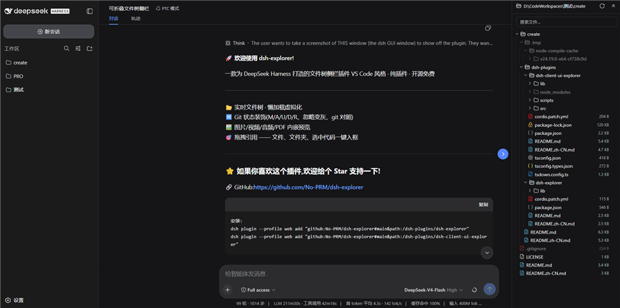

[English](README.md) · [中文](README.zh-CN.md)

# dsh-client-ui-explorer

Collapsible real-time file-tree **drawer** for the dsh web GUI — a 100% pure
plugin (no modifications inside the shipped dsh packages, survives upgrades).



## Features

- Floating DeepSeek-blue round toggle (\> / \<) on the right-middle edge
- Right **drawer** (overlay column with its own drag handle, 264–720 px),
  open/close slide animation (0.45 s, no bounce), button follows the drawer
- Current folder = current session workspace (`cwd`), root expanded by default
- Collapsible tree with **VS Code-style per-row indent guides** + hover
  highlighting (active node's guide line), lazy loading, persisted expansions
- **Virtualized rendering** (@tanstack/virtual-core): only visible rows are
  mounted, so huge folders stay smooth
- **Git decorations** (VS Code-style): M/A/U/D/R status letters with theme
  colors, filename tinting, folder dirty dots, deleted files shown as
  struck-through ghost rows, gitignored files/folders dimmed — host
  `/filetree/gitstatus`, ~3 s poll
- VS Code `files.exclude` defaults: `.git`/`.svn`/`.hg`/`CVS` and
  `.DS_Store`/`Thumbs.db` are hidden; `node_modules` stays visible
- Search box (host `/filetree/search` with client-side BFS fallback), skips
  `.git`/node_modules, click a hit to preview it
- **Git diff**: modified files get a *diff* toggle in the preview header —
  HEAD vs working tree side-by-side (@codemirror/merge, unchanged regions
  collapsed, gutter markers)
- Click any file → **preview**: text via **CodeMirror 6** (line numbers,
  selection/copy, themes, virtualization, VS Code-style floating find widget
  on Ctrl+F), and **media natively** — images / video / audio / PDF streamed
  from the host `/filetree/raw` (Range-enabled, video seeking works)
- 512 KB cap + binary detection for text, 1.2 s live refresh
- Expand-all / collapse-all (bounded: 150 dirs × depth 6), manual refresh
- **Drag & drop**: drag any file/folder row into the chat composer — a plain
  workspace-relative path is inserted at the caret (only a drop INTO the
  composer fills; a ghost pill follows the pointer and turns blue over it) and a removable reference
  chip (file/folder icon + path + ×) appears above the composer, synced with
  the draft (auto-dismisses when the text is deleted or the message is sent)
- **Drag selected code from the preview**: dropping a text selection inserts an
  XML-tagged reference `<reference path="relative/path" lines="from-to" />`
  (unambiguous for the model; same chip flow as file drags)

## Engineering setup (official toolchain)

| File / dir | Purpose |
| --- | --- |
| `src/client/*.ts(x)` | TypeScript/TSX source, split by concern (entry, drawer, panel, tree, virtual, preview, icons, styles, fetch, locales, constants) |
| `src/types/` | Shared structural types (single `index.ts`, imported by the client sources) |
| `tsdown.config.ts` | tsdown (rolldown) build: emits `lib/client.js` in the exact `window.__ModuleLoader__.load({ id, factory })` format; react / jsx-runtime / primitives stay external (loader module table), everything else inlined. **oxc minify** (comments stripped, names mangled) + `process.env.NODE_ENV` baked to production |
| `tsconfig.json` | strict, `jsx: react-jsx`, `allowImportingTsExtensions` |
| `tsconfig.types.json` | declaration-only emit config for `npm run types` |
| `scripts/types.mjs` | emit `lib/types/*.d.ts` + normalize relative import extensions |
| `scripts/dev.mjs` | `npm run dev`: tsdown --watch + junction-aware sync to the live profile install |
| `lib/client.js` | **Build output** (do not hand-edit) |
| `lib/index.js` | Node half (no-op apply; makes the package a loader entry) |
| `lib/types/*.d.ts` | **Generated** type declarations (`npm run types`) |

The profile install at `~/.dsh/profiles/web/node_modules/dsh-client-ui-explorer`
is a **junction** to this directory, so building is all it takes to go live:
the client-HMR chain stat-polls the served file and reloads within ~1 s.

## Dev workflow

```bash
npm install        # once (needs --legacy-peer-deps on this machine)
npm run dev        # tsdown --watch + live sync → edit src, save, see it in the GUI
npm run bundle     # one-shot minified build
npm run types      # generate lib/types/*.d.ts declarations
npm run typecheck  # tsc --noEmit
```

## Libraries in use (tsdown inlines them)

| Library | Used for |
| --- | --- |
| `@tanstack/virtual-core` | Virtualized tree list (via `src/client/virtual.ts`, a minimal local React adapter — the official `@tanstack/react-virtual` would pull react-dom, ~1 MB) |
| `@uiw/react-codemirror` (+ CodeMirror 6 core/languages) | **Preview**: read-only editor (line numbers, themes, virtualization, VS Code-style find widget) |
| `@tabler/icons-react` | File-type icons (per-icon ESM subpath imports — tree-shaken to exactly the icons used) |
| react / react/jsx-runtime / `@deepseek-ai/dsh-client-ui-primitives` | Platform externals (loader module table, never bundled) |

## Install (for a fresh profile)

Two packages must be installed (see the repo-level `dsh-plugins/README.md`):

1. Copy this package (with a **built** `lib/client.js`) and the host
   `dsh-explorer` package into the profile's `node_modules`.
2. Add both to the profile's `cordis.patch.yml` (`insert` entries).
3. Restart dsh (or bump the host package name for a no-restart deploy).

No `npm install` is needed by consumers — the bundle is self-contained and
the platform externals come from the dsh loader.
