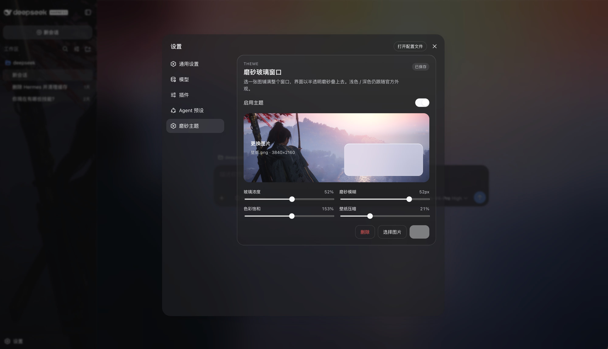

# dsh-frosted-window

[English](README.md) | 中文

DeepSeek Harness Web 主题插件：上传一张图片，铺满整个窗口，侧栏、会话、详情叠一层**半透明磨砂玻璃**。官方浅色 / 深色 / 跟随系统仍然有效。

```sh
dsh plugin --profile web add github:SenryLee/dsh-frosted-window
```

重启 `dsh web`，打开 **设置 → 磨砂主题**。



## 功能

- 本地上传 JPEG / PNG / WebP / GIF，不限制文件大小
- 整窗壁纸 + 三列统一磨砂（侧栏 / 会话 / 详情）
- 滑杆：玻璃浓度、模糊、饱和、壁纸压暗
- **保存 / 删除**：先预览再落盘，方便换图和微调
- 开关：绿色开启、灰色关闭；关掉即回到官方外观
- 不抢官方主题：只用 `overrideTokens`，不 `setTheme('custom')`

图片存在浏览器 IndexedDB，旋钮存在 `localStorage`。不写进 `$DSH_HOME/settings.yaml`，也不从 URL 拉图。

## 安装须知

先能运行 `dsh web`（profile 名一般是 `web`）。

### 方式 A：从 GitHub 安装（推荐）

```sh
dsh plugin --profile web add github:SenryLee/dsh-frosted-window
```

pnpm ≥ 10 默认不跑 git 依赖的 `prepare`。第一次 `add` 若报构建被拒绝，把下面写进该 profile 的 `pnpm-workspace.yaml`（通常是 `~/.dsh/profiles/web/pnpm-workspace.yaml`），再执行一次 `add`：

```yaml
allowBuilds:
  dsh-frosted-window: true
```

仓库里已带构建好的 `lib/`，授权构建只是为了在源码安装时再编一次。

### 方式 B：从 Release 的 tarball 安装

不需要 `allowBuilds`：

```sh
dsh plugin --profile web add https://github.com/SenryLee/dsh-frosted-window/releases/latest/download/dsh-frosted-window-0.1.0.tgz
```

### 终端里没有 `dsh` 命令时

用官方启动器：

```sh
npx @deepseek-ai/dsh plugin --profile web add github:SenryLee/dsh-frosted-window
```

并保证本机 `pnpm` 在 PATH 上。

## 使用

1. **完全退出再打开** `dsh web`（只刷新页面不够）。
2. 点左侧栏底部 **设置**。
3. 打开 **磨砂主题**（或 **通用设置** 里外观下面的同一块面板）。
4. 打开「启用主题」，上传或拖入图片，调滑杆。
5. 点 **保存**。右上角「已保存」表示下次启动还会用这张图。

换图：再选一张 → **保存**。不要了：点 **删除**。

设置 → **插件** 列表里搜的是技术名 `frosted-window` / `dsh-frosted-window`，不是「磨砂主题」。上传入口在设置页，不在插件清单里。

## 卸载

```sh
dsh plugin --profile web remove dsh-frosted-window
```

然后重启 `dsh web`。

## 开发

```sh
npm install
npm test
npm run build
```

`dsh.bundle` + `dsh.client`，符合官方 [打包安装](https://github.com/deepseek-ai/deepseek-harness/blob/master/docs/user/develop/basic/publish.zh.md) 契约。

## License

MIT
