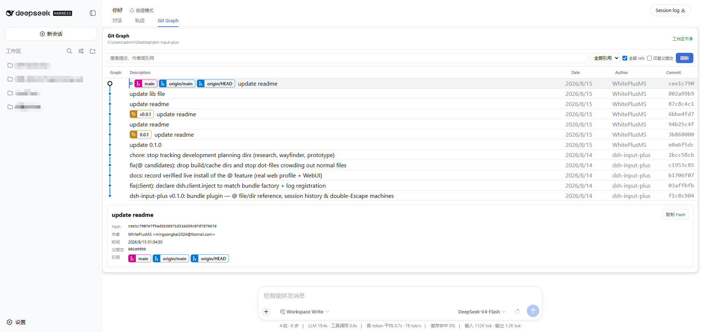

# `dsh-git-graph`

Git Graph for the DeepSeek Harness web interface. Open a dedicated `Git Graph` view beside Chat and Trajectory to inspect the current workspace's Git history; refreshing the graph does not create a conversation message or write to the trajectory.



## Features

- A dedicated `Git Graph` entry beside Chat and Trajectory.
- Commit topology with branch, merge, and parent relationships.
- Local branch, remote branch, tag, and HEAD reference labels.
- The clean or dirty working-tree state in the graph header.
- Search for commit hashes, commit subjects, authors, email addresses, and reference names.
- Filter commits by reference kind and choose whether to include all refs.
- First-parent mode for viewing the mainline history more easily.
- Select a commit from the graph node or commit list to open its details.
- Copy the full commit hash from the details panel.
- Refresh the current repository without creating a conversation message or tool trace entry.
- Load more commits as needed, up to 500 commits.
- Display an empty state instead of an error when the current directory is not a Git repository or the repository has no commits yet.

The current release is read-only. It does not create, delete, rename, merge, rebase, push, pull, fetch, create tags, stash, or reset Git data.

## Open Git Graph

After installing the plugin and restarting DSH Web, click `Git Graph` in the view switcher beside Chat and Trajectory.

The page reads the current session workspace. Refresh operations call the plugin's Typert Remote directly; they are not rendered as conversation tool cards and do not append refresh events to the trajectory.

## Git data and path handling

The Host reads Git metadata through fixed subprocess arguments without using a shell. It reads repository status, HEAD, and bounded commit history; the plugin does not open or upload file contents.

The model tool supports the following parameters:

```text
git_graph({
  path?: string,          // Repository directory; defaults to the current session workspace
  max_commits?: number,   // 1..500, defaults to 100
  all?: boolean,          // Include all reachable refs, defaults to true
  first_parent?: boolean  // Follow only the first parent, defaults to false
})
```

The provided path is used only as the Git subprocess working directory and is never interpolated into a shell command. If the path is not a Git repository, the page displays an empty state instead of a repository error. A Git repository with no commits is handled the same way.

## Install or update

Install version `v0.0.1` from GitHub:

```powershell
dsh plugin --profile web add https://github.com/WhitePlusMS/dsh-git-graph/archive/refs/tags/v0.0.1.tar.gz
```

Use the same command to update an existing installation. Restart `dsh web` after installation so the Host entry and browser client load the new version.

## Uninstall

Remove the current package from the `web` profile:

```powershell
dsh plugin --profile web remove dsh-git-graph
```

## Development

```powershell
pnpm install
pnpm run typecheck
pnpm test
pnpm run build
```

The build writes the standalone Host and browser artifacts to `lib/`. Profile installation uses these generated artifacts and does not require a Harness monorepo checkout.

## Reference and inspiration

This project was created with reference to the following open-source project: [vscode-git-graph](https://github.com/mhutchie/vscode-git-graph). We would like to express our thanks to its authors and contributors.

## License

MIT
