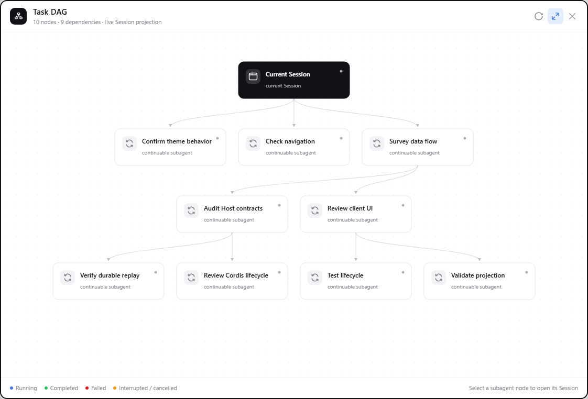

<h1 align="center">dsh-task-dag</h1>

<p align="center">
  DeepSeek Harness Web 的实时任务拓扑。<br>
  用一张可导航 DAG 展示当前会话、委派子代理与持久工作流。
</p>

<p align="center">
  <a href="https://awesome.re"></a>
  <a href="https://awesome-dsh-plugin.com"></a>
  <a href="https://github.com/LeemanCheung/dsh-task-dag/actions/workflows/ci.yml"></a>
  <a href="https://github.com/LeemanCheung/dsh-task-dag/releases/latest"></a>
  <a href="LICENSE"></a>
</p>

<p align="center">
  <a href="README.md">English</a> · 中文
</p>



## 一览

`dsh-task-dag` 将 DSH 已有的 Client 投影转换为自顶向下的任务依赖图。插件不维护另一套工作流数据库，也不发送轮询请求；Session 状态变化时，图会随投影实时变化。

| 能力 | 行为 |
| --- | --- |
| 实时拓扑 | 响应 Session 与子代理目录快照，无需 Host 轮询。 |
| 持久工作流 | DSH 重启后从 `workflow-run` Conversation Node 恢复阶段和成员。 |
| 清晰归属 | 将工作流成员归入工作流节点，避免根会话到成员的重复直连边。 |
| 直接导航 | 点击健康且在 Session 列表中的子代理节点即可打开对应会话。 |
| 画布控制 | 可在全图适应与原始尺寸画布之间切换；可平移画布并拖动节点，当前 Session 关闭后再打开面板仍会保留重新布局。 |
| 有界布局保留 | 手动节点位置只存在于当前页面、当前 Session 的 React state；切换 Session、刷新页面或重启 DSH 后恢复确定性的自动布局。工作流拓扑本身仍由持久 Conversation Node 重建。 |
| 投影稳健性 | 会拒绝断裂或循环的血缘，同时为有效的深层依赖链生成确定性的垂直层级。 |
| 原生呈现 | 使用 DSH 主题语义、克制的状态色与自绘 SVG 图标，适配浅色和深色模式。 |
| 生命周期安全 | UI 与样式均由 Cordis 生命周期托管，卸载时完整移除。 |

## 实际运行截图

截图来自正在运行的 DSH Web Session，任务名称已经匿名化；面板、布局、连线、控件与状态呈现均为插件真实界面。



## 安装

```powershell
dsh plugin --profile web add github:LeemanCheung/dsh-task-dag
```

首次安装后重启一次当前 DSH Web 进程并刷新页面，随后可在会话标题栏看到“任务 DAG”入口。

固定安装指定版本：

```powershell
dsh plugin --profile web add github:LeemanCheung/dsh-task-dag#v1.2.0
```

## 使用任务图

| 操作 | 结果 |
| --- | --- |
| 点击“任务 DAG” | 打开当前 Session 范围内的任务图面板，启用并刷新相关父节点目录。 |
| 拖动空白画布 | 在原始尺寸模式下平移可滚动的画布。 |
| 拖动节点 | 调整节点位置，连线会实时同步；当前 Session 关闭并重新打开面板后仍会保留布局。 |
| 点击子代理节点，或在其上按 `Enter` / `Space` | 当节点存在于 Session 列表时，打开对应会话。 |
| 切换适应模式 | 在全图概览和原始尺寸可滚动画布之间切换。 |
| 手动刷新 | 刷新正在观察的子代理目录；工作流节点仍由投影驱动。 |
| 拖动标题栏 | 移动面板，同时不会捕获工具栏按钮事件。 |
| 按 `Escape` 或关闭按钮 | 关闭面板，并将焦点还给入口按钮。该对话框没有焦点陷阱，也不支持通过键盘拖动面板、画布或节点。 |

状态颜色仅用于业务蓝、成功绿、错误红和警告琥珀色；其余层级通过间距、排版、边框与线型表达。

## 架构



浏览器插件组合三类持久 Client 数据源：

- `SessionListState.byId` 与 `parentId` 提供子代理血缘。
- `SessionListState.subagentsByParent` 提供标签、模式、活动状态与目录健康信息。
- `workflow-run` Conversation Node 提供工作流阶段、成员与结果。

插件拥有的 graph-model 模块会统一血缘、插入工作流分组节点、派生导航能力并排布稳定的垂直层级；UI 模块再将投影渲染到 `conversation.session.header.actions`。

整个过程不存在进程内工作流缓存、模型 Prompt 注入、模型 Tool、Host RPC 端点或轮询循环。

### 投影边界

仅展示通过 `origin: "subagent"` 血缘可追溯到当前 Session 的后代；孤儿、缺失父节点的链路和循环均会忽略。目录中的 `running` 活动状态优先于已完成的 Session summary；工作流成员使用其 `workflow-run` 状态；未知状态显示为历史/空闲。同一成员若出现于多个工作流，最终解析的工作流归属决定其显示分组和状态。

## 安全与权限

这是一个仅运行在浏览器中的只读可视化插件。它不读取工作区文件、不执行命令、不发起网络连接、不注册模型工具，也不持久化 Session 内容或凭据。

安全报告方式与完整信任边界见 [SECURITY.md](SECURITY.md)。仓库已启用私密漏洞报告。

## 开发

运行时软件包声明 Node.js 20+。开发和锁定的 jsdom 测试栈应使用 Node.js 20.19+、22.13+ 或 24+；CI 当前使用 Node.js 22。

```bash
npm install
npm run check
```

检查流程会：

1. 校验源码语法及纯 graph-model 模块；
2. 运行 graph-model 单元测试，覆盖血缘、工作流分组、稳定布局和深层链路；
3. 重建并校验预编译浏览器模块；
4. 运行 jsdom 交互冒烟测试，覆盖控件、画布平移、节点拖拽布局保留和节点导航；
5. 在 CI 中确认提交的 `lib/client.js` 可以由源码稳定重现。

这些是纯模型与 jsdom 冒烟检查，不是完整的 DSH Web 端到端测试。真实 profile 中的主题视觉、响应式布局、完整焦点流程和卸载行为仍需人工或浏览器 E2E 验证。

`scripts/build.mjs` 会将 `src/graph-model.js`、`src/client.js` 和 `src/style.css` 嵌入已提交的 `lib/client.js`。不要直接修改该生成文件：应修改 `src/`，再在提交前运行 `npm run build` 或 `npm run check`。

## 排障

| 现象 | 检查方式 |
| --- | --- |
| 找不到“任务 DAG”入口 | 确认使用 Web profile，重启 `dsh web` 并刷新页面。 |
| 节点无法打开 | 仅仍显示在 DSH Session 列表中的会话可导航。 |
| 子代理状态或标签疑似过期 | 点击“刷新”以刷新观察到的子代理目录。 |

## 卸载

```powershell
dsh plugin --profile web remove dsh-task-dag
```

## 许可证

[MIT](LICENSE) © LeemanCheung
